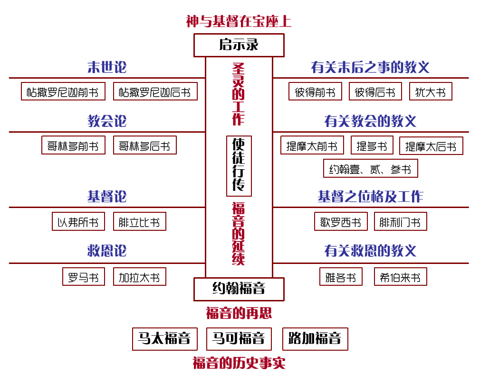
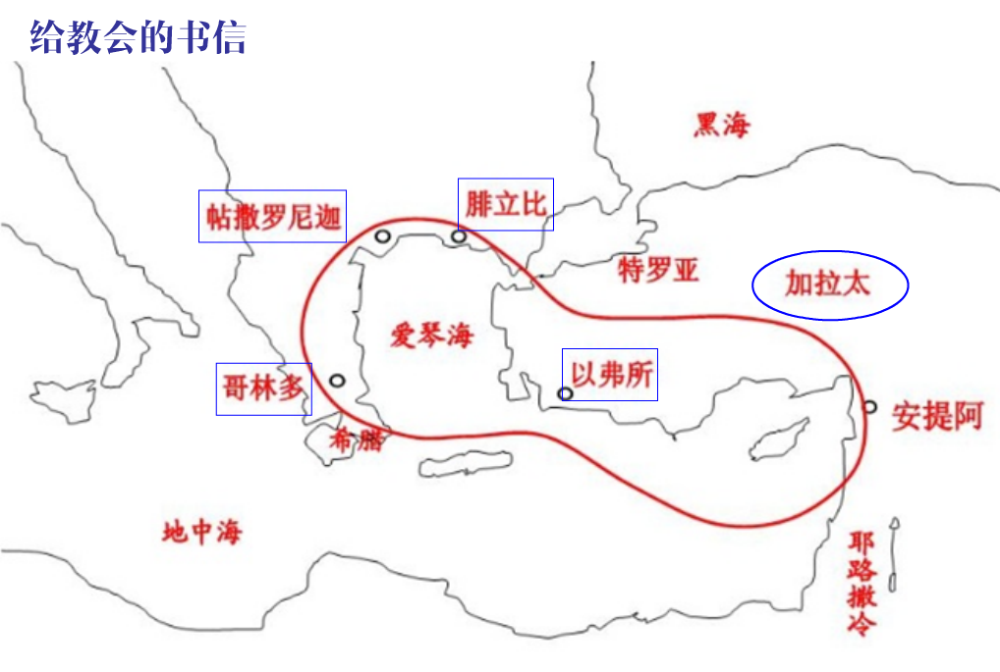
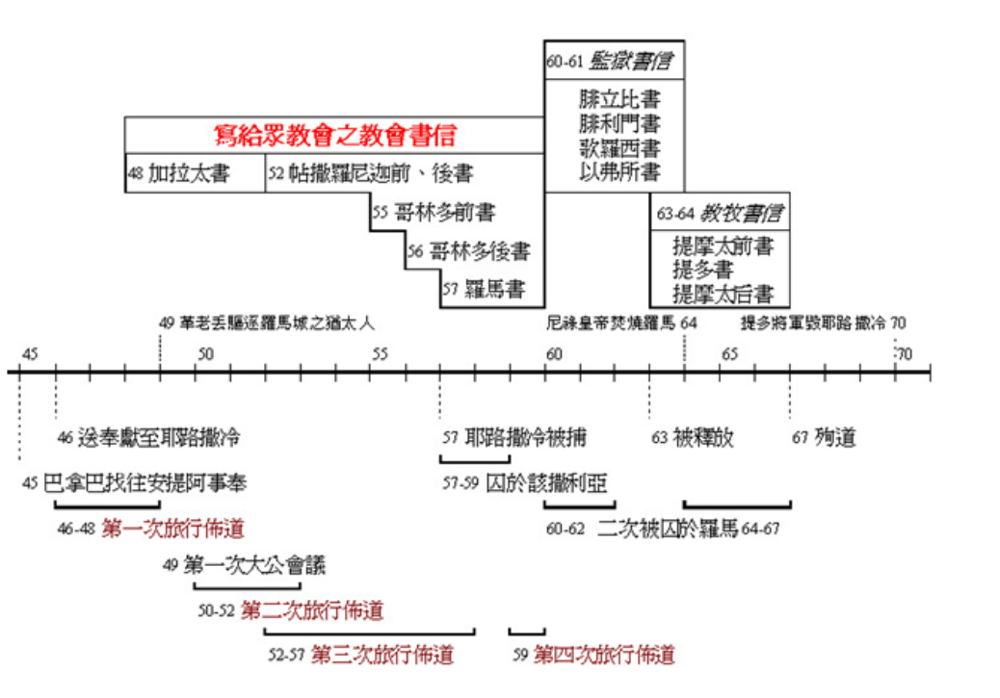
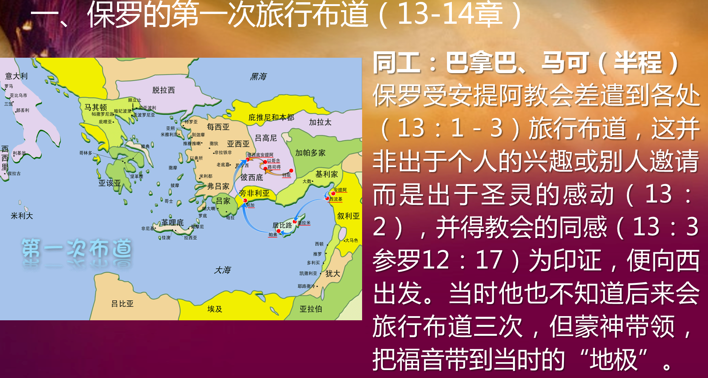
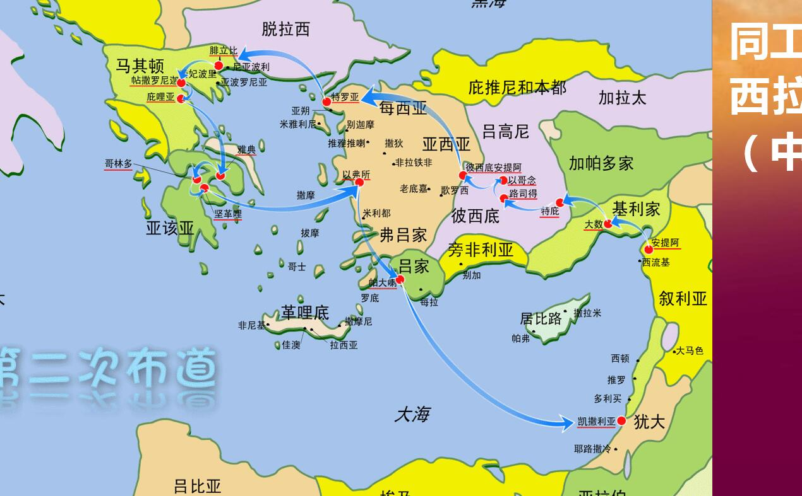
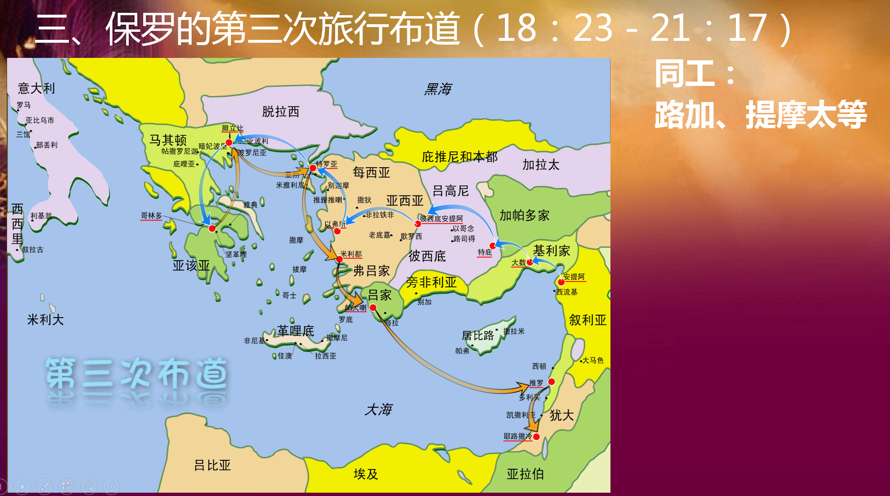
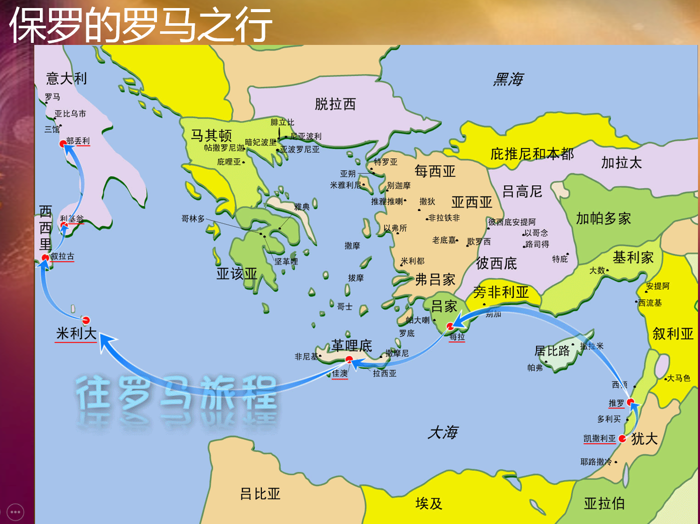
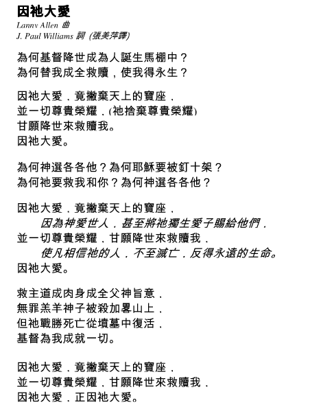
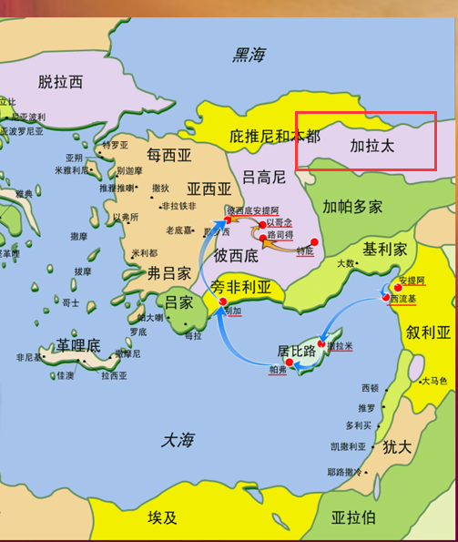
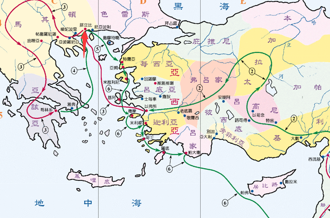

matthew
===============

## 耶稣基督的家谱

犹大取了迦南女子、并与迦南儿媳（他玛）生下、

救赎是什么？

人类一直是被掳的，直等到基督主动来救赎；

我门对生活中发生的许多意外都难以理解，我们埋怨神、我们嚎啕大哭，不肯受安慰，但是接受神的旨意有时是不能通过我们的情感认同来实现的，神的旨意高过人的旨意。

#### 10:34 你们不要想，我来是叫地上太平；我来并不是叫地上太平，乃是叫地上动刀兵。

做门徒的代价：主来到地上的工作，乃是要切断人的天然生命。为着爱主，我们必须把所有的属人关系都推到次要的地位。因为主要求我们一切都给祂，少一点也不行，不是相对的爱，乃是绝对的爱。凡肯接受十字架的对付而不追求满足自己的，必要得着天国的丰富，因为他里面所充满的是主自己。今天有没有什么成了你跟随主、专心爱主的拦阻？是你凭己意所定下的人生目标？或是亲人朋友、物质享受，甚至是你自己？就在今天，靠主的力量胜过一切的拦阻，做一个他喜悦的信徒吧！

#### 20:28 正如人子来，不是受人的服事，乃是要服事人，并且要舍命，作多人的赎价。

基督由神生，有着无上的权利，但在世上的时间却持守着奉献者的角色，与世人一样受劳苦，试探、经历流血、酷刑。这爱（牺牲）长阔高深，过于人所能测度。

这样的不符合逻辑的“甘心乐意“是因为神计划的旨意“不是受人的服事，乃是要服事人”。造物主的奇妙之爱成全了基督在地上的使命。

你是否励志效法基督，做服事人、牺牲（舍命）、作多人的赎价的工作？盼望你我都能领受这奇妙之爱，效法基督的爱（牺牲），随时预备服事人。

#### 24:51 定他和假冒为善的人同罪。在那里必要哀哭切齿了。

24:6
你们也要听见打仗和打仗的风声，总不要惊慌，因为这些事是必须有的，只是末期还没有到。

24:7 民要攻打民，国要攻打国，多处必有饥荒、地震。

24:8 这都是灾难的起头（注：“灾难”原文作“生产之难”）。

24:9 那时，人要把你们陷在患难里，也要杀害你们；你们又要为我的名被万民恨恶。

24:10 那时，必有许多人跌倒，也要彼此陷害，彼此恨恶；

24:11 且有好些假先知起来，迷惑多人。

24:12 只因不法的事增多，许多人的爱心才渐渐冷淡了。

24:13 惟有忍耐到底的必然得救。

24:14 这天国的福音要传遍天下，对万民作见证，然后末期才来到。

24:36
但那日子、那时辰，没有人知道，连天上的使者也不知道，子也不知道，惟独父知道。

Q：恶仆恶在哪？哀哭切齿是否意味着不得救？

末世会在一个“惟独父知道“的突然时刻到来，一个有见识的仆人意味着殷勤主动看顾主人的家产；不容人挖透房屋大致是当发现家庭、教会的破口及时填补。

恶仆的恶在于懒惰，消极的态度。与醉酒的人同吃喝意味着忘记了仆人身份，家中有贼挖窟窿他也也不知道。

#### 25:3 愚拙的拿着灯，却不预备油；

新郎已经约定好要来，为何有童女拿着不预备油的灯，这样的灯有何用？为何基督要求我们时刻准备着？

我们处在极危险的世代里，预备油意味着，我们要做随时的属灵装备。由于肉体的拘束，我们的意志力若没有圣灵的助力是无法与撒旦阻挡的，我们需要装备油以防止被这世界的风俗吞吃。

陈丽燕

太9：27-31默想。医治瞎子。犹太人世世代代都在等候着弥赛亚的来临。在他们的观念中，这位弥赛亚是大卫的子孙，要拯救他们脱离外族的统治，也要带领他们征服全世界。耶稣并没有对瞎子们的呼求作出立时的响应，直到他们跟进房子去，他才跟他们对话。耶稣是在考验他们的要求是否出于诚意、信心是否真实。在感情高涨的群众中高声呼喊是容易的；然而，耶稣却要他们单独来到他面前，切实地面对自己的问题和需要。他们得蒙医治，再次显明了信心的能力。在我们每天的生活中，真正要紧的是我们单独与主相处时所作的一切。他要我们诚实的面对自己，承认自己的软弱和限制，并且把一生交托给他，相信他能够把我们塑造成合乎他使用的器皿。 -
07:13

08月19日陈丽燕 (+8618742517231)

陈丽燕

家昊,我今天去市里市里教堂啦\~下午不知道几点赶回来还.所以要是去你们教会,我再联系你喔\~昨晚忘说了… -
11:25

我

好的 \^O\^平安噢 - 11:26

08月20日陈丽燕 (+8618742517231)

-   陈丽燕

太9：35-38默想。今天的经文我们首先看到耶稣所做的，走遍各城各乡，在会堂教训人、宣讲天国福音、医治各样病症的工作，我们更看到这样一位何等怜悯的耶稣。迷失的羊群会被野兽践踏吞吃，未收割的成熟庄稼会朽坏；群羊需要牧养，庄稼需要收割。远离神迷失的百姓，外面受着黑暗权势各样的折磨，心灵枯干，心思浮燥，里面没有平安。漂流的人群或者是光有外表的敬虔，却没有里面的敬畏，因为心里没有空处为神存留，也不肯在神的权柄下跟随。主巴不得掉转他们的脚步，叫他们的心思转向神，可以接受天国的安宁。主今天也让我们看到，作工的人往往比所需要的少。生命的禾场上，我们愿意成为收割者吗？愿意起来去体贴主的心肠，去合乎主使用，去使主欢欣吗？ -
07:49

-   08月21日陈丽燕 (+8618742517231)

陈丽燕

太10：1-4默想。耶稣拣选十二使徒。“十二”是以色列支派的总数；耶稣设立十二使徒，表示了他重建的百姓——真以色列。“使徒”是“被差遣者”的意思，而这被差遣者是带着差遣者所赋予他的权柄。耶稣呼召了不同的人——渔夫、激进党人、税吏作他的门徒，他呼召平民老百姓和杰出领袖、富有的和贫穷的、知识分子和文盲。耶稣呼召不同背景和经历的人作门徒，宣扬天国的福音。没有收割庄稼的人，收成的工作便无法完成；他昔日选召工人与他同工，今天他同样差遣你去引领人明白救恩。神能够使用任何人，不管那人觉得自己何等卑微。我们觉得自己很微小、没有价值吗？要切记神会使用平凡的人去做他那不平凡的工作。当基督的呼召临到时，你会如何回应呢？ -
07:10

-   08月22日陈丽燕 (+8618742517231)

陈丽燕

太10：5-15默想。这段经文是耶稣差遣使徒外出传道前的嘱咐。使徒们是先集中向犹太人传道，不是象征世界的办法（“外邦人的路”），也不是象征半属基督教半属世界的混杂团体（“撒玛利亚人的城”），而是去往“以色列家迷失的羊”，原是属神的百姓，却因偏行己路，而如羊走迷。使徒们要去传道、医病、赶鬼，只信靠神会藉他人或别的方式供应一切需要。耶稣教导如何去服事别人的原则：“你们白白地得来，也要白白地舍去”。因着主在十字架上为我们所流的宝血，替我们担当了罪孽，使我们白白地得着恩典（“白白地得来”），因着这样的倾福给我们，我们是否也要去行动，好让别人也能白白的得着（“白白地舍去”）呢？是否愿意慷慨地把自己的时间、爱心或者财物与他人分享呢？让我们来回应主的大爱，告白自己在这里，请求神的差遣吧\~ -
08:53

-   08月23日陈丽燕 (+8618742517231)

陈丽燕

太10：16-25默想。耶稣以“羊进入狼群”来比喻门徒日后所遇的迫害。地上的权柄不欢迎天国的来到，地上的人也不欢迎天的权柄。“灵巧像蛇”，乃是提醒我们要有敏锐的属灵触觉，可以分辨环境的险恶。“驯良像鸽子”是让我们因看见神的安排而坦然接受凶险的环境。收庄稼的人会经历很多苦难，不但有政府的，甚至包括亲人、朋友的逼迫。敬畏神又顺从神的人可能会不住地经历这样的事，但即使在逼迫中，我们也要有信心，要站住见证的立场，因为耶稣“已经胜了世界”（参约16：33），忍耐到底的人必然得救（10：22）。今儿七夕也活出真正敬虔的生命吧\~ -
08:51

-   08月24日陈丽燕 (+8618742517231)

陈丽燕

太10：26-31默想。信徒所当惧怕的，不是那能叫我们外面暂时受亏损的，而是那能叫我们永远受亏损的。若是天父不许，魔鬼和世人都不能加害我们。我们一切的遭遇，都是父神许可的，他知道什么是对我们有益处的（来12：10）。信徒所遭遇的每一件事，都是出于神的安排；神对于我们环境的安排，像我们的头发都被数过一样，是极清楚且仔细的。神的无限细微，正如他的无限伟大；在我们身上，没有一件事是太细小到神不来管理的。神爱我们，看我们为至宝贵，保护我们如同保护他眼中的瞳人。在主的爱里没有惧怕，却是满有喜乐和平安。让我们相信神的安排，等候神的旨意成就，不惧怕，且要赞美吧\~ -
11:53

-   08月25日陈丽燕 (+8618742517231)

陈丽燕

太10：32-33默想。在这里，承认基督包括了认他是生命的主、是救主，并且在生活和嘴唇上都认他。我们可能在我们的话语中否认他，但更可能是在我们的沉默中否认他，还更可能是在我们的行为中否认他。基督徒永远不能逃避与世界有分别的责任，我们的责任，不是与世界一致，而是从世界中转变过来。灯岂不是照耀在黑暗中么？天太黑了，灯反而要休息，等到天亮，灯还有什么用呢？让我们不是只有话语中的属基督，更不可以用胆怯的静默去否认，真实的基督徒那样却要做个行道者。我们若在今世向他尽忠，他将来也必向我们显明他的忠信；人若以承认耶稣基督是他的主为荣耀，耶稣基督也以承认他为祂的仆人为荣耀。你愿意怎样对待耶稣呢？求主帮助我们不论在任何的景况中都学习向主尽忠吧。

#### 26:41 总要警醒祷告，免得入了迷惑。你们心灵固然愿意，肉体却软弱了。

警醒的意思是对每个被试探的可能提高警觉，敏感到撒但的狡猾诡计，装备好灵性来对抗它。我们最脆弱的地方往往最容易被试探，我们不能单独抵抗它，必须靠着祷告支取神的能力，使我们可以抵挡撒但的攻击。

### 2018年春节信息：使命与传承 太28：18-20

> 在一个人人为己的时代，有谁愿意将上帝的子民放在心上，为他们守望，警醒，甘心牺牲自己呢？
>
> 在一个物欲横流的时代，有谁愿意忠于上帝的使命，往普天下去，付上时间、金钱、生命，将福音带给世上的万民呢？

1.守住每周主日、参加小组、日夜灵修、祷告，十一奉献就能达到神的标准吗？

引入行为与信心的

人寻求神的程度往往与个人经历痛苦的程度成正比；

john
============

1:29
次日，约翰看见耶稣来到他那里，就说：“看哪，　神的羔羊，除去（注：或作“背负”）世人罪孽的。

1:30 这就是我曾说‘有一位在我以后来，反成了在我以前的，因他本来在我以前。’

1:31 我先前不认识他，如今我来用水施洗，为要叫他显明给以色列人。”

1:32 约翰又作见证说：“我曾看见圣灵彷佛鸽子从天降下，住在他的身上。

1:33
我先前不认识他，只是那差我来用水施洗的，对我说：‘你看见圣灵降下来，住在谁的身上，谁就是用圣灵施洗的。’

1:34 我看见了，就证明这是　神的儿子。”

1:35 再次日，约翰同两个门徒站在那里。

1:36 他见耶稣行走，就说：“看哪，这是　神的羔羊!”

1:37 两个门徒听见他的话，就跟从了耶稣。

施洗约翰在与耶稣的会面过程中大声

表现：为神预备道路（修直主的道），明白神子降世为人的位分。

“在我以后来”指是地上的时间；

“他本来在我以前”是神预定的顺序；

我们能晓得属灵的事情大于人眼所见的时空、逻辑吗？

1:51你们将要看见天开了，神的使者上去下来在人子身上。

耶稣不需要见证人去见证（不要通过表现自己可以得到）、因为他知道人心。

In Capernaum's temple,  Jesus said Destroy this temple,I will raise it  again in
three days.

起初与神在一起的道，神通过这道建立了世界，这道中包含生命（人的光），并且光来到了世界，要驱走那黑暗。

约3:3 耶稣回答说：“我实实在在地告诉你：人若不重生，就不能见　神的国。”

人若不重生，就不能进天国。换句话说人若想进入天国，他首先需要重生。

何谓重生？一个实实在在还陷在罪恶中之中，似乎还未重生，我能进入天国吗？

我们的行为 并不是判断我们重生的标准、一个行为很坏的人也可能重生？

我已经重生了吗？

世人都犯了罪、然而世人都有机会被救赎。

重生就是在基督里的重生，借着水和灵。

人是看外表，看加入什么组织，加入什么教，看戴什么型号的十字架，但神是看人内心的神。信仰基督教不是加入什么，而是和永生上帝直接发生个人关系。

是在神面前求圣灵光照，让自己看到自己是个罪人，承认自己是罪人，愿意接受基督耶稣为自己的救主。何时你真挚的向神做过认罪悔改，接受救主的祷告，何时你就已经是基督徒。

一次得救，永远得救。是的。圣经说相信，承认，就可以得救。我们得救完全是神的恩典，人所做的只是伸手要神的恩典。这个恩典不光是赦免我们的罪，而且，（请特别注意这个而且）更伟大宝贵的是————赐给我们一个新生命，同时圣灵内住，引导我们过一个有新生命样式的生活。  

也就是说每一个真正重生得救的人，一个真正的基督徒，在他里面会有一个与不信的人不同的生命，从神而来的生命。  
随着**这个生命的长大**，  
我们会越来越看到救主的荣美，越来越看透世事的虚空本质。  
我们开始轻看那短暂的，来寻求永恒的长存的真正有价值的。慢慢地从心里愿意撇下一切跟随耶稣。就如你所说的：“会信的好，会改变自己。”

再次询问重生倒底是什么？什么是重生？重生的表现？

答:“重生”，顾名思义就是“再有一次的生命诞生”。常常听到基督徒讲这个词，不过，讲得最多的人不一定是对重生这一观念尽都了解。重生包含了以下几方面的意思:

1、重生是神的工作，不是人自己努力的成果。英文的"To be born
again"是个被动语态。母亲生孩子，孩子是被生下来的。若公公婆婆急于抱孙子，儿子媳妇却想晚一点生孩子，老人家总不能怪责孙子为什幺不努力出世吧！同样，重生是神作主动的。他什幺时候，要重生什幺人，不是你我可以决定的。耶稣说：风从哪里来，要往哪里吹，我们无法知道，但是我们可以感觉得到它所带来的后果。神的灵就如风一样，看不见，摸不着，但当他在人心里作工的时候，被重生的人当时也许察觉不到，但事后会发现自己与以往大大不同了。而在旁的人则也能从这人生命的有形改变而得知圣灵无形之工作的实在。  

2、重生是内在生命的彻底改变。这也是基督教与其它宗教不同的地方。“宗教”是用一些外在的教条、规范来约束人的言行。这种约束对某些人来说也能起到一定的作用。因此，常听到有人说：“宗教总是导人向善的，有宗教总比没有宗教的好……”但是，外在的约束是消极的，如果没有内在的性情配合，对信奉的人来说很可能变成一件苦差——心中欲为之，宗教曰不可为之，苦也！这也就是为什幺好些人看见某某基督徒的好品行，虽然会欣赏他，肯定他，不过就是不要像他。他们觉得信了基督教，这也不许，那也不准，一天到晚跟自己过不去，何苦呢？因此，把基督教信仰看成是人的心理作用，自然而然产生出来的结果，是既不符合实际情况，也不合乎科学精神的结论。
如果一个人没有向善的本质，任何“导人向善”的教条只能叫他活得更辛苦。基督徒都有自虐狂吗？非也！他们内心喜爱神所喜爱的，厌恶神所厌恶的。这是神的性情在他里面自然的流露，而不是因受制于教规，“不得不”照着做。人从外表观察到的是两者间一些相似的宗教表现，但在两者内心中他有主动与被动、积极与消极的巨大差别。真正的基督徒会对神的事情有一份发自内心的渴慕。这不是说基督徒一定不会犯错，但他信主前后的内心世界是大不相同的，因为神把刚硬的心(石心)除去了；赐给人一颗柔软的、愿意顺服神的心(肉心)；把神自己的灵放进人的心里。
(以西结书36:26-27)
对罪和善的心态是有天渊之别的：信主前，他有自己的私欲，鉴于宗教规条，勉为其难循规蹈矩；信主后，他有神的性情，偶尔犯罪后，会失去平安，心中责难。因此，使徒保罗说，若有人在基督里，他就是新造的人，一切的事都变成新的了(林后
5:17)。  

3、人重生是要藉着水和圣灵重生的。当耶稣在约翰福音叁章讲这话的时候，他没有提到洗礼。“水”，对犹太人的意义，就是洁净。耶稣的意思是，当我们被重生后，我们的心会被洁净，
因而会对自己从前的罪过感到难过，自责；同时，神又赐下圣灵，叫人悔改信主，从此弃罪从善(参多3:3-8)。因此，若有人称自己是基督徒，却没有圣洁生活的表现，或者视圣洁为负累，觉得过信仰生活过得很受束缚，这人的信仰一定有问题。
由此可见，重生，是神作主动所成就的善工，非人凭自己努力所能达到的结果，(人得救是本乎恩，弗2:8-9)。神重生人的目的是要把一个崭新的生命赐给人，叫人不止知道何为善，并且有能力行善。

使徒行传
============

犹太的“使徒”השליחים (apostle)
通常是代表某个人(偶尔指团体/公会)受指派，亦即接受大祭司或地位类似的人物的委派。

ambassador(大使)

one who is sent away(信使)

保罗书信背景
============

保罗书信总论:http://fungclass.fhl.net/S_paul/02/

监狱书信:

<http://wenku.baidu.com/link?url=NWcTpEXhJKWWWzig5ZhQ1GJQqI2m01isZhbov2n3jwRWw4vV5qC1uWavnvHyWATGEXlDc4VrAev0tcmnwulEoJBeqkK6G-n-2mGQaNAYAPm>

保罗书信分类
------------

### 新约正典顺序：地方教会/个人

地方教会：罗马书\~帖撒罗尼迦后书

其次再按篇幅长短分类。

个人：提摩太前书\~腓利门书

### 时间划分

| A.D.46～48       | 第一次旅行布道                                                                                                                                                                                                                                                  | 加拉太书                                                                                                                                                                                                                                                                                                             |
|------------------|-----------------------------------------------------------------------------------------------------------------------------------------------------------------------------------------------------------------------------------------------------------------|----------------------------------------------------------------------------------------------------------------------------------------------------------------------------------------------------------------------------------------------------------------------------------------------------------------------|
| A.D.49           | 耶路撒冷大会前 (犹太传统是否保留)                                                                                                                                                                                                                               |                                                                                                                                                                                                                                                                                                                      |
| A.D.50～52       | 第二次旅行布道                                                                                                                                                                                                                                                  | 帖撒罗尼迦前后书                                                                                                                                                                                                                                                                                                     |
| A.D.53～57       | 第三次旅行布道                                                                                                                                                                                                                                                  | 罗马书 56年12月-57年2 哥林多 大约在[公元56或57年]间 ﹐[保罗第三次宣教之旅] 接近尾声时﹐他和同行的人从小亚细亚行船到耶路撒冷﹐要将收到的奉献交给在那里正受饥荒之苦的穷 困基督徒。那期间﹐他们曾在[米利都]暂停﹐保罗会见了附近[以弗所]教会的长老们。聚会中保罗透露圣灵曾对他有警告﹐说在他抵达耶路撒冷时﹐会被捕下监。 |
| 55年春天五旬节前 | （以弗所）                                                                                                                                                                                                                                                      | 哥林多前书                                                                                                                                                                                                                                                                                                           |
| 55年初冬         | （可能是腓立比）                                                                                                                                                                                                                                                | 哥林多后书                                                                                                                                                                                                                                                                                                           |
| A.D.57～59       | 犹大凯撒利亚被困                                                                                                                                                                                                                                                | 无                                                                                                                                                                                                                                                                                                                   |
| A.D.60～62       | 较大可能是罗马狱中                                                                                                                                                                                                                                              | **腓利门书**                                                                                                                                                                                                                                                                                                         |
|                  |                                                                                                                                                                                                                                                                 | **歌罗西书**                                                                                                                                                                                                                                                                                                         |
|                  |                                                                                                                                                                                                                                                                 | **腓立比书**                                                                                                                                                                                                                                                                                                         |
|                  |                                                                                                                                                                                                                                                                 | **以弗所书**                                                                                                                                                                                                                                                                                                         |
| A.D.62～66       | 罗马被释放旅行布道                                                                                                                                                                                                                                              | 提多书                                                                                                                                                                                                                                                                                                               |
| 64-65            | 罗马/腓立比                                                                                                                                                                                                                                                     | 提摩太前书                                                                                                                                                                                                                                                                                                           |
| A.D.66～68       | 在罗马狱中                                                                                                                                                                                                                                                      | 提摩太后书                                                                                                                                                                                                                                                                                                           |
| 《腓立比书》     | 狱中书信； 学者们对此有不同的看法。有些人认为是**凯撒利亚**【第二次】﹐另一些人则认为是罗马。在这一课里﹐我们主张**保罗可能是从罗马**写这些信﹐虽然这个细节对于我们的解释无关紧要。不过﹐既然知名的学者对此看法不一致﹐我们还是要探讨他在这两个城市的逗留时间。 |                                                                                                                                                                                                                                                                                                                      |
| 《歌罗西书》     |                                                                                                                                                                                                                                                                 |                                                                                                                                                                                                                                                                                                                      |
| 《腓立门书》     |                                                                                                                                                                                                                                                                 |                                                                                                                                                                                                                                                                                                                      |
| 《以弗所书》     |                                                                                                                                                                                                                                                                 |                                                                                                                                                                                                                                                                                                                      |
| 《提摩太前书》   |                                                                                                                                                                                                                                                                 |                                                                                                                                                                                                                                                                                                                      |
| 《提多书》       |                                                                                                                                                                                                                                                                 |                                                                                                                                                                                                                                                                                                                      |
| 《提摩太后书》   | 公元65年，（罗马监狱）监禁却比第一次艰难得多                                                                                                                                                                                                                    |                                                                                                                                                                                                                                                                                                                      |

### 旅途书信

3次坐牢
-------

第一次坐牢：第二次旅行布道时在腓立比，与西拉一起被捕1天；

第二次坐牢：3次旅行布道后，在凯撒利亚被腓力斯拘役2年(24:27)

第三次坐牢：为使徒行传尚未记录，大致在保罗在自己所租的房子里住了足足两年。凡来见他的人，他全都接待，放胆传讲　神国的道，将主耶稣基督的事教导人，并没有人禁止。
(使徒行传 28:30-31 和合本)

### 1

第一次宣教之旅（使徒行传13-14）：回应神关于宣讲基督的呼召，保罗和巴拿巴离开叙利亚的安提阿教会。刚开始时，他们传福音的方法是在犹太各会堂里讲道。但有很多犹太人拒绝基督，宣教士们便意识到神要他们在外邦人中做见证的呼召。  

因为扫罗关于耶稣的大胆见证，迫害者扫罗成了受害者保罗。那些拒绝通过接受耶稣基督得救恩的试图阻止和迫害他。在一个城中，保罗被用石头打，扔在那里等死。但是神救了他。经历了试探、毒打和监禁后，保罗坚持传讲基督。   

保罗对外邦人的事工导致谁能得救和如何得救的争论。在他第一次和第二次宣教之旅期间，保罗参加了在耶路撒冷关于救恩途径的会议。最后达成一致，外邦人可以在不遵从犹太传统的情况下接受耶稣。 

### 2

第二次宣教之旅**（使徒行传15：36-18：22）**：保罗又去了一次安提阿，在那里建立教会，开始准备第二次宣教之旅。保罗邀请巴拿巴与他同行，再次访问第一次旅程去过的教会。但由于意见分歧，导致两人分手。神把这个争端变成两个积极的宣教团队。巴拿巴和马可的约翰去了塞浦路斯，保罗带着西拉去了亚细亚。   

神派遣保罗和西拉去了希腊，把福音带到欧洲。在**腓利比**，宣教团队遭到棍打和囚禁。他们在监牢里为基督受苦而唱诗赞美。突然间神让地震发生，监牢的门都被敞开【第一次】，囚犯们的锁链也都松开了。吃惊的狱卒及其家人信了主，但是当地的官长请求保罗他们离开那里。  

在去雅典的途中，保罗在马斯山对好奇的人讲道，颂扬他们可以认识的唯一真神，叫他们不拜偶像。跟上次一样，一些人嘲笑，一些人信服。  

保罗教导那些信了基督的，带领他们进入教会。在第二次宣教旅途中，保罗收了来自各种背景的门徒：一个叫提摩太的年轻人，商人利底亚和亚居拉百基拉夫妇。

### 3

### 4

Rome罗马书
==========

1.11-12 因为我切切地想见你们，要把些属灵的恩赐分给你们，使你们可以坚固。

神的公义（2:1\~2:16）
---------------------

#### 人无公义，不可论断

| 约8:7 | 他们还是不住地问他，耶稣就直起腰来，对他们说：“你们中间谁是没有罪的，谁就可以先拿石头打她。” |
|-------|----------------------------------------------------------------------------------------------|

如果你是一个无罪的人，那么你就真的可以拿起石头打这个人。

这节经文解释了审判的权利、公义属于神，

而当一个人本神既无，论断的人在自行所行的事上和别人一样。

论断(Judge，判断)，这里的论断更偏向审判的意思，即对他人不好的行为进行判断。

论断的依据通常分间接与直接两类，间接是通过传言进行的推断、演绎，通常说是耳听为虚，通常导致的结果是绯闻满天飞，错误的推断、传递导致结论会与客观事实大相径庭；直接依据则是事实清楚，证据充分，比如眼见为实。即使一个人通过眼见为实、客观合理的依据进行论断，当他与他论断的人所行的一样时，他无权利去做这样的审判。只有神拥有审判或授权审判（如祭司、城门、法庭等）的权利。

人不可揣测、论断他人的恶，即使他真的很恶。不要忘记，你与他很可能毫无区别。

禁止论断的几个要素：

1.  当想要论断人的时候，要想起自己所行和别人一样，（当神的公义审判临到时，我们如何站立得住？在你教导别人之前你应当先教导自己！）【罗2:21】

2.  人的论断极有可能带来的是负面反应，真正当做的应当给瞎子引路，作小孩子的师傅，以个人行动榜样实践真理。

#### 人不悔改，公义必临（2:4\~2:6）

不是不报，时候未到。——“为自己积蓄忿怒，以致神震怒，显他公义审判的日子来到”

#### 公义面前，人人平等

神的审判是公义的，即使是在超越民族的界限。

### 犹太人的特别（2:17\~3:2）

神的律法是叫人知罪（3:9\~3:20）
-------------------------------

圣经中第一次出现律法一词是在：

*出24：12“你上山到我这里来，住在这里，我要将石板并我所写的律法和诫命赐给你，使你可以教训百姓。”*

以色列百姓从埃及为奴之家出后，这只是神拯救以色列民的计划的第一步，神为了让以色列民摆脱来自埃及地各式偶像风俗的奴役，祂的拯救第二步——让摩西来到山上领受律法和诫命——为了“教训”心底长久远离了神的以色列人。

神要“教训”百姓什么？

*出29:45\~46我要住在以色列人中间，作他们的　神。他们必知道我是耶和华他们的　神，是将他们从埃及地领出来的，为要住在他们中间。我是耶和华他们的　神。*

当初以色列民在肉体受到奴役时会想到向神求救，神垂听看顾了！神要“教训”百姓的是他们在摆脱肉身奴役之后仍然需要神的拯救，因为以色列民虽在肉身不受奴役，但在心思意念上却仍然没有逃离埃及的奴役（从拜金牛犊事件可看出），他们仍然需要在心思意念上清洁、更多依靠神。

*加3:22 但圣经把众人都圈在罪里，使所应许的福因信耶稣基督，归给那信的人。*

神借着祂的律法“教导”我们——在罪的权势里毫无指望，唯有归向神的救赎才能脱离这罪恶。圣经记载了以色列的历史——以色列中的精英群体沦为了“完美律法主义者”，他们以行得“完全的”律法作骄傲的资本，他们忽略了这样的事实——带着罪性的肉体无法通过自我解决罪的问题。

如今的我们，在面对神的律法——义与罪的界限时，我们每个人毫无例外的被圈在了罪中。当我们晓得了什么是罪，并且想要去解决罪的问题，且明白唯有靠着基督的十字架的救恩（又有许多人计划通过自我解决罪的问题）死里复活的代赎时，我们才得以因信称义。

###  如何看待、省察老我的罪性？

神已经将世人所应知道的关于神的事情显明在他们心中，然而许多人知道神却不将祂当作神来对待，人们以此为骄傲，却不晓得这样的无知只会导致心思的进一步昏暗，从而演变出更多的罪恶来，不单自己犯罪，还愿意别人一起犯罪。

罪从始祖入了世界，于是每个人出生以后都带着罪性，神看到世人十分有必要认识到这个问题的严重性，并开始预备了救赎的计划，律法便是救赎计划的开端。在旧约时期神就对以色列民族提出了许多行为准则，十诫、律法书。律法提出了神对人在“义”上的要求。

从而在灵性上与神恢复关系、结出新生命的果子。领受这赎罪祭的条件：信靠基督、顺从基督。

律法表达了神对“义”的要求，但是律法并没有使人达到“义”的标准。那么，神颁布无人能遵守的律法，意义是什么？

人与动物的显著区别是人心是有善（爱神爱人）恶之分的，但由于历史以世界一直被黑暗掩盖，以至于人心对善恶的认知混乱：

1.  让人认识义（圣洁）的标准，也是认识神；

2.  查验得知自我的罪恶、与污秽，以至于需要寻找救赎以至于恢复圣洁。

认识自己是罪人的我们寻求救赎的动机，从这一点上看律法引领我们到基督那里。

我们无法按自我的意愿去行出，反倒去做不愿行的恶。我们意愿行的善我们却行不出。

| 3:1  | 这样说来，犹太人有什么长处，割礼有什么益处呢？                                                                    |
|------|-------------------------------------------------------------------------------------------------------------------|
| 3:2  | 凡事大有好处，第一是　神的圣言交托他们。                                                                          |
| 3:3  | 即便有不信的，这有何妨呢？难道他们的不信，就废掉　神的信吗？                                                      |
| 3:4  | 断乎不能！不如说，　神是真实的，人都是虚谎的。如经上所记：“ 你责备人的时候，显为公义；被人议论的时候，可以得胜。” |
| 3:5  | 我且照着人的常话说，我们的不义若显出　神的义来，我们可以怎么说呢？　神降怒，是他不义吗？                          |
| 3:6  | 断乎不是！若是这样，　神怎能审判世界呢？                                                                          |
| 3:7  | 若　神的真实，因我的虚谎越发显出他的荣耀，为什么我还受审判，好像罪人呢？                                          |
| 3:8  | 为什么不说，我们可以作恶以成善呢？这是毁谤我们的人说我们有这话。这等人定罪是该当的。                              |
| 3:9  | 这却怎么样呢？我们比他们强吗？决不是的！因我们已经证明：犹太人和希腊人都在罪恶之下。　                            |
| 3:10 | 就如经上所记：“没有义人，连一个也没有！                                                                           |
| 3:11 | 没有明白的，没有寻求　神的；                                                                                      |
| 3:12 | 都是偏离正路，一同变为无用。没有行善的，连一个也没有！”                                                           |
| 3:13 | “他们的喉咙是敞开的坟墓；他们用舌头弄诡诈。”“嘴唇里有虺蛇的毒气。”                                                |
| 3:14 | “满口是咒骂苦毒。”                                                                                                |
| 3:15 | “杀人流血，他们的脚飞跑，                                                                                         |
| 3:16 | 所经过的路，便行残害暴虐的事；                                                                                    |
| 3:17 | 平安的路，他们未曾知道。”                                                                                         |
| 3:18 | “他们眼中不怕　神。”                                                                                              |
| 3:19 | 我们晓得律法上的话，都是对律法以下之人说的，好塞住各人的口，叫普世的人都伏在　神审判之下。                        |
| 3:20 | 所以凡有血气的，没有一个因行律法能在　神面前称义，因为律法本是叫人知罪。                                          |

世人都犯了罪，亏缺了神的荣耀(3：23)
-----------------------------------

*【罗3:23】 因为世人都犯了罪，亏缺了神的荣耀。*

这句话经常在传福音时提到，这是圣经中对罪人的圈定——强调动机而不是行动的罪、灵性的罪..

然而这实际上然后回到这个问题：先由于元祖亚当夏娃犯罪，招致我们在出生时便有犯罪的天性（Original
Sin/邪灵？）。

人因为离开了神，所以犯了罪。

【罗5:14】
然而从亚当到摩西，死就作了王，连那些不与亚当犯一样罪过的，也在他的权下。亚当乃是那以后要来之人的预像。

Nevertheless, death reigned from the time of Adam to the time of Moses, even
over those who did not sin by breaking a command, as did Adam, who was a pattern
of the one to come. 

一人犯罪，株连九族；

一人赎罪，九族蒙福；

在极好土壤里发芽的种子自然会快速结出果子。这土壤如今就是魔鬼掌控的世界，他已经计划好在我们生命的不同阶段用不同的方式使我们陷入试探，使我们结出犯罪的果子——邪恶、嫉妒、贪婪、骄傲……

通常对方在这里会反问“上帝为什么会创造悖逆祂、犯罪的人类？”

上帝不会创造必然犯罪的人，神创造了自由选择的人（可能犯罪的人）。是人类**选择了**犯罪，人仿佛开始可以
“自由” 地选择犯罪——其实是成为了罪的奴仆……

### 圣经中原罪

<http://blog.sina.com.cn/s/blog_67a3e1090100qpr3.html>

我们通过【行为-\>价值观-\>信念-\>世界观】

做了什么-\>什么是好的-\>什么是正确的-\>什么是真实

Q1行为"做了什么"——吃了神吩咐不可吃的-\>不听神的话的罪、推脱责任的罪、责怪上帝的罪

Q2价值观“什么是好的” ——“我如果能像神一样能分辨善恶，那是好的”-\>不相信神的话

这问题本身有关人类价值观的基础。圣经已经清楚记载了神造亚当夏娃的过程。亚当夏娃也知道自己的来源。所以，亚当夏娃应该如此回答：“我们是耶和华神所造的，因祂的爱造了我们，保养我们，所以我们的生命以讨祂喜悦为目的，我们的生活以享受祂为喜乐满足。”遗憾的是，他们没有这样做，倒过来是想离开神，做一个“独立的人”，以自己的善恶标准来过生活。这样，人类的祖先从一开始，对“我是谁?”的问题答错了，直到如今。所以，神创造人是我们信仰的基石，是每个人生定位的座标。也形成这世界的两种不同信仰：相信人是被造的，当然要以神为中心生活;不相信人是被造的，当然要以人为中心生活。

Q3信念“什么是正确的”——“我应该要离开这个造我的神，像神一样，去寻找善恶的标准”。——以自我为中心，离弃神的罪。

这问题是涉及到人类道德标准的根基。神说不要吃“分别善恶树上的果子”，神这个命令有几个意思：

(1)听神的话是正确的生活方式，你遵守造你养你的天父命令是正确的，是符合道德的。

(2)受造物顺服造物主，人是神造的，我们生命来源于祂，与神的联系是关系到人类的生死，而遵守神的话是保持与神关系的关键。

(3)神告诉人类：人的善恶标准是出于神，而遵守神的话本身就是最大的善;人不应该，也不可能从神以外的地方找到善恶标准。

离弃神去寻找善恶标准的行为本身就是最大的恶。

Q4世界观“什么是真实的”——“我没有罪，我不需要认罪，我不需要神的救赎”——。

这问题是关系到人类知识的起源。神说：“只是分别善恶树上的果子，你不可吃，因为你吃的日子必定死”(创2：17)。可是魔鬼化身的蛇说：“你们不一定死”(创3：4)。面对夏娃的问题是：你相信谁说的话是真实的。这问题对亚当和夏娃应该不是一个困难问题，因为他们知道自己是被神造的，知道神是爱他们，安排了如此美好的伊甸园供应他们的生活。但他们决定选择相信蛇的话，来试探神的话究竟是不是真实的;我们也常犯这个罪，即怀疑神的话真实。神的真实，包括祂创造的自然规律的真实，祂定的道德原则的真实，是人类知识的源头，也是人类生存的依据;面对这事实，人不愿相信，甚至以犯罪来试探神说的话是否兑现。当然，神的话一定兑现，那时，对犯罪的人来说已经太晚了，就如发生在亚当夏娃身上那样。圣经记载了大量这类犯罪的事来告诫人类一个原则：对神的话的真实性在没有兑现之前，必须靠信心接受，不信就是罪。

#### 为何降生马槽？为何受死在各各他？

神的大爱显明在他要解决**全体**世人的罪恶。

基督降生在马槽、拿撒勒地区，象征了普世救赎的方面。

> 【罗1:4】 按圣善的灵说，因从死里复活，以大能显明是神的儿子。

*his son,[who through the Spirit of holiness][was declared with power ] [to be
the Son of God ][by his resurrection from the dead]: Jesus Christ our Lord. *

这就是神与以色列百姓立约的预备的救赎（赎罪祭）——无残疾的羔羊、无罪的基督；

因信称义（3:21\~5:21）
----------------------

基督徒有福的盼望就在于持续的**信**，基督徒是因信得以站立（引荐）在神面前；失去信心的基督徒就失去了基督徒的意义；

#### 因所信义中信的对象

惟有基督在我们还作罪人的时候为我们死，神的爱就在此向我们显明了。

旧约亚伯拉罕因信有神得以称义（神的朋友），并且以割礼为记号作为未受割礼时的记号；

新约伴随基督而来的福音（恩典），神借着道成肉身的基督使人罪过得以赦免。

**不但如此，我们既藉着我主耶稣基督得以神和好，也就藉着他以神为乐。**

#### 因信称义是神的恩典 

作工的得工价，不算恩典；惟有不作工的得工价才算为恩典。比较了因行为称义和因信心称义的区别。

罪从一人入了世界，死是从罪而来的；**但是罪不如恩赐（恩典），若因一人的过犯，众人都死了，何况神的恩典，与那因信基督耶稣一人的恩典中的赏赐，岂不更加倍地临到众人吗？**

#### 两个主的比喻

成圣的道路（6:1 \~8:39）
------------------------

我们可以仍在罪中，叫恩典显多吗？

我们在恩典之下，不在律法之下，就可以犯罪吗？

我们常常将罪与恩典想象成一对杠杆，为了保持杠杆平衡，当罪恶越多时，就需要更多的恩典来平衡。

另外一种想象是得救的人从良善的神手上接过一张透支额度无限的信用卡，因为有着一个大中保总会帮我们还债，所以大可安心的透支信用卡。

#### 受洗的意义（6：3\~6：4）

3 岂不知我们这受洗归入基督耶稣的人，是受洗归入祂的死？

4 我们藉着洗礼归入死，和他一同埋葬，原来是叫我们一举一动有新生的样式。

受洗是与耶稣同死并复活的标记——

进入水表明，我们与耶稣共同经历十字架--我们宣告罪身已死，我们过去曾是罪的奴仆，如今因着死而一刀两断。

从水中出来表明，我们与耶稣因天父的荣耀得着复活--我们宣告现在活着的我是为神而活。

或许你还不愿接受耶稣的爱，这份钉死十字架的爱，没做好将罪身舍弃的预备。

或许你还没预备好整洁的自我，你仍旧放不下自己在世界

不要爱这地上的（罪身的死），舍弃这就没有新生的复活。

#### 在罪上死在基督里活（6：1\~12）

答案在：

6:16
岂不晓得你们献上自己作奴仆，顺从谁，就作谁的奴仆吗？或作罪的奴仆，以至于死；或作顺命的奴仆，以至成义。

信用卡如同羔羊的血铸成了因信称义的约，让我们这群按约的人（签约的人）得着了。

神有良善并不意味着神没有怒气，这怒气是藉着羔羊的血免去的，或者说这怒气发泄的对象转移到了羔羊上了。【5:9现在我们既靠着他的血称义，就更要藉着他免去　神的忿怒。】

而我们靠信心称义，而不靠外在的行为。解决罪性（肉体）或者罪行的问题。

“凡有血气的，没有一个因行律法能在神面前称义，因为律法本是叫人知罪”（3:20）

神是真实的，人都是虚谎的。通过成全律法得以称义的结局是失败的，圣经已经清楚说明了没有一个能靠行为称义，只有信并顺服基督。因为只有祂做成了挽回祭，止住了神怒气、洗清了我们的罪。

“将肢体献给不义”，指过去的我们不晓得肢体带着罪性，因此这罪性引导我们犯罪时，我们的意志因着所谓的“本能”就顺服了罪（更糟糕的一种情况是即使晓得是顺服罪，依然纵容着罪性）。

“将肢体献给义”，就是因信称义所得到的圣灵会提醒我们，或者压制肢体上的罪性，因此罪性又一次引导我们犯罪时，我们的意志选择顺服圣灵，因此是借着圣灵的帮助胜过了罪。

没有信心，我们根本无法得到圣灵的帮助，我们的意志无法胜过罪性，因此肉体会犯罪。

信心软弱，我们的意志不愿顺服于圣灵，肉体依然被罪性所辖制，因此肉体会犯罪。 

总体理解就是：过去，我们的意志因为无知因此顺服于罪性，如今，我们的意志要因为信心因此顺服圣灵的提醒。 

肢体虽是被罪性所辖制，然而我们的意志选择怎样的顺服圣灵，圣灵就能怎样的辖制住自己的罪性。我们需要巩固信心，祈求神给我们更大的信心，不要取那纵容的意志。

6:1我们可以在仍在罪中，叫恩典显多吗？

5:20 律法本是外添的，叫过犯显多。只是罪在哪里显多，恩典就更显多了。

6:15 这却怎么样呢？我们在恩典之下，不在律法之下，就可以犯罪吗？断乎不可！

Q：是否是我们的态度选择导致了我们与撒旦的毒沟纠缠。好像是我们保持了**犯罪的选择权**（在罪上死），是否？

Now if we died with Christ,we believe that we will also live with him.

#### 义的奴仆（6:15\~6:23）

我们只有两个选择，作义的奴仆或是作罪的奴仆。

我们虽在恩典之下，若是

#### 脱离律法“真自由”（7:1\~7:25）

你若可**按自己的意志选择（不受人和环境的约束时）做或不做某件事**，那么你在这件事上是**自由**的。反之，当你**被强迫去做或不做某件事时**，那么你在这件事上就不自由（奴役）。

成瘾就是不自由，我们在生活中，学习中，家庭关系等等问题上大多时候也不是那么地自由。根据这样的方式去理解“犯罪”的自由与不自由：

“犯罪”的自由——**按自己的意志选择（不受人和环境的约束）犯罪或不犯罪**

“犯罪”的不自由1——**被强迫去犯罪；**

“犯罪”的不自由2——**被强迫不能犯罪；**

在伊甸园里的人是被诱惑但却仍是按自己的意志选择了犯罪，看的出撒旦一直在努力使你在犯罪的自由过渡到犯罪的奴仆——当你按自己的意志选择犯罪后，久而久之，你很快发现这个犯罪的自由就会消失而被带到“犯罪”的不自由1中。

而基督的工作则是要使你脱离
“犯罪”的不自由1——上帝的慈绳爱索、圣灵的提醒会救我们脱离这凶恶，如果你在犯罪的自由上常常选择的是不犯罪，久而久之，那么圣灵会提醒你进入到不自由2中。

*【罗7:5】
因为我们属肉体的时候，那因律法而生的恶欲，就在我们肢体中发动，以致结成死亡的果子。*

*For when we were controlled by the sinful nature, the sinful passions aroused
by the law were at work in our bodies, so that we bore fruit for death. *

*【罗7:18】
我也知道，在我里头，就是我肉体之中，没有良善。因为立志为善由得我，只是行出来由不得我。*

*I know that nothing good lives in me, that is, in my sinful nature. For I have
the desire to do what is good, but I cannot carry it out. *

*【罗7:24】 我真是苦阿，谁能救我脱离这取死的身体呢？*

*What a wretched man I am! Who will rescue me from this body of death? *

-   肉体fresh

肉体行出的果子通常就是骄傲、淫乱。

肉体是自我 图操控我们、与我们相争。保罗称呼其为body of death，sinful
nature（本能）。

对于基督徒而言的，我们将神的荣耀，我们常常不服圣灵，但是圣灵却不会输，是 \____\_
在与肉体较量？

*立志为善由得我，只是行出来由不得我。*这句话说的是我们法通过自我达到义的标准（战胜罪性）。

#### 圣灵叫人成圣（8:1\~11）

仿佛我们注定就会输给肉体，所以我们当按着圣经教导选择顺服圣灵的引导？

如何顺服？实际上你就是选择与神为敌、顺服魔鬼的权柄。

合适的信心
----------

冬令营

【罗12:3】
我凭着所赐我的恩，对你们各人说，不要看自己过于所当看的。要照着神所分给各人信心的大小，看得合乎中道。

For by the grace given me I say to every one of you: Do not think of yourself
more highly than you ought, but rather think of yourself with sober judgment, in
accordance with the measure of faith God has given you. 

你对神现在赐给你的一切觉得满意吗？

你希望神会赐给你更多吗？

信心也是从神来的，

眼神若在世界上，只能吸引魔鬼的目光。

除了耶稣以外，世上找不到更好的。

哥林多前书
==========

共16章

强调了教会纪律；

教会分裂态势的管控（领导的职分、传道者的地位、教会根基）；

教会道德松懈的管控（乱伦、在不信主的面前告状、奸淫）；

信徒的婚姻观；

1.信物：代表双方的彼此立约；

2.盟约：婚礼现场众人(包括三位一体神)面前新人的立约；

3.通知：对于未能亲自见证的重要生命见证人的告知、感谢；

最大的是爱
----------

如今，常存的，有信有望有爱，基督是神的能力和智慧

Galatians加拉太书
=================

### 中心

加2:16
既知道人称义，不是因行律法，乃是因信耶稣基督，连我们也信了基督耶稣，使我们因信基督称义，不因行律法称义，因为凡有血气的，没有一人因行律法称义。

### 关键词

犹太割礼派、自由——为奴、律法（摩西）——信心/应许（亚伯拉罕），

单方面（亚伯拉罕之约）——双方面（摩西律法之约）

### Q&A

律法主义与敬虔的区别？

敬虔的操练乃是信心外在的体现，若有信心，则必有敬虔的行为表现；

若将信心-\>行为是一种“由内而外”路径，由外而内的副作用？

#### 加拉太在哪？

A:看下图，如今的土耳其地区；

Q: 保罗为何写加拉太书？

A：加拉太的教会发生了一些严重的问题。

从耶路撒冷一带来的一些犹太基督徒提出了得救需要增加行割礼的**错误教导**：若承认行割礼的必要性——必然导致同样也需要行处其他的摩西律法（“妄自行割”[得救必须要XXX]，则欠了“行全律法”）。

现代也有类似的律法主义，如

| “若想灵魂得救**除了**相信基督耶稣十字架担当律法的罪以外….” | 还必须要为主殉道…                              |
|------------------------------------------------------------|------------------------------------------------|
|                                                            | 还必须要获得方言…                              |
|                                                            | 还必须要完全认同加尔文神学…                    |
|                                                            | 还必须要多做圣工，参与圣诞节服侍、清理教会卫生 |
|                                                            |                                                |

人称义，不是因行律法，乃是因信耶稣基督，连我们也信了基督耶稣，使我们因信基督称义，不因行律法称义，因为凡有血气的，没有一人因行律法称义。

加拉太书是在一位人剑客手中握的一柄雪亮的宝剑。保罗和他所传的福音受到猛烈的攻击。如果敌方胜利的话，基督教便会成为犹太教的另一支派，将依恃割礼和遵守律法，把恩典的一件事抛在九霄云外。保罗的敌人得逞乃是一件不可思议的事，福音似乎只是为了犹太人，我们便没有机会知道基督的爱了。

敌基督者要把我们外邦人与神隔绝.....但神亲手把我们养育，使我们外邦人躲避灾难、饥荒、瘟疫，并藉着在祂独生爱子的牺牲，使得所有以信为本的选民得以进入永恒国度。除祂以外，别无救赎。

保罗信主的经历
--------------

【Morning】

主题：《保罗信主的经历》

经文：加1:1-1:21

诗歌：旅途蒙引《620何等大的慈爱》

耶和华亲手把我们养育，躲避无数的灾难、饥荒、瘟疫；你用翅膀遮蔽了我们，赐平安又保守我们。

祷告：

主啊，我们盼望您给我们身体、灵魂都有力量。用纯正的福音，不增不减的福音来将我们被错误的价值观念，世界观念都修正。

我们接下来将查考的加拉太书，恳求你将这封书信中的力量赐给我们。

【Evening】

回顾：思考今天的工作生活是否回应了灵修主题，交流

一次得救，永远得救使我们在蒙保守，能依靠圣灵走成圣道路的可靠；

Q: 大家如何理解使徒和门徒的区别？（解释）

apostle/特使emissary extraordinary（特使）， He that is sent

disciple/mathetes:信徒，追随者; 门徒

Q[1:10]:我现在是要得人的心呢？还是要得神的心呢？我岂是讨人的喜欢吗？若仍旧讨人的喜欢，我就不是基督的仆人了。

这里讨人的喜欢是指哪些人？那些人喜欢什么事情？

A.耶路撒冷来的一群基督徒，他们认为仅仅依靠信心是不足的，还需要继续保守犹太教传统的双保险才可以得救。

祷告：

主啊，我们热切的恳求您使我们充满力量、这力量不单是在身体上，更是在灵魂上有力量！我们晓得您启示的福音里面就包含这力量。我们若信这福音，这力量就要充满我们。你的福音有力量，可以将错误的价值观念，世界观念都归正。

我们接下来将查考的加拉太书，恳求你将这封书信中的力量赐给我们。

【Evening】

回顾：思考今天的工作生活是否回应了灵修主题，交流

一次得救，永远得救使我们在蒙保守，能依靠圣灵走成圣道路的可靠；

“割礼派”神学论据亚伯拉罕之约与摩西律法（加2:1-3:18）
----------------------------------------------------

【Morning】

主题：《亚伯拉罕之约与摩西律法》

经文：加2:1-4:21

诗歌：青年《当乘着年轻》

祷告：

圣父，圣子，圣灵，我们赞美你，赞美你在上古与伯拉罕之约已经将一切外邦人靠着信心都能得到拯救的应许放在我们中间，如今我们可以盼望那天上永恒的产业，地上能够火热的跟从你，都在于这奇妙的应许！

愿我们都明白亚伯拉罕之约的属灵含义，指教我们谦卑与敬畏的功课，依靠着基督完全的救赎，因我们晓得照着我们的本相，当我们试图守全律法时，我们就已经在败坏之中了。感谢赞美主！

Q&A：

Q保罗援引亚伯拉罕之约与摩西律法对比有何种意义？

A如果犹太派基督徒诉诸几百年的传统、足以傲人的律法历史和摩西的约，保罗就诉诸更大的传统——亚伯拉罕的约，这比摩西的约要早好几百年。

Q为何说凡以行律法为本的，都是被咒诅的。请给出几个以行律法为本的案例【加3:10】

A因为经上记着，凡不常照律法书上所记一切之事去行的，就被咒诅。

Q：摩西律法是否废掉亚伯拉罕之约？请简单阐述这两者的关系？

A:摩西律法的目的存在是为了圈罪，从而引导人通过恩典来解决罪的问题。

Q：如何理解作为儿子的身份在孩童时期的状态？

A：

奴仆与儿子(加3:19-4:7)
----------------------

经文：加3:19-4:7

加3:19
这样说来，律法是为什么有的呢？原是为过犯添上的，等候那蒙应许的子孙来到。并且是借天使经中保之手设立的。

加3:20 但中保本不是为一面作的。神却是一位。

加3:21
这样，律法是与神的应许反对吗？断乎不是。若曾传一个能叫人得生的律法，义就诚然本乎律法了。

加3:22 但圣经把众人都圈在罪里，使所应许的福因信耶稣基督，归给那信的人。

加3:23
但这因信得救的理，还未来以先，我们被看守在律法之下，直圈到那将来的真道显明出来。

加3:24 这样律法是我们训蒙的师傅，引我们到基督那里，使我们因信称义。

加3:25 但这因信得救的理，既然来到，我们从此就不在师傅的手下了。

加3:26 所以你们因信基督耶稣，都是神的儿子。

加3:27 你们受洗归入基督的，都是披戴基督了。

加3:28
并不分犹太人，希利尼人，自主的，为奴的，或男或女。因为你们在基督耶稣里都成为一了。

加3:29 你们既属乎基督，就是亚伯拉罕的后裔，是照着应许承受产业的了。

加4:2 乃在师傅和管家的手下，直等他父亲预定的时候来到。

加4:3 我们为孩童的时候，受管于世俗小学之下，也是如此。

加4:4 及至时候满足，神就差遣他的儿子，为女子所生，且生在律法以下，

加4:5 要把律法以下的人赎出来，叫我们得着儿子的名分。

加4:6 你们既为儿子，神就差他儿子的灵，进入你们（原文作我们）的心，呼叫阿爸，父。

加4:7 可见，从此以后，你不是奴仆，乃是儿子了。既是儿子，就靠着神为后嗣。

诗歌：青年《当乘着年轻》

祷告：

加4:4\~5及至时候满足，神就差遣他的儿子，为女子所生，且生在律法以下，要把律法以下的人赎出来，叫他们得着儿子的名分。

我们天上的阿爸父，你在四千多年与先祖亚伯拉罕立的约，是你与世人的盟约。凡以信为本的，便是亚伯拉罕的子孙。

我们承认您的律法是圣洁的，是我们训蒙的师傅。引导我们到那荣耀的大祭司、大君王面前。

世人的罪藉上帝的律法被显露出来，救恩的泉源便引向了万邦万族。

弟兄姊妹们，我们要来赞美耶和华的名，愿天下万民都来崇拜祂！

Q&A：

Q：摩西律法是一份双向约定，亚伯拉罕却是神赐下的单向约定；在双向约定和单向约定中间，两者是否冲突？

A：当历史追溯到摩西带领以色列人出埃及过程中，是以色列人高呼要遵守律法；

Q：律法与神的应许反对吗？

A：律法叫人知罪，人无法通过行义得着义。律法是一个圣的标准，堕落的人无论努力去遵守，却无法遵守。

Q【3:24】：为什么说律法是训蒙的师傅？

A：因为律法的标准是神圣的标准，堕落的人无法达到这个标准。律法仿佛给每个人一个量器，所以我们才明白自己需要基督的救恩。

凭应许，作儿女(4:8\~4:31)
-------------------------

### 经文

| 但从前你们不认识神的时候，是给那些**本来**不是神的作奴仆。现在你们**既然认识神，更可说是被神所认识的**，怎么还要**归回那懦弱无用的小学**，**情愿**再给它**作奴仆**呢？你们谨守日子，月分，节期，年分。我为你们**害怕**。**惟恐**我在你们身上是枉费了工夫。弟兄们，我**劝**你们要**象我一样**，因为我也象你们一样。你们一点没有亏负我。你们知道我头一次传福音给你们，是因为身体有疾病。你们为我身体的缘故受试炼，没有轻看我，也没有厌弃我。反倒接待我，如同神的使者，如同基督耶稣。你们**当日所夸的福气**在哪里呢？那时你们若能行，就是把自己的眼睛剜出来给我，也都情愿。这是我可以给你们作见证的。如今我将真理告诉你们，**就成了你们的仇敌吗**？那些人热心待你们，却不是好意，是要离间（原文作**把你们关在外面**）你们，叫你们热心待他们。在善事上，常用热心待人，原是好的，却不单我与你们同在的时候才这样。我小子阿，我为你们**再受生产之苦**，直等到基督成形在你们心里。我巴不得现今在你们那里，改换口气，因我为你们，心里作难。你们这**愿意在律法以下**的人，请告诉我，你们岂没有听见律法吗？因为律法上记着，亚伯拉罕有两个儿子，一个是使女生的，一个是自主之妇人生的。然而那使女所生的，是按着血气生的。那自主之妇人所生的，是凭着应许生的。这都是比方。那两个妇人，就是两约。一约是出于西乃山，生子为奴，乃是夏甲。这夏甲二字是指着亚拉伯的西乃山，与现在的耶路撒冷同类。因耶路撒冷和她的儿女都是为奴的。但那在上的耶路撒冷是自主的，她是我们的母。因为经上记着，不怀孕不生养的，你要欢乐。未曾经过产难的，你要高声欢呼，因为没有丈夫的，比有丈夫的儿女更多。弟兄们，我们是凭着应许作儿女，如同以撒一样。当时那按着血气生的，逼迫了那按着圣灵生的。现在也是这样。然而经上是怎么说的呢？是说，把使女和她儿子赶出去，因为使女的儿子，不可与自主妇人的儿子一同承受产业。弟兄们，这样看来，我们不是使女的儿女，乃是自主妇人的儿女了。 |
|----------------------------------------------------------------------------------------------------------------------------------------------------------------------------------------------------------------------------------------------------------------------------------------------------------------------------------------------------------------------------------------------------------------------------------------------------------------------------------------------------------------------------------------------------------------------------------------------------------------------------------------------------------------------------------------------------------------------------------------------------------------------------------------------------------------------------------------------------------------------------------------------------------------------------------------------------------------------------------------------------------------------------------------------------------------------------------------------------------------------------------------------------------------------------------------------------------------------------------------------------------------------------------------------------------------------------------------------------------------------------------------------------------------------------------------------------------------------------------------------------------------------------------------------------------------------------------------------------------------------------------------------------------------------------------------------------------------------------------------|

### 祷告

救恩来自神的应许，

义行是救恩的结果。

当人若妄自行割时，他就得罪了神，因他抗拒了基督的救恩，而欠下了行“全律法”的罪。

因为全律法都包在爱人如己这一句话之内了。而以自我为中心的人是无法遵循律法的。

神差遣祂的儿子基督道成肉身，藉着基督的无暇，为我们做成了义，也叫我们得以自由，所以要站立得稳，不要再被奴仆的轭挟制。

当我们取侍奉

Q：保罗感到害怕？

A：保罗首先感到害怕的的是他看到加拉太信徒从靠基督十字架的救赎 倒退到
遵循律法的个人拯救，如同中学生倒退到小学阶段“字母/浅显的教导”。

保罗为了得着这些人，从以色列人到外邦人，结果这些外邦人竟然想变成外邦人。

这样的倒退使他感到“枉费了功夫”；

Q: 他们做奴仆的有什么表现？（观察）

你们谨守日子，月分，节期，年分。（加4:10）【串词：人总是想要通过“自己做些什么”来救赎自己。加拉太人想要通过守律法来称义，其实就是做律法的奴仆。】

Q：保罗在回忆与加拉太信徒过去相处的经历，有什么感受？

A：保罗与加拉太信徒，因为现在的关系由于受到异端的挑拨，他们的关系受到了破坏，他盼望着加拉太信徒能战胜异端的搅扰，以至于恢复过去的关系。

Q：“我**劝**你们要**象我一样**，因为我也象你们一样”，这里的象保罗一样具体是哪些方面一样？

A：象我一样设身处地的为你们考虑，请你也这样设身处地的考虑我这样劝阻你们的原因吧。

Q: 当日所夸的福气有哪些？如今为何不再夸赞了？

A:
保罗描述的是加拉太人以前待他的态度。现在，他们却变了，彷佛视他为敌人。理由为何？保罗做了什么？只因为保罗将真理告诉他们。当加拉太人的注意力被异端吸引之后，他们会混乱到如此的情况——宁可将真理当作仇敌，黑白颠倒！

Q: 两个妇人分别是谁？两约又是什么？

Q:
如今我将真理告诉你们，就成了你们的仇敌吗？从这里我们可以观察到在加拉太教会发生了什么样的情况？

A: 在犹太教基督徒占据了引导舆论的力量，正在挑拨离间保罗与加拉太教会的关系。

Q：**把你们关在外面？**

以弗所书
========

| 以弗所书 | 基督是我们的丰富 | 福音与其天福 | 在基督里的高举 |
|----------|------------------|--------------|----------------|

-   神学家考察此信为写给以弗所**一带**教会的书信；

-   作为监狱书信之一，其他三封书信是《歌罗西书》《腓立比书》《腓利门书》；

-   有关预定论

耶稣基督奥秘的旨意/训诲的旨意
-----------------------------

【弗一5】“又因爱我们，就按着自己意旨所喜悦的，豫定我们，藉着耶稣基督得儿子的名分，”

【弗2:8】 你们得救是本乎恩，也因着信，这并不是出于自己，乃是神所赐的。

### 预定论&宿命论

宿命论与预定论的共同点：**经历/结局是受到**非人类主观力量（神、自然力）影响、注定的描述。当讨论两个名词意义的区别时，和合本圣经没有出现“宿命”一词，“预定”则出现了17次，在ASV版中分别旧/新约对应为：

Appointed 1111/11111

Provided 1/

Determined /1

foreordination(宿命、预定)/1（新约）111

ordainted(分类)/1

purposed1/

基于这样的理由，将预定一词作为基督教信仰中关于“人对人一生的经历与结局，受到非人类主观力量（神、自然力）影响”的描述；而不认可的内容划入宿命论内。

传3:11
神造万物，各按其时成为美好。又将永生安置在世人心里。（永生原文作永远）然而神从始至终的作为，人不能参透。

徒13:48 外邦人听见这话，就欢喜了，赞美神的道，凡预定得永生的人都信了。

彼前2:8 又说，作了绊脚的石头，跌人的磐石。他们既不顺从，就在道理上绊跌。（或作他

们绊跌都因不顺从道理）他们这样绊跌也是预定的。

我们争战的兵器本不是属血气的，乃是在　神面前有能力，可以攻破坚固的营垒，将各样的计谋，各样拦阻人认识　神的那些自高之事，一概攻破了，又将人所有的心意夺回，使他都顺服基督。
(哥林多后书 10:4-5 和合本)

### calvin&amine

人的自由意志是使用在神训诲的旨意上的；

神的主权，我们要谦卑降服，因为我们的顺服其实正是将自由意志交回给神

|                  | 阿米念Determinism                                                                                                                                                                                    | 加尔文Determinism                                                                                                                                      |
|------------------|------------------------------------------------------------------------------------------------------------------------------------------------------------------------------------------------------|--------------------------------------------------------------------------------------------------------------------------------------------------------|
| 主张             | 人一生**大部分**的经历与结局，在**神的旨意下**；但人的自由意志也占有影响。                                                                                                                           | 人一生**所有的**经历与结局，都在神奥秘的旨意下，但人无权涉问神奥秘的主权；                                                                             |
| 对待自由的意志？ | 人的自由意志是存在的，顺从与不顺从是人的自由意志                                                                                                                                                     | 没有得救的人是没有自由意志的                                                                                                                           |
| 得救的原因       | 人的自由意志+ 神的决定                                                                                                                                                                               | 100%神                                                                                                                                                 |
| 救恩是否会丢失？ | 有可能，与人的积极度有关                                                                                                                                                                             | 得救到底                                                                                                                                               |
| 传福音的态度     | 人在传福音的事上有左右                                                                                                                                                                               | 得救的人是已确定的，但传福音是神**训诲的旨意**需要遵守                                                                                                 |
|                  | 凡相信主耶稣的，必定得救。 基督为众人而死。 人需要神的恩典，因为人的本性败坏，无能自救。 神的恩典是可抗拒的。人人皆能领受，也能抵抗和拒绝。 人虽一度做为信徒，但却有可能背道，甚至最终亦有可能沉沦。 | 神无条件的拣选，全不考虑到人的意志。 赎罪是有限制的，基督仅为他所拣选者死。 人因堕落而全然败坏。 神的恩典是不可抗拒的。 被拣选者无条件享有永远的安全。 |

### 20180113一杯水的比喻

>   若将人比作一杯水，罪恶比作墨水，是否可以导出如下几点：

>   【一滴墨就使一杯水全部变黑】：由于水自身不具备分解（自洁）能力，他无法将色素分解，即以圣洁（律法）的标准，人人都被圈在罪里；

>   【清洁剂】：耶稣基督的代赎好比清洁剂，且因效果和量都足够多，完全足够分解所有的色素(神爱世人)；

>   【水不会想要清洁】：堕落的人没有选择圣洁的自由意志，他唯一能做的是使别的水也被污染；

>   【清洁剂被通过开关进入水中】：神按着其奥秘的旨意选择救赎堕落的人；

>   【最终有些水变清洁】：不管这些水曾经是不同程度的污染，人被拯救的标志是其中的水被洗清洁；

### Q&A

#### 自由意志

【弗2:8】 你们得救是本乎恩，也因着信，这并不是出于自己，乃是神所赐的。

Q1：人是如何得着救赎？是因着自由意志的信（顺服）得着救赎，还是神预定人的自由意志得着救赎吗？

Q2：如果说人的自由意志是一种被预定的“自由意志”，是否合乎“自由”？

人的自由意志已经被预定会做出顺服，

人的自由意志已经被预定会做出跌绊。

Q3：我们的信（顺服）是否意味着我们将自由意志交回给神？

#### 关于神的旨意

Q1：既然上帝可以“从起初指明末后的事”，他预知人类的堕落犯罪，以及进一步的悲惨后果。【有的人绊跌也是预定的….如何理解这句经文】这是否与满有恩赐、满有怜悯的属性冲突？

Q2.上帝会修改预定的未来吗？

认识天上各样属灵的福气(1:3\~14)
-------------------------------

荣耀颂(1:3\~14)

圣灵的印记是我们这群蒙拣选的子女要得着天上各样属灵的福气。

福气！他在地位上因信称义（完成时），行为上因信成圣（现在进行时），成为圣洁无有瑕疵；

【信祂-\>受圣灵为印记-\>得圣徒的基业】

福气！儿女的名分，穿越时候的领域之神的奥秘（旨意），信祂名的都是祂的儿女！

福气！得着/成为天上的基业，在基督、教会中合一，我们是既是神的产业又是受托管理祂一切创造的管家。

出死入生（2：1\~2：10）
-----------------------

在基督里合一（2：11\~2：22）
----------------------------

保罗奉差向外邦人传福音（3：1\~3：13）
-------------------------------------

基督的爱难以测度（3：14\~3\~19）
--------------------------------

基督里的新生活（4：25\~5:21）
-----------------------------

新人的标准，这是一个人从沉睡到睡醒的恢复。

人际关系(5:21\~6:9)
-------------------

主题：《光明子女的人际关系》

经文： 弗5:21\~6:9

祷告：我们宝座上圣洁的主，我们带着我们的身体与灵魂来到你的面前，我们要来敬拜你，也要在你里面得安息。

我们从你里面领受了爱惜光阴的道理，但是由于我们完全败坏的罪性，我们时常心里刚硬，随着败坏的躯壳而行，属灵光景也是长期在原地停留。

圣灵啊，我们渴慕你，愿你来破碎我们，将在基督里要天天成为新人的道放在我们的心中，运行在我们的心中。直到我们要见你的那一刻！

今天我们要查考的主题是《新人的人际关系》

| 5:21 | 又当存敬畏基督的心，彼此顺服。                                                               |
|------|----------------------------------------------------------------------------------------------|
| 5:22 | 你们作妻子的，当顺服自己的丈夫，如同顺服主。                                                 |
| 5:23 | 因为丈夫是妻子的头，如同基督是教会的头，他又是教会全体的救主。                               |
| 5:24 | 教会怎样顺服基督，妻子也要怎样凡事顺服丈夫。                                                 |
| 5:25 | 你们作丈夫的，要爱你们的妻子，正如基督爱教会，为教会舍己。                                   |
| 5:26 | 要用水藉着道把教会洗净，成为圣洁，                                                           |
| 5:27 | 可以献给自己，作个荣耀的教会，毫无玷污、皱纹等类的病，乃是圣洁没有瑕疵的。                   |
| 5:28 | 丈夫也当照样爱妻子，如同爱自己的身子，爱妻子便是爱自己了。                                   |
| 5:29 | 从来没有人恨恶自己的身子，总是保养顾惜，正像基督待教会一样，                                 |
| 5:30 | 因我们是他身上的肢体（注：有古卷在此有“就是他的骨、他的肉”）。                               |
| 5:31 | 为这个缘故，人要离开父母，与妻子连合，二人成为一体。                                         |
| 5:32 | 这是极大的奥秘，但我是指着基督和教会说的。                                                   |
| 5:33 | 然而你们各人都当爱妻子，如同爱自己一样；妻子也当敬重她的丈夫。                               |
| 6:1  | 你们作儿女的，要在主里听从父母，这是理所当然的。(此包括弗6:1-2)                              |
| 6:3  | 要孝敬父母，使你得福，在世长寿。这是第一条带应许的诫命。                                     |
| 6:4  | 你们作父亲的，不要惹儿女的气，只要照着主的教训和警戒养育他们。                               |
| 6:5  | 你们作仆人的，要惧怕战兢，用诚实的心听从你们肉身的主人，好像听从基督一般。                   |
| 6:6  | 不要只在眼前事奉，像是讨人喜欢的，要像基督的仆人，从心里遵行神的旨意，                       |
| 6:7  | 甘心事奉，好像服事主，不像服事人。                                                           |
| 6:8  | 因为晓得各人所行的善事，不论是为奴的、是自主的，都必按所行的，得主的赏赐。                   |
| 6:9  | 你们作主人的待仆人也是一理，不要威吓他们，因为知道他们和你们同有一位主在天上，他并不偏待人。 |

Q1，我们这些得救的人，有什么样的称号？

A：得称为光明子女/圣徒/新人

Q2，这段经文里介绍了那几类人际关系？

丈夫和妻子/父母和儿女/主人和仆人

讨论人际关系时，保罗首先处理家庭中最基本的关系，那就是夫妻关系。全段自始至终所关注的焦点是丈夫和妻子的本分，而非权利，这一点很重要。此外阅读本段时，必须了解它紧接在第21
节彼此顺服的教训之后

Q3，丈夫与妻子的关系，这是否与“身份平等”有冲突？

身分平等和彼此顺服，是基督教关乎夫妻关系的基本原则。基督教与世界其他宗教的差异是：两人“在价值上没有分别”，但家庭要有秩序和合一，就必须有领袖的功能；这里将领导的责任落在为夫、为父者身上。（加三28，哥林多前书七3-5）

保罗提到的接着加上短短的一句话如同顺服主，他不是说她和丈夫的关系与她和天上之主的关系完全同等，而是说“在主里面”履行本分。

接下来的经节以爱的至高要求，对这地位加以节制

Q4

希腊文中还有三个字，可以用来形容丈夫对妻子的爱；对古典希腊文的作者来说，这

三个字都是比较自然的选择。表达男对女之强烈情欲的字是eraō，phileō 和storgeō
则用作形容家人间的感情。这些字本节一个也没有

保罗反而选择了典型的基督教字眼agapaō（亚迦贝），即完全无私的爱。这爱不求自己的满足，甚至不求对方以感情回报感情

Q26\~27: 用水藉着道把教会洗净，分别表示什么？

惟有倚靠祂成圣和更新的果效，她的玷污、皱纹、罪污和岁月风霜，才能一一除去。保罗进一步使用一章4
节出现过的圣洁没有瑕疵；主洁净的工作就是为此。事实上，第一章把它形容为基督工作的整个宗旨和目标。保罗为自己事工所定的目标，也是如此。在哥林多后书十一2，他提及自己对教会有“神那样的愤恨”，要将她“如同贞洁的童女，献给基督”。

Q雇主应当

Q天然的人靠着血气在灵界的征战中完全失败，

腓立比书
========

腓立比书写作时保罗是在何处坐监存在争议，但是从经文中可以看出保罗处于一个受苦的状态。不论是被暗杀或公开的迫害﹐都表明保罗处在一个不利的处境。

腓立比是当年罗马帝国**马其顿行省**的一个重要城市﹐马其顿位于现今的希腊地区。腓立比城傍着维亚.依格纳区的大道﹐那是首都罗马与帝国东部几个行省之间的交通要道﹔

虽然腓立比是罗马的殖民地﹐但此地却享有和意大利行省/或是再首都罗马一样的行政权利；它的居民甚至可以拥有罗马的公民权。

公元49或50年﹐于他的第二次宣教之旅时建立了腓立比教会。保罗到腓立比之前﹐是在[亚细亚]传道。接着他领受了一个异象﹐有个人请求过他到[马其顿]去传讲福音。保罗顺从了这个异象﹐就坐船到马其顿﹐在[尼亚波利] 上岸﹐然后一路行到位于尼亚波利西北十哩外的[腓立比城] 。

腓立比很少犹太人，这是一个「军事城」，不是一个「商业城」。「马其顿这一方的头一个城」（徒十六12），马其顿呼声是保罗一个宣教路线的转折，基督教历史上从亚洲的方向改为欧洲。

革老丢统治年间（主后41-51
年）遭遇大饥荒，损失惨重。在安提阿（叙利亚）的大多数外邦人教会都很快回应这需要

腓立比书注重实践性的，神学性较少；重劝勉多过重教条的。

有一些很特出的道理，在这卷书信中重复出现的。其中有基督徒的「喜乐」（一4、18、25，二16、17、18、28，三1、3，四1、4）。另一点是在基督里的「益处」或「得着」（一21、32，三7、8、14，四19）。还有一个特征是用「榜样」传讲教训——例如基督的榜样（二5～11）、提摩太的榜样（二19～24）、以巴弗提的榜样（二25～30）、保罗的榜样（三1～四9）。

以基督的心为心，叫基督在个人的身上得著彰显
------------------------------------------

-   什么是以基督的心为心：无比荣耀的的身份却是奴仆的样式，圣灵相通

-   如何以基督的心为心

以基督的心肠为准绳？

怎样关心别人，关心别人的界限是什么？

多余的关心会反而给人造成困扰，关心别人是按照别人的所需酌定来给予对方。关心别人所关心的，

我叔叔关心的是钱，我应该关心他的钱；

### 明光照耀，显出生命的道

亲爱的弟兄，你们既是常顺服的，不但我在你们那里，

献上自己，以基督为满足，见证基督
--------------------------------

以认识基督为至宝，向著标杆直跑
------------------------------

胜过环境的秘诀
--------------

“处卑贱，或饥饿，或缺乏，随事随在，我都得了秘诀。”

“我靠着那加给我力量的，凡事都能做。”

受到馈赠的保罗仿佛很情愿。保罗不是因为缺乏得到满足而喜乐，他的喜乐是因为“基督将慷慨的心放在腓立比信徒”上，横向转为纵向。

### 需要和想要

我们可能没有像保罗一样落入卑贱、缺乏、饥饿的境况之中，但是我们都有我们自己的各种需要，分清需要和想要（“贪心”）两者的界限，不要把缺乏与自己的贪心混淆。

改革开放以来的中国人，通常喜欢以结果作为行动导向。在信仰上也是这样——
“这个耶稣到底是谁不重要？只要他能给我带来好处，我就信他”。这种典型的心理的投射（“天国”、“永生”）也被马克思比喻成精神鸦片。

神将万事赐给我们，让我们在日光之下与家人享受劳碌所得。外在的诱因可能曾是我们了解基督信仰的原因，但是当我们真正得着了在基督里丰盛的生命时，我们需要避开结果导向的信仰，以及“邪情私欲”，不要将“成功”当作基督信仰的根本目的或和最终目的。

### 不要否定苦难/环境

保罗胜过环境的秘诀**并非否定苦难/环境**。

马太福音写了基督在客西马尼园
祷告“我父啊，倘若可行，求你叫这杯离开我”。三次祷告都是相同的内容，“说的话还是与先前一样”。

实际的应用例子就是：不要明明是不好，硬是要说成好。爸爸打小孩子，小孩子硬是说不疼、不疼。

苦难将真实的我表明出来，引导我们可以与神有更直接迫切的祷告。（彼得要掉进水里的时候，他的祷告可不是“圣洁、全知的神啊…”，约伯的祷告，诅咒1：“愿怀我胎的那夜和生我身的那日都灭没！愿那天变成黑暗，愿神不去寻找，愿光明不去照耀。愿密云遮盖他，愿日蚀显现恐吓他，愿那一夜永远不入年轮，不记人岁月。愿那一夜没有欢乐的声音，没有生育的喜悦。愿那夜黎明的星宿变为黑暗，永远盼不到晨曦的亮光。”

诅咒2：“我只愿神能满足我的要求，结束我的生命。我从没违背过神的旨意，并用它来安慰自己。我非铜铁浇铸，我已无力再等待下去。

诅咒3：“我心里苦恼，所以我一定要说话。我要对神说：‘不要定我有罪，告诉我，你造了我，为什么又要毁了我，为什么要让恶人的计谋得逞？其实，你知道我是无辜的，我没有罪。为什么你要让我出世，不如让我就死在母腹中。我剩下的日子已经很少了，求你放过我，就是让我去那黑暗和死荫之地，也让我走得痛快点。’”

）值得注意的是大部分环境的压迫、苦难的来临都不能以人的理性和逻辑理解。所以当我们聆听信徒的怒苦时，我们绝对不要随意假传圣旨，合理化“苦难”，而是应当解释苦难的神学意义。

### “然而你们和我同受患难，原是美事”。

卑贱，或饥饿，或缺乏的本身作为苦难，本身是不好的，但是上帝的恩典使得“忧愁变喜乐，哀哭变为跳舞”。

属灵的人并非有超然的力量，同样保罗并非看破红尘，将苦难不当作苦难。只是他知道神对他的托付，晓得苦难的意义——效法基督，为着爱祂的缘故。

歌罗西书
========

导论:

-   满心知道神的旨意

-   认识基督和他的救赎

-   认识神的奥秘是基督

-   认识基督里的丰盛

-   基督是我们的生命

-   活出基督

-   怎样活出基督

以弗所书的姊妹篇(延伸篇)。

动机:

歌罗西教会出现了异端的苗头:

崇拜天使/高举使徒或其他伟人的智慧：唯独基督

犹太教律法主义/禁欲主义/行为主义：唯独信心

诺思底主义(Gnosticism)：灵知派/灵智派，希腊语中意为“知识”，“灵知”在希腊语原文是指透过个人经验所获得的一种知识或意识。诺思底主义者相信透过这种超凡的经验，可使他们脱离无知及现世。(肉体灵魂完全分割)。

主体内容：

具体介绍了耶稣是谁；

作为人应当在信心与悟性上的责任；

解释了人竭其所能积蓄的一切知识/财富以及意义。

认识基督里的丰盛
----------------

2:8你们要谨慎，有人用他的理学和虚空的妄言、世上的小学、神秘的玄机

理学：哲学、PHD、

虚空的妄言：吹牛、谎言

Deity:神内在的本质、神的属性；

居住在

补满基督患难的缺欠
------------------

不是说所有信徒要先受预定的苦难，才能赚取救恩。保罗只是说信徒在世上传基督的福音，免不了要忍受苦难，就是基督的苦难。

未完成的患难？

“基督患难的缺欠”：指主的身体（教会）还将要受难。“肉身上补满”指保罗受苦难是为了教会。

弟兄姊妹们在这段经文里保罗说他“现在受苦，倒觉欢乐”，这里的受苦不是指受逼迫或遭受反对的那种受苦，而是指在教会里面服侍的劳苦。http://www.1amen.com/shuji/Html/?20755.html

帖撒罗尼迦后书
==============

基督再来时的审判——帖后1:1-1:12
------------------------------

【灵修】

主题：《基督再来时的审判》

经文：帖后1:1-1:12

诗歌：774 在这些仅存的年岁

祷告：

我们公义威严的神啊，正如你已宣告：「凡不时常遵守律法书上所写的，都是被咒诅的。」

我们晓得你是极厌恶我们生来就有的罪和实在犯了的罪，并会在今生和永恒中用公义的审判去刑罚罪恶。

愿我们今天就晓得被你所称义的必然要顺服在圣灵以下，成为圣洁。【当恐惧战兢，作成得救的工夫。】

QA：

Q3 相爱的心增长会经历怎样的阶段，如何看的出？

信徒信心的增长和爱的充足，在前书（三10、12）他曾为此祷告。那时他为他们的信心（帖前三5～7）担忧，现在则为其信心满有增长而感恩。动词hyperauxanei（新约中只此一

处）表示“格外增长”。充足（pleonazei）是另一强有力的动词；两者不同之处在于，前者专指有机体的长大（例如一棵健康的植物），后者则含有扩散之意，除了团体所表现的爱，还有每个个人之间的爱心。

保罗在治理教会方面，保罗固然对他们有些善意的责备，却很乐意在信开头无保留地赞美那充溢信徒之间的基督徒之爱。

忍耐和信心

Q5\~10 神是如何体现祂公义的判断？

1.受苦的人才配得过神的国；

2.将患难【今世或永生里的沉沦】报应给哪些加患难给你们的人；

3.受患难的人得平安；

Q10 那日子到来时，信的人身上会显什么稀奇意味着什么？

远胜过我们所知的（显为稀奇）；

它会使我们讶异非常；

Q11 看你们配得过所蒙的召是什么意思？count you worthy of HIS Calling

这里就是说配得过，配不配得过（上）？

Q12 我们通提到的“白白的恩典”侧重什么，“白白的恩典”目的在何？

恩强调神对我们这些不配的人的爱，目的要我们更好地顺服祂的旨意、重新活出应有的生命。

【回应】

思考今天的工作生活是否回应了灵修主题，进行交流；

不法的人——帖后2:1-1:12
----------------------

【灵修】

主题：《不法的人》

经文：帖后2:1-1:12

诗歌：105 坐在宝座上圣洁羔羊

祷告：

全能的救主，你是昔在今在并且以后永在，你已将真理的灵启示我们，主啊你天天赐下天上的粮给我们，求主激励我们为我们预备那永生的路，求神开启我们属灵的眼睛，让我们能够有分辨真理的心，让我们在等候主再来的时候不被沉沦之子诱惑。主你也给我爱真理，按公义去生活。感谢赞美主我们或出或入你的慈爱和平安都随着我们，让我们的祷告不是流于形式而是凭着心灵和诚实，求主加给我力量，过得胜的生活。

Q1 我们主耶稣基督降临的时候会发生什么事？

主的日子尚未来到（二1～2）

（参帖前四16～17）。　　

Q2大罪人，沉沦之子有什么特征

他们喜爱不义；这是人拒绝神所赐的光和背离真理后，所落入的一种光景。它必然会有影响；他们变成热衷于追求污秽低下，以至于到了乐此不疲的地步。他们远远偏离他们受造的真正目的.离道反教。

Q3这敌对者所“抵挡”的是谁？

（一）他“要反对人所敬拜、所认为神圣的一切”
2（二）他要抵挡的是“主”，即是基督。。（三）敌对者所敌对的是“上帝”这是从文理引申出来的答案：上一节“背叛之事”所指的是“决定性的、对神的大反叛”，本节稍后则提到敌对者不但“高自己，超过一切称为神的”，并且“坐在神的殿里，自称是神。

【实践】

1、 启示录读一遍

2、 新千年会发生什么事。启示录20:1\~7

【代祷】

1、为我们有国度的眼光祷告，求神帮助带领我们；

2、为我们接下去有充足的时间预备；

3、为我们接下来我们的心思意念祷告，喜乐的灵充满，卸去一切的忧虑；

4、求神让家昊有更多的机会练习弹琴，弹琴更有触动，给家昊美好的灵性；

5、保守我们的家人在各样的事上站立的住，保守美乐的心不要陷入sad；

感恩与激励——2:13\~2:17
----------------------

主题：《被拣选的救恩，不住的感恩》

经文：帖后2:13-1:17

诗歌： 626 鼓舞

祷告：

这个世界充满的苦难与坎坷都是由于，

Q13

Q14

【实践】

找到3件平时忽视的但是确实需要感恩的事情3件；

【代祷】

忍耐——3:1\~3:5
--------------

主题：《忍耐》

经文：帖后3:1\~3:5

诗歌： 230 求主来到我们中间

主啊求你来到我们中间，让我们见到你的荣光。

开启我们的眼睛和心窍，才能辨认方向。

唯有你是神是真神是活神，是永远的王。

主啊求你来到我们中间，把我们的心照亮。

祷告：

Q1道理快快行开的拦阻是什么？/保罗让使徒代祷的内容是什么？

保罗在帖撒罗尼迦短暂的时间带来了十分巨大的属灵复兴，仇敌必然不甘心。所以也在这时兴起了无理之恶人的手来攻击保罗的宣教工作。

Q2 我们应该学习基督哪些方面的忍耐？具体来说有哪些方面

1.  爱罪人（圣洁的神的仇敌）；

2.  十字架上的受苦；

3.  禁食；

Q3 为什么人不都是有信心？

因为没有人有信心，唯有圣灵在人里面主动施行时人才能有信心；

按着人本性的败坏，人是天生的败坏

【实践】

顺服圣灵感动行的一件事；

教会纪律——3:6\~3:15
-------------------

主题：《教会纪律》

经文：帖后3:6\~3:15

诗歌： 218《到神的殿》

你到上帝的殿，要谨慎脚步，

因为近前听道，胜过愚人的献祭。

他们本不知道，所作的是恶。

祷告：

神啊，我们向你承认

Q6 “远离他/不和他交往”的意思是要离开这些软弱的弟兄不再和他们交往吗？

不是，从15可以看出，这里的交往是指在侍奉、同工上远离；而在情感上则不是冷酷无情，而是用爱的行为纠正。

Q7-9 保罗是怎样按规矩行？

“没有白吃饭”——没有收取信徒的奉献，而是通过织网自己补足自己。

留给众圣徒榜样——虽然有权柄收取，却不收取。

Q10 专管闲事是指哪些闲事？

你们家女儿什么时候出嫁？

【不安静】为什么你现在做这个工作赚钱太少了啦，怎么不去做点赚钱的买卖呀；

Q13 为什么保罗劝勉众人“行善不可丧志”？说明一个人行善需要有怎样的预备？

Q15 如何准备劝勉的技巧，在说话方式，在真理的储备上？

【实践】

【代祷】

提摩太前书
==========

>   提摩太前后书中心是关于教会教义的书：

（提后三1)后来的时候（en hysterois
kairois）不是指遥远的“末世”。保罗想到在他之后必发生的教会中潜在的危害，所以他希望提摩太对这些事情要有所了解。一如先知的预言性讲论，此处把将来的事当成是已经在发生的当今情况，特别具有当代的意义。

提前4:1 后来的时候（en hysterois
kairois）不是指遥远的“末世”。保罗想到在他之后必发生的教会中潜在的危害，所以他希望提摩太对这些事情要有所了解。一如先知的预言性讲论，此处把将来的事当成是已经在发生的当今情况，特别具有当代的意义

提前4:8“应许”不是指在物质世界上的满足，而是所有神所赐福分的总和。因为不论基督徒被安排到世上的什么位置，基督徒实际上同时拥有属灵与属世最好的福分。

圣经.丁道尔译本 是英语世界中第一本直接译自希腊语和希伯来语的圣经。

1526年至1536年十年间，丁道尔将新约及旧约的一半译为英语。丁道尔的圣经对后世的译本产生了深刻的影响，为后来的《马太圣经》，英国第一本官方认可的《大圣经》，以及《日内瓦圣经》奠定了基础。钦定版圣经有百分之八十多来自丁道尔翻译的圣经[2]

丁道尔注释 是基于希腊文、犹太文
语法表达以及语义习惯方式释经。所以和一般的总结类解经书有很大的区别

希伯来书
========

1:3他是神荣耀所发的光辉，是神本体的真像，常用他权能的命令托住万有。他洗净了人的罪，就坐在高天至大者的右边。

献祭的意义：

1.  感恩，把好的东西献给神；

2.  赎罪，无罪代替有罪；

3.  把偶像烧毁

来10
----

来10:38-39

“只是义人必因信得生。（义人有古卷作我的义人）他若退后，我心里就不喜欢他。我们却不是退后入沉沦的那等人，乃是有信心以致灵魂得救的人”

若依据改革宗如何解释来10.38？

1.信主之人不可能“退入沉沦”，否则与后一节的“我们却不是那等人--因有信心以致灵魂得救的人”直接冲突。

2.这里他若退后，我认为是指着外入的沉沦，而不可能有义人（“因信心称义”）中的某些人沉沦，这是个悖论命题。

3.同样，当讨论信徒灵性低潮，神往往会通过严厉的手段（如亡国时期兴起外邦人攻击以色列人）提醒他们，但是这种严厉之后神又借着慈爱与计划的恩典使以色列这个族群没有在这样的覆灭。

4.关于圣灵恩典的看法，对于那些圣灵有更多提醒、以及特别赐恩的人群，他们如同得更多银钱的管家，他们既然敢向神要这么多本钱，他就要拿到更多的收益。从这个角度来看，神安放每个人在不同的位置上有他的心意，真是他丰富奇妙的属性彰显

你怎么会放弃聚会、放弃与肢体团契的机会？

来10:25
你们不可停止聚会，好像那些停止惯了的人，倒要彼此劝勉。既知道（原文作看见）那日子临近，就更当如此。

来10:26 因为我们得知真道以后，若故意犯罪，赎罪的祭就再没有了。

来10:27 惟有战惧等候审判和那烧灭众敌人的烈火。

来10:28 人干犯摩西的律法，凭两三个见证人，尚且不得怜恤而死。

来10:29
何况人践踏神的儿子，将那使他成圣之约的血当作平常，又亵慢施恩的圣灵，你们想，他要受的刑罚该怎样加重呢。

来10:30 因为我们知道谁说，伸冤在我，我必报应。又说，主要审判他的百姓。

来10:31 落在永生神的手里真是可怕的。

来10:32 你们要追念往日，蒙了光照以后，所忍受大争战的各样苦难。

来10:33 一面被毁谤，遭患难，成了戏景，叫众人观看。一面陪伴那些受这样苦难的人。

来10:34
因为你们体恤了那些被捆锁的人，并且你们的家业被人抢去，也甘心忍受，知道自己有更美长存的家业。

来10:35 所以你们不可丢弃勇敢的心，存这样的心必得大赏赐。

来10:36 你们必须忍耐，使你们行完了神的旨意，就可以得着所应许的。

来10:37 因为还有一点点时候，那要来的就来，并不迟延。

来10:38
只是义人必因信得生。（义人有古卷作我的义人）**他**若退后，我心里就不喜欢他。

来10:39 我们却不是退后入沉沦的那等人，乃是有信心以致灵魂得救的人。

来12
----

脱去缠累；

存心忍耐；

定睛基督；

雅各书
======

试练中要有大喜乐【1:1\~1:11】
-----------------------------

### 上帝借着这段经文说什么（神学）

SOPHIA智慧从那厚赐与众人、也不斥责人的　神而来。

温柔的；

旧约的神是直接斥责人的，但是在新约里，神用圣灵帮助人自己责备自己。

忍耐和信心是基督徒应当具备的基本素质；信心在**某样**事情上（工作、家庭）状态的变化：

试练（患难）-\>忍耐-\>老练-\>盼望（生命的冠冕）

1:3 因为知道你们的信心经过试验，就生忍耐。

1:4 但忍耐也当成功，使你们成全完备，毫无缺欠。

1:12 忍受试探的人是有福的，因为他经过试验以后，必得生命的冠冕，

罗5:4\~5
忍耐生老练。老练生盼望。盼望不至于羞耻，因为所赐给我们的圣灵将神的爱浇灌在我们心里。

| 痘印   | 刚长出来的时候好烦呀，用手抠，抠破了，难过。 | 考虑克制自己不要再抠   | 慢慢习惯了不去抠它，长出新的也不是很介意。 | 好像可以好起来吧 |
|--------|----------------------------------------------|------------------------|--------------------------------------------|------------------|
| 会计证 | 压力好大啊，学不会啊                         | 开始按时间表去抄写笔记 |                                            |                  |
| 开车   | 驾驶证好难考，                               |                        |                                            |                  |

### 上帝借着这段经文“对你”说什么（个人）

### “今天”上帝借着这段经文说什么（当前社会）

使人得救的信心【2:14\~2:26】
----------------------------

雅2:14
我的弟兄们，若有人说，自己有信心，却没有行为，有什么益处呢？**这信心能救他吗？**

雅2:15 若是弟兄，或是姐妹，赤身露体，又缺了日用的饮食，

雅2:16
你们中间有人对他们说，平平安安地去吧，愿你们穿得暖吃得饱。却不给他们身体所需用的，这有什么益处呢？

雅2:17 这样信心若没有行为就是死的。

雅2:18
必有人说，你有信心，我有行为。你将你没有行为的信心指给我看，我便借着我的行为，将我的信心指给你看。

雅2:19 你信神只有一位，你信的不错。鬼魔也信，却是战惊。

雅2:20 虚浮的人哪，你愿意知道没有行为的信心是死的吗？

雅2:21 我们的祖宗亚伯拉罕，把他儿子以撒献在坛上，岂不是因行为称义吗？

**雅2:22 可见信心是与他的行为并行，而且信心因着行为才得成全。**

雅2:23 这就应验经上所说，亚伯拉罕信神，这就算为他的义。他又得称为神的朋友。

**雅2:24 这样看来，人称义是因着行为，不是单因着信。**

雅2:25 妓女喇合接待使者，又放他们从别的路上出去，不也是一样因行为称义吗？

雅2:26 身体没有灵魂是死的，信心没有行为也是死的。

### 主题

使人得救的信心，是由神亲自拣选、在我们还未在母胎之中形成就已确定；

罗3:20 所以凡有血气的没有一个，因行律法，能在神面前称义。因为律法本是叫人知罪。

。

罗7:12 这样看来，律法是圣洁的，诫命也是圣洁，公义，良善的。

律法与诫命是作为人成为圣洁的标记。若非圣灵引导，我们靠自己即使再如何努力，我们也无法活出圣经上的“义”。当我们看到自己毫无良善可言，毫无义行之时，我们真的需要不断的省察认罪、悔改顺服，只有这样，我们才能在我们声称的信心上找到得救的确据！

### 诗歌

603：主怀念我

当我遇见试炼痛苦，经过荆棘昨野之疆，

我有一个甘美思想，就是主怀念我。

**主，你正怀念我！主，你正怀念我！**

**我怕什么？有你亲近，并且还怀念我！**

今生忧虑缠累围迫，使我心思都变昏黑，

但是苦境使我记得：主，你正怀念我！

所以，无论愁云多少，无论安乐，或是苦恼，

我已满足，因我知道：主，还是怀念我！

### Q&A

雅2:14
我的弟兄们，若有人说，自己有信心，却没有行为，有什么益处呢？**这信心能救他吗？**

这里的反问句答案是：不能救，因为不是真信心；

雅2:15 若是弟兄，或是姐妹，赤身露体，又缺了日用的饮食，

雅2:16
你们中间有人对他们说，平平安安地去吧，愿你们穿得暖吃得饱。却不给他们身体所需用的，这有什么益处呢？

16节中用什么例子来说明信心若没有行为的表现是什么样的？

嘴上说说，却不做。嘴上说的安慰看起来是很好的弟兄姊妹；

雅2:17 这样信心若没有行为就是死的。

雅2:18
必有人说，你有信心，我有行为。你将你没有行为的信心指给我看，我便借着我的行为，将我的信心指给你看。

雅2:19 你信神只有一位，你信的不错。鬼魔也信，却是战惊。

雅2:20 虚浮的人哪，你愿意知道没有行为的信心是死的吗？

雅各17-20节中用什么例子来说明信心若没有行为就是死的？（观察）

鬼魔也信神只有一位，但是结果是战兢

旁白：这里的“信”是“理智中的知道”而已

雅2:21 我们的祖宗亚伯拉罕，把他儿子以撒献在坛上，岂不是因行为称义吗？

**雅2:22 可见信心是与他的行为并行，而且信心因着行为才得成全。**

雅2:23 这就应验经上所说，亚伯拉罕信神，这就算为他的义。他又得称为神的朋友。

**雅2:24 这样看来，人称义是因着行为，不是单因着信。**

雅2:25 妓女喇合接待使者，又放他们从别的路上出去，不也是一样因行为称义吗？

雅2:26 身体没有灵魂是死的，信心没有行为也是死的。

Q 2:14/24:

这样看来，人称义是因着行为，不是单因着信。(雅2:24)

人称义是因着信，不在乎遵行律法(罗3:28)

这项陈述使雅各及保罗间的差异达于高潮。不是和保罗的说法不是正相反吗？得救是否靠着行为？

答： 答案是否定的；一个人是否得救是

若有人说，自己有信心，却没有行为，有什么益处呢？这信心能救他吗？ (雅各书2:14)

神拣选人的旨意，不在乎人的行为，乃在乎召人的主。(罗马书9：11)

保罗对信心的观念是强而有力的，信徒凭借此信心与他的主基督亲密的联合，此信心也包括对主绝对顺服；因此保罗可以谈“信心的顺服”（罗一5），并说“使人生发仁爱的信心”在基督里才有功效（加五6）。换句话说，对保罗而言，信心包括绝对顺服；信心的真实内容为承认耶稣是主，这种信心能带来救恩及称义（罗十9～10）

让我们看一处现代版的译文：[可见，人要被上帝算为义人，必须有与信心相称的行为，并非单有“所谓的信心”。  (雅各书 2:24 当代译本)]

即——善行不是拣选的原因，是拣选的结果。

保罗否认的是**悔改之前**的行为有任何功效，而雅各则是恳切呼吁，悔改之后的行为绝对有必要。当一个人在悔改之前，他的行为对于他是否得救起不到任何的功效；而某一天**他决志信主**了，他开始过圣徒团契、主日敬拜的生活以后。他可能会有这么几种选择：

1.顺服圣灵，老我不断被破碎、走向敬虔(LIKE-GOD)成圣的道路；(属灵\\属肉体)

2.顺服肉体，依然过着我行我素的生活；

对于属肉体/血气，我们需要被省察我们是否真正决志信主；

Q:
雅各21-26节中用哪二个人的例子来说明用“人称义是因着行为，不是单因着信”？（观察）

亚伯拉罕

喇合

Q：知识上的信心；

讨论：请用例子说明我们是否有能带出行为的信心—带领查经者可以用一个自己的例子引导（应用）

### 祷告

我们在天上的父，你在亘古以先创造了你的百姓，你拣选了属于你自己的子民，又以圣子神的宝血、无比奇妙的圣灵神的保护实现你所定的计划；我们晓得行为不是得救的原因，却是得救的必然结果。当我们晓得雅各在竭力透露这令人胆战心惊的信息时，我们不能回避这样的警告。我们唯有谦卑安静的在你面前，完全依靠着你，盼望着

教会内的纷争与批评和警告【4:1\~5:6】
------------------------------------

对内：

放纵口舌之害（三1～12）

真智慧带来和平（三13～18）

**私欲是纷争的根源（四1～3）**

**劝告悔改（四4～10）**

禁戒肢体之间互相**论断**（四11～12）

对高傲的责难（四13～17）

对错用财富的责（五1～6）

### 主题

亲爱的主，我们感谢你。「罗5:8」:惟有你在我们还作罪人的时候为我们死。

你用十字架的爱救赎了我们，在属灵的战场上为我们坐王，亲自斩断恶者的网罗。我们不禁要高唱哈利路亚，赞美我们的救主：

**因灵魂 的救恩击鼓**

**又要因生命 的乐歌起舞。**

**愿我们蒙恩得救、聚集在一处时，时时警醒，晓得使人得救的信心不在乎我们的行为，但却是我们有好行为的必然结果。**

**我们明知情欲的事是显而易见的；又是多多领受真理与知识的区别，彼此顺服，内在的生命。**

### 诗歌

### Q&A

1.  私欲(以自我为中心的罪、对基督徒而言属肉体)是纷争的根源，请解释什么是私欲？（解释）

当我们以自我为中心，以自我代替了神对生命的掌控时，

冲突(争战)/斗殴，勾心斗角；

“因律法而引起的争竞”；

这里特别将以自我为中心的表现——

1.  4:3 我们得不到想要的，有哪几个原因？（观察）

    1.  有争战斗殴，有杀害嫉妒（这里应该是指思想里面，不是行为上的）。意思是这些弟兄姐妹在罪中，神不听他们的祈求

    2.  不求：这里很有意思，他们明显想得到，以致贪恋，以致嫉妒，斗殴争战，但是却没有想到为自己的需要求神！

    3.  妄求（新译本：动机不良）--和第一个原因差不多

2.  雅各在4-10节中指出那里的弟兄姐妹有什么问题？（观察）

>   **与世俗为友(贪恋、嫉妒、动机不纯的祷告)**、陷入口角之争(论断彼此)、自夸、为富不仁等。

1.  淫乱（4）—这里是指不忠于神，具体地说就是与世俗为友

    1.  旁白：下面第5节的意思是神是嫉妒的，不喜悦我们与世俗为友

2.  骄傲（6、10）

3.  有罪（8）

4.  心怀二意（8），就是说信神，但是有想得世俗得好处

警戒了既然这类争执几乎总会出现尖刻的话语，批评及毁谤。彼此论断以及、

1.  4:11-4:17 圣经说不可彼此论断，那么到底什么是彼此论断？（解释）

    1.  很明显论断不是**批评**别人，不然雅各在这里不是论断嘛！

    2.  这里的论断是“像神那样”：

        1.  像神那样设立律法：不用**神的标准**，以自己的方便设立标准（带领者可以给一个例子）；

        2.  像神那样判断人：我们只可以判断人做的事，但是不能判断人的内心（带领者可以给一个例子）；

2.  4：13-5：6节针对哪些听众？（观察）

    1.  应该是有财产的人：4：13节说做买卖，5：1说富足人，5：4说他们有工人

3.  为什么“往某城去，住一年，做买卖得利（4：13）”这句看似正常的话，雅各却说是“张狂夸口”？（解释）

    1.  应该这样说：主若愿意“God
        Willing”（参考徒18：21，林前4：19，16：5-8），我们就可以活着（路12：15-21，箴27：1），也可以作这事，或作那事

    2.  计划是我们需要的，这里主要是描述不需要神，不依靠神的心态（带领者可以给一个例子，比如很多弟兄姐妹的工作好像完全与神无关）

4.  在5：1-6中所讲的富足人有什么特点？（观察）

    1.  只知道积攒钱财

    2.  亏欠工人工资

    3.  享美福，好宴乐

    4.  当宰杀的日子竟娇养你们的心

    5.  定义人的罪，把他杀害

5.  从上下文来看“人若知道行善，却不去行，这就是他的罪了。”是指什么？（观察）

    1.  没有很好地使用钱财

6.  什么叫“当宰杀的日子竟娇养你们的心”（解释）

    1.  像猪一样不知道快要被宰杀了

“宰杀的日子”是在生动的描写审判之日，

圣经时常使用战场上的屠杀比方来形容审判的日

子（参结七14～23；启十九17～21）。因此雅各的要点仍如第3 节，神

的审判即将迫近之时，富人却自私又漠不关心的囤积财产，并浪费地花

在自己的享乐之中154。“末世”已经开始了，神的审判随时可能来临──

然而富人的行为不但不避免那审判，相反的，他们自私的纵欲使自己罪上

加罪，就好比牛养肥了等着宰杀。

应用问题：这段圣经是雅各对门徒的“批评和警告”，所以设计应用性问题，可以先总结雅各提到的问题，对照我们自己。讨论可以选一个，比如第十个问题是以不求为题：

1.  总结：雅各提到了哪些那时代的弟兄姐妹有的具体的罪？对照我们自己，哪些是我们容易犯的罪？（应用）

-   不祷告，或者求的动机不当

-   不寻求神，反而与世俗为友

-   彼此论断

-   **只知道积累钱财，不知道行善**

1.  讨论：我们是否也常常不求？什么原因使我们想要而不求呢？（应用）

### 祷告

申32:9 耶和华的分本是他的百姓。他的产业本是雅各。

申32:10
耶和华遇见他在旷野荒凉野兽吼叫之地，就环绕他，看顾他，保护他，如同保护眼中的瞳人。

申32:11 又如鹰搅动巢窝，在雏鹰以上两翅扇展，接取雏鹰，背在两翼之上。

申32:12 这样，耶和华独自引导他，并无外邦神与他同在。

约翰一书
========

按照败坏的本性，人们的道德、判断标准都受到了玷污；

Q&A：

1.在公司，你很渴望上级领导对你的夸奖吗？你思考过神对你的评价是怎样的吗？

2.你是否经常喜欢得到别人的表扬，甚至因此会努力表现自己？

REFERENCE
=========

圣经书名
--------

**创出利民申，书士得撒王**

**代拉尼斯伯，诗箴传歌赛**

**耶哀结但何，珥摩俄拿弥**

**鸿哈番该亚，玛**

**太可路约徒罗林**

**加弗腓西帖提多**

**门来雅彼约犹启**

加尔文主义tulip
---------------

| total depravity            | 人的全然败坏   |
|----------------------------|----------------|
| unconditional election     | 无条件拣选     |
| limited atonement          | 有限的赎罪     |
| irresistible of grace      | 不可抗拒的恩典 |
| perseverance of the saints | 圣徒永蒙保守   |

改革宗相关信条<http://www.jonahome.net/files/ldxt/sxyd11.htm>

前千/后千/无千
--------------

前千:耶稣二次降临发生在千禧年前

后千:耶稣二次降临发生在千禧年后

无千:耶稣二次降临前都是千禧年

被提和殉道后复活的得胜圣徒一起与主耶稣在

时代论：

教会在灾难前被提。(帖前四13至18)。神会在灾难中审判不信的外邦人，及不服从的以色列人(启六至十九)。灾难结束时，基督与教会再来，在地上建立千禧年国。在千禧年国度之后，撒但会再被释放，但他和他的随从者都会被丢在火湖里(启二十7至10)，跟着便是永世。

两次被提：s

前3年半：

-   1. [被提](https://zh.wikipedia.org/wiki/%E8%A2%AB%E6%8F%90)发生

-   2.
    敌基督和[假申言者](https://zh.wikipedia.org/w/index.php?title=%E5%81%87%E7%94%B3%E8%A8%80%E8%80%85&action=edit&redlink=1)兴起

-   3.
    圣殿在[耶路撒冷](https://zh.wikipedia.org/wiki/%E8%80%B6%E8%B7%AF%E6%92%92%E5%86%B7)重建

-   4. [巴比伦](https://zh.wikipedia.org/wiki/%E5%B7%B4%E6%AF%94%E4%BC%A6)兴起

-   5. 大淫妇

-   6. [两个见证人](https://zh.wikipedia.org/w/index.php?title=%E4%B8%A4%E4%B8%AA%E8%A7%81%E8%AF%81%E4%BA%BA&action=edit&redlink=1)出现，144,000人兴起

-   7. [七印](https://zh.wikipedia.org/wiki/%E4%B8%83%E5%8D%B0)的审判

-   8. 七号的审判

中点：

-   9. 两个见证人的死与复活

-   10. 大淫妇的毁灭

-   11. 敌基督的死亡与复活

-   12. 敌基督亵渎圣殿，自称为神

-   13. 兽的印记开始

-   14. 犹太人的余民逃到旷野

后三年半：

-   15. 七碗的审判

-   16. 犹太人和信徒的殉道

-   17. 巴比伦被摧毁

-   18. 敌基督鼓动全世界的军队前往哈米吉顿

-   19. 哈米吉顿战役

-   20.

-   21. 耶稣基督在荣耀中再临

-   22. 敌基督和假申言者被投入火湖

-   23. 撒但被捆绑1000年

-   24. 殉道者复活

大灾难以后

-   25. 基督建立千年国度

-   26. 1,000年后撒但被释放

-   27. 最后的决战

-   28. 撒但、死亡和阴间被投入火湖

-   29. 白色大宝座的审判

-   30. [新天新地](https://zh.wikipedia.org/w/index.php?title=%E6%96%B0%E5%A4%A9%E6%96%B0%E5%9C%B0&action=edit&redlink=1)，永世（Eternity）开始

5个唯独
-------

五个唯独：唯独**圣经**，唯独**基督**，唯独**恩典**，唯独**信心**，唯独**神的荣耀**。

唯独圣经：圣经的真理在基督徒的良心中淡薄退化，其中的教训失去了显著的地位，教会在其正直，道德权威的方向教导上日益变得空洞。

律法是衡量真正的义的唯一标准，福音是对拯救人的真理的唯一宣告。上述的内容都在神对人的启示——圣经。唯独圣经教导我们脱离罪的一切所需。

当我们陷在不冷不热时，求神藉着环境的打击、和较量使我们意识到学习圣经的益处。教会在其正直，救赎观、道德权威的教导上缺少圣灵的力量。最后我们再恳求神复兴祂所爱的教会的讲台。

福音

基督

教会

末世

神学院
------

威斯敏斯特(Westminster)神学院位于宾夕法尼亚（费城郊区）和得克萨斯州的达拉斯

<http://rtf-usa.com/>

http://www.rts.edu/global/ 改革宗神学院

<https://www.cetsedu.org/bs/> 圣约福音神学院

海得堡大要理问答
----------------

德国的普法勒次在1546年成为信义宗的教区，但在这不久，**改革宗**的信仰也在此地传开。因对圣餐礼观点的不同，发生了一连串的争辩；信义宗认为基督的身体是实实在在地在饼与杯之中，而改革宗则主张饼与杯是**基督同在的表征与记号**。为了解决此教义的分歧，当时在位的腓勒德利三世（Frederick　III，1515～1576）在研究这两观点之后，采纳了**改革宗**的论点。为了教育青年，他不顾信义宗所施加的压力，邀请了数位海得堡大学的教授，也是改革宗的神学家，完成一个适用于学校、教会及讲台信息教导的信仰问答，其中最主要的两位，是善于辩证的乌尔西努（Zacharius
Ursinus），及善于热诚表达的俄利维亚努（Caspar　Olevianus），他们二人的特长成为此问答的特色。腓勒德利三世也积极地参与于著作的过程中，带着论战性的第80问答，是出于他的建议，他并为德国的版本作了一篇序言。这份问答于1563年的1月，在海得堡的议会中被采用，故以此名之。在出版的同时，拉丁文版本也已完成。

　　〈海得堡要理问答〉在改革宗的信条著作中，是最具有权威性及最为通行的，其原因有三：

　　1．它被翻译成多种的语言，因此为许多的团体所采用。

　　2．虽然是在激烈的神学争辩中产生的，但此问答却**不具咄咄逼人的辩腔，语气十分温和**，除了第80条之外，文辞之间满有安慰，而内容**着重于实际信仰的需求，不重神学的研讨**，所以颇受普法勒斯以外改革宗教区的喜爱。

3．此问答的组织与众不同，乃是照着罗马书的方式写成。全文129个问答，分成三个部份：

1到11是有关人类的罪及苦情；

12到85是有关基督的救赎和人的信，包括对**使徒信经及圣礼**的解释：

最后的部份强调人应有的回应，其中包括**对十诫及主祷文的阐释**。故改革宗的神学观随处可见。

　　海德堡要理问答

　　问1：在生和死当中，什么是你唯一的安慰？

　　答：在生和死两者之中，我的身体、灵魂都不属于我自己，却是属于我信实的救主耶稣基督，他用宝血完全涂抹了我一切的罪恶，并且救赎我脱离魔鬼一切的权势；他保守我，若非天父允许，我的头发一根也不能掉下；他又叫万事互相效力，使我得救。因此，他透过圣灵使我确实知道有永生，也使我从此以后甘心乐意为他而活。

　　问2：为了叫你在这种安慰中快乐地生或死，有多少事情是你必须知道的呢？

　　答：有三件事：第一，我的罪恶和灾祸有多大。第二，我怎样从自己一切罪恶和灾祸中得到救赎。第三：我当怎样为这样的救赎感谢上帝。

　　第一部　论人的痛苦

　　问3：你从何处知道你的灾祸呢？

　　答：从神的律法。

　　问4：神的律法对我们有什么要求？

　　答：基督已在马太福音廿二章37～40节总括的教训了我们：「你要尽心，尽性，尽意，爱主你的神。这是诫命中的第一，且是最大的。其次也相仿，就是要爱人如己。这两条诫命，是律法和先知一切道理的总纲。」

　　问5：你能完全遵守这诫命么？

　　答：不能：因为我的本性是倾向于憎恨神和邻舍的。

　　问6：神造人就是如此邪恶和悖逆么？

　　答：不；神造人原本是善的，且按照他自己的形象，就是公义和圣洁：以致他能正确地知道他的创造者神，诚心爱他，与他同住在永福中，赞美、荣耀他。

　　问7：那么，这种堕落的人性是从何而来？

　　答：是从我们的始祖亚当和夏娃在乐园中堕落不顺服而来，因此我们的本性变得败坏，我们都在罪里成孕出生。

　　问8：是否我们都堕落深沉，以致完全无心向善而只倾向于恶呢？

　　答：是，除非我们都由神的灵重生。

　　问9：那么，神在他的律法中要求人行他不能行的事，岂非冤屈人吗？

　　答：不：因为神造人，叫他本来能行律法；但人因着魔鬼的怂恿，自甘悖逆，把自己和后裔行善的这种能力夺去了。

　　问10：神会否放任这种悖逆和背信，而让它们不受刑罚呢？

　　答：决不；他极厌恶我们主来就有的罪和实在犯了的罪，并会在今生和永恒中用公义的审判去刑罚罪恶，正如他已宣告：「凡不时常遵守律法书上所写的，都是被咒诅的。」

　　问11：神不也是慈悲的么？

　　答：神确实是慈悲的，但他同样也是公义的：因此他的公义要求那干犯了至高神之威严的罪恶，必须受到极刑，就是身体和灵魂同样受到永远的刑罚。

　　第二部　论人的救赎　　

　　问12：既然我们因神公义的审判，应受到今世和永远的刑罚，那么我们需要些什么才能逃避刑罚，并且能再次被接入恩宠中呢？

　　答：神要满足他公义方面的要求，因此我们必须满足他的公义，若不是由我们自己达到，就是由别人完成。

　　问13：我们自己能够满足神公义的要求么？

　　答：决不能：相反，我们天天增添罪咎。

　　问14：有任何（仅是）受造者能够为我们满足神公义的要求吗？

　　答：没有；首先，因为神不会将人自己所犯的罪加罚于其他任何受造者；其次，仅是受造者不能担当神对罪恶所发出的永远忿怒的重担，而能使第三者从其中得救赎的。

　　问15：那么，我们需要寻找一位怎样的中保和救赎主？

　　答：一位真实而无罪的人，但却要比一切受造者都更有能力；就是一位同时也是真神的。

　　问16：为什么他必须是真实和无罪的人？

　　答：因为神的公义要求那同样犯了罪的人性本身要为罪做出补偿；但人人都是罪人，故无人能为别人偿罪。

　　问17：为什么他必须同时是真神呢？

　　答：他要透过他神性的能力，在他人性中担负神的忿怒，如此便为我们取得并恢复了公义和生命。

　　问18：但现在谁是那位中保？谁同时是真神，又真的是无罪的人？

　　答：我们的主基督耶稣，他白白的赐给我们完全的救赎和公义。

　　问19：你从那里知道这事呢？

　　答：从神圣的福音，这是神自己首先在乐园里启示的，以后由神圣的族长和先知宣布了，再由律法中的献祭和其他礼仪预表了，最后由他独生爱子成就了。

　　问20：因为亚当，众人都灭亡了，是否因基督，众人就都得救呢？

　　答：不；只有那些藉真信仰而连接触基督，并接受他所有恩惠的人。

　　问21：什么是真信仰？

　　答：这不单是一种确实的知识，藉此我把握到神在他的话语里向我们启示的一切真理，同时也是一种真心的信靠，是圣灵透过福音在我里面作成的，叫我知道靠着神的恩典，只因基督的功劳，神白白地将赦罪和永远的公义赐给人，不仅赐给别人，也赐给我。

　　问22：什么是基督徒所必须相信的？

　　答：就是在福音里向我们所应许的一切事，也就是我们基督教大公而不容置疑的信条所教训我们的。

　　问23：这些信条是什么？

答：

我信神，全能的父，是创造天地的主。

我信我主耶稣基督，是神的独生子；因圣灵感孕，由童贞女马利亚所生；在本丢彼拉多手下受难，被钉在十字架上，受死，埋葬，降在阴间；第三天从死里复括；升天，坐在全能父神的右边；将来必从那里降临，审判活人死人。

我信圣灵；我信圣而公之教会；我信圣徒相通；我信罪得赦免；我信身体复活；我信永生。

　　问24：怎样划分这些信条呢？

　　答：可划分为二部份：第一部份论及**父神和我们的受造**：第二部份论及**子神和我们的救赎**：第三部份论及**圣灵神和我们的成圣**。

　　问25：既然神只有一位，那么为何你说有二，就是父、子和圣灵呢？

　　答：因为神在他的话语里这样启示了他自己，这分开的三位是独一、真实、永恒的神。

　　论父神

　　问26：当你说：「我信神，全能的父，创造天地的主」，你相信什么？

　　答：我相信我们耶稣基督永恒的父，从无有中创造了天地，和其中的一切，又用他永恒的计划和供应托住并管理天地。他因着他儿子基督的缘故，作我的神和父神；我毫无疑惑地相信他必供应我身体和灵魂一切的需要。此外，在流泪的幽谷，无论他给予我什么不幸，都会变为对我有益的；因为他是无所不能的神，所以他能如此行，并且他既是一位信实的天父，他也愿意如此行。

　　问27：你所了解的神的眷顾是什么？

　　答：神用无所不能，无所不在的能力，如同用他的手一样，仍旧托住天地和万物，以致一草一木、天晴下雨、丰收饥荒、食物饮料、健康疾病、富足贫穷，一切都并非是偶然而生的，而是出于神的手。

　　问28：我们知道神创造和眷顾万物，那对我们有什么益处呢？

　　答：我们可以在患难中忍耐，在富足时感恩，并在信实的天父神里，对将来有足够的信心；因万物都在他手中，他若不准许，它们劝也不能动，所以没有什么能使我们与他的爱隔绝。

　　论子神　　

　　问29：为什么神的儿子要起名叫耶稣，即救主呢？

　　答：因为他把我们从罪恶里救出来：我们不能从其他人寻求或得着拯救。

　　问30：这样，那些向圣徒、自己，或其他地方寻求拯救和幸福的人，真是相信独一救主耶稣么？

　　答：不；虽然他们也许夸耀他，却在行为上否认独一的救主耶稣。因为除非耶稣不是一位完全的救主，否则，凡用真信心接受这位救主的，就必定在他里面，拥有一切凡为他们得救所必须的东西。

　　问31：为何他称为基督，即受膏者呢？

　　答：因为他被父神任命，用圣灵膏立，作我们的首要的先知和教师，他完全地向我们启示有关神对我们救赎的奥秘计划和意旨：他又是我们唯一的大祭司，一次献上他的身体而救赎了我们，且永远活着，为我们向神代求；他也是我们永远的君王，他用他的话语和圣灵管理我们，又保护并保守我们在他为我们预备的救赎中。

　　问32：你为何被称为基督徒呢？

　　答：因为透过信心，我就是基督的肢体，并因此也在他的受膏上有份；为此我也可以承认他的名，可以把自己当作感恩的活祭献给他，又可以用自由的良心在今生与罪恶和魔鬼对抗，并且以后，在永恒中与他一起掌管万物。

　　问33：既然我们也是神的儿女，为何他却被称为神的独生子呢？

　　答：因为唯有基督才是神永恒的、本来的儿子：我们却是因他的缘故，靠着恩典被收纳为神的儿女。

　　问34：你为何称他为我们的主呢？

　　答：因为他不是用金银，却是用他的宝血，把我们的身体和灵魂，从罪恶和魔鬼一切的权势中，买赎、拯救出来，叫我们归属他自己。

　　问35：「因着圣灵感孕，从童贞女马利亚所生」是什么意思？

　　答：意即神永恒的儿子他现在、永远都是永恒的真神，因圣灵的运作，自己取了人性和由童贞女马利亚而来的血肉，为要叫他也可作为大卫的真后裔，凡事与他的弟兄一样，只是没有犯罪。

　　问36：你从基督圣洁的受孕和出生得了什么益处？

　　答：他是我们的中保，他用他的纯洁和他完全的神圣，在神面前掩盖我的罪，我是成胎在罪中的。

　　问37：你对「受难」这词有什么了解？

　　答：我所了解的，是他活在地上的整个时期，特别是最后阶段，他在身体和灵魂里担当了神对全人类罪恶的忿怒，以便藉他的受难，作为唯一的赎罪祭，他可以救赎我们的身体和灵魂脱离永远的沉沦，并为我们取得神的恩典、公义和永生。

　　问38：他为何在审判官本丢彼拉多手下受难？

　　答：他虽然原本是无罪的，却被属世的审判官定罪，好使我们从本来当受的神严厉审判中，被拯救出来。

　　问39：他被钉在十字架上，比起他以其他的方式来受死，有什么强处？

　　答：有；因此我确知他已把那加在我身上的咒诅，担在他自己身上，因为十字架的死法是神所咒诅的。

　　问40：基督为何必须受死呢？

　　答：因为按着神的公义和真理，除了神儿子的死之外，没有别的赎罪方式。

　　问41：他为何埋葬了？

　　答：藉此表明他实在是死了。

　　问42：既然基督为我们死了，为何我们也要死？

　　答：我们的死不是为了补偿我们的罪，只是向罪死，并进入永生。

　　问43：我们从基督在十字架上的牺牲和受死，有否另外得到什么益处？

　　答：藉他的能力，我们的「旧我」与他同钉十字架，死了，并且埋葬；好叫肉体的情欲，在我们里面不再作王，我们可以把自己献给基督，作为感恩的祭物。

　　问44：为何加上「降在阴间」呢？

　　答：好使我在极大的试探中，可以确信我主基督，藉他那不可用言语表达的悲痛、苦楚和恐怖，就是他的灵魂在十字架上及其以前所受的苦楚，已经救赎找脱离地狱的惨痛和苦难。

　　问45：我们从基督的复活得了什么益处？

　　答：第一，他藉复活战胜了死亡，叫我们分享他藉死为我们所取得的公义。第二，我们现在也藉他的权能活过来得着新生命。第三，基督的复活成为我们将来蒙福的复活的确实保证。

　　问46：你怎样解释「他升天」呢？

　　答：就是基督在门徒眼前从地上被接到天上去，为我们留在那里，直到他再来审判活人和死人。

　　问47：基督岂不是要与我们同在直到世界的末了，正如他所应许的？

　　答：基督是真人，也是真神。按照他的人性而言，他现在不在地上；但按照他的神性、尊严、恩典而言，他无时不在我们中间。

　　问48：但如果基督的人性不是在神性所到之处，这岂不是将他的两种性情彼此分开了么？

　　答：决不能；因为神性既是不可能理解的，和无处不在的，就必然是超越其所取的人性范围，但却又依然在人性当中，并且二者仍然联合。

　　问40：我们从基督升天得了什么益处？

　　答：第一，他在天上他父面前作我们的代求者。第二，它确实保证我们在天上也将有我们的肉身；基督作为头，也要把我们接纳作他的肢体，并带到他那里去。

　　问50：为何加上「坐在神的右边」呢？

　　答：因为基督升到天上，为的是他可以在那里彰显作为他教会的头，父藉他管理一切。

　　问51：我们从我们的头基督的荣耀得到什么益处？

　　答：第一，他藉圣灵在我们这作他肢体的人里面赐下属天的恩赐：并且藉他的权能，使我们在一切仇敌面前得蒙庇佑。

　　问52：基督「将来必从那里降临，审判活人死人」，这对你有什么安慰？

　　答：好使我在诸般的忧愁和逼迫中，能举起头来，仰望那位从前向神的审判，为我献上自己的一位，他除去我一切的咒诅，他还要从天上再来作审判的主；他要将他的和我的仇敌都丢在永远的定罪中，却要把我和一切选民带到他那里，带到天上的快乐和荣耀里。

　　论圣灵神

　　问53：你相信圣灵是怎样的一位？论到圣灵，你相信什么？

　　答：第一，我相信他与父和子同为永恒的神。第二，他是赐给我的，他用真实信仰使我分享基督和他一切的恩惠，他安慰我，永远与我同在。

　　问54：你对神圣大公教会是怎样理解的？

　　答：从全人类当中，自全世界的开始到末了，神的儿子藉着他的圣灵和话语，为自己聚集、保卫并存留一群选民，在真实信仰里联合一起，直到得永生；并且我是，也永远是这群体里有生命的一员。

　　问55：你对「圣徒相通」有何了解？

　　答：第一，所行信徒都是基督的肢体，在他和他一切的丰富和恩赐中有份；第二，每一个信徒当自觉他有责任随时高兴地去使用他的恩赐，使其他肢体得益处。

　　问56：你对「罪得赦免」是怎样理解的？

　　答：神因基督补偿了罪的缘故，不再记念我的罪，也不记念我在一生中需要与之斗争的罪恶天性：反而凭恩典将基督的义分给我，叫我永不再定罪。

　　问57：「身体复活」给你什么安慰？

　　答：在死后不仅我的灵魂被立刻带到为首的基督那里，连我的身体也要因基督的权能活过来，再与我的灵魂联合起来，并要跟基督荣耀的身体相似。

　　问58：你从论永生的信条得着什么安慰？

　　答：既然我现在心里开始觉得永恒快乐，此生之后，我也要得着完全的快乐，这是眼晴未曾看见的，耳朵未曾听见的，人心也未曾想到的快乐，在其中要永远赞美神。

　　问59：现在你相信这一切，对你有何帮助呢？

　　答：这使我在神面前，在基督里称义，并且承受永生。

　　问60：你如何在神面前称义呢？

　　答：唯有藉着对基督耶稣的真信仰，就是：虽然我的良心控告我们是严重地于犯了神的一切诫命，从没有遵守任何诫命，并且时常倾向罪恶；然而，并非出于我任何的功德，乃神出于白白的恩典，将基督完全的补罪、公义，和圣洁赐给我，好像我从没有犯过罪，又好像我自己作成了基督为我作成的一切顺服，只要我用信心接受恩典就够了。

　　问61：为何你说你仅是因信称义？

　　答：我在神面前蒙悦纳，并不是因我的信仰有价值，乃因基督的补罪、公义，和圣洁，成为我在神面前的义。并且除了单凭信以外，我不能用任何方法接受它们，作为自己的。

　　问62：但何以我们的善功不能作为我们在神面前之义的一部分？

　　答：因为能站立在神审判台前的义，必须彻头彻尾地完全，且必须与神的律法完全相合；然而，就是我们今生最好的功德都是不完全的，都是被罪玷污了的。

　　问63：我们的善功既算不得什么，神为何要在今生来世加以报赏呢？

　　答：报赏非由功德，乃由恩典而来。

　　问64：这教义岂非使人怠慢不敬么？

　　答：不：因为凡经真信仰植根于基督的人，不能不结出感恩的果子。

　　论圣礼

　　问65：我们既单因信而分享基督及其恩惠，这信从何而来？

　　答：圣灵活福音在我们心里工作，以至有信，并藉圣礼印证它。

　　问66：圣礼是什么？

　　答：圣礼是圣洁的有形标志和印记，是神所指定的，以至藉着圣礼，他可更完全地向我们宣布并印证福音的应许；即因基督一次在十字架上所完成的牺牲，神出于白白的恩典，使我们罪得赦免，承受永生。

　　问67：那么，道与圣礼是为指引我们，相信耶稣基督在十字架上之牺牲，乃是我们得救的唯一基础么？

　　答：诚然如此；因为圣灵在福音里教导我们，又藉圣礼向我们保证，我们得救全靠基督在十字架上一次完成的牺牲。

　　问68：基督在新约中指定了多少圣礼？

　　答：两个：洗礼和圣餐。

　　论洗礼

　　问69：洗礼如何表明，并印证你在基督十字架上的牺牲有份呢？

　　答：就是：基督指定了这外在的水洗，并加上他的应许，使我因他的血和灵得以洗净我灵魂的污秽，即一切罪恶，就如我身体上的污秽通常是用水洗净一般。

　　问70：用基督的血和灵洗涤是什么意思？

　　答：就是我们藉恩典，因基督在十字架上为我们牺牲流血，使我们的罪从神那里得赦免；又被圣灵更新，并成圣作基督的肢体，叫我们多向罪死，过圣洁无暇疵的生活。

　　问71：基督在那里应许我们被他的血和灵洗净，如同被洗礼的水洗净呢？

　　答：他在设立水礼时如此说：「所以你们要去，使万民作我的门徒，奉父子圣灵的名，给他们施洗。」「信而受洗的必然得救，不信的必被定罪。」在圣经里称洗礼为重生的洗和除去罪恶的洗，且都重述这个应许。

　　问72：如此，外在的水洗便能洗去罪恶么？

　　答：不：因为只有耶稣基督的血和圣灵才能洗净我们一切的罪。

　　问73：那样，为何圣灵称洗礼是重生和除去罪恶的洗呢？

　　答：神如此说并非没有重大理由的：即他不单藉此教训我们，就如身体的污秽用水洗去一般，我们的罪也同样要用基督的血与灵洗去；他更藉这神圣的保证和标号，使我们确知我们的罪恶真的得到属灵的洗，正如我们的身体用水洗净一样。

　　问74：婴孩也要受洗么？

　　答：是；因为他们既然与父母同属乎神的约，同为神的子民，并且他们因基督的血，得蒙应许，有救赎和起信的圣灵，如同他们父母所有的，那么他们也藉着那作为约的表记之洗礼，被接入基督教会中，有别于不信者的儿女，正如旧约的割礼所行的，这割礼已由新约的洗礼所代替。

　　论基督的圣餐

　　问75：圣餐如何向你表明并印证你是有份于基督在十字架上一次的牺牲及一切恩惠呢？

　　答：就是：基督已经吩咐我和众信徒吃这擘开的饼，喝这杯，并作了以下的应许：第一，他的身体在十字架上为我舍了，破裂了，他的血为我流了，正如我亲眼看见主的饼为我擘开，主的杯递给我一样确实：再者，他被钉的身体和流出的血，喂养我的灵魂直到永生，正如我从神仆人的手接受，并用嘴吃喝主的饼和杯，作为基督的身体和血之标记一般确实。

　　问76：吃基督被钉的身体，喝他所流的血，是什么意思？

　　答：这不仅是指我们用信心领受基督的苦难和死，藉此获得赦罪和永生，更是指我们藉着居住在我们和基督里面的圣灵，渐渐联于他圣洁的身体。这样，虽然他在天上，我们在地上，我们仍是他肉中的肉，骨中的骨，并且永远由一个灵管理，正如身上的肢体由一个灵魂管理一样。

　　问77：基督在何处应许了他会用他的身体和血喂养信徒，正如他们吃这擘开的饼，喝这杯呢？

　　答：关于设立圣餐，经上这样记着说：「主耶稣被卖的那一夜，他拿起饼来，祝谢了，就擘开，说：『这是我的身体，为你们舍的：你们应当如此行，为的是记念我。』饭后，也照样拿起杯来，说：『这杯是用我的血所立的新约；你们每逢喝的时候，要如此行，为的是记念我。』你们每逢吃这饼，喝这杯，是表明主的死，直等到他来。」保罗把这应许反复他说：「我们所祝福的杯，岂不是同领基督的血么？我们所擘开的饼，岂不是同领基督的身体么？我们虽多，仍是一个饼，一个身体：因为我们同是分受这一个饼。」

　　问78：饼和酒成为基督的真身体和血么？

　　答：不：正如洗礼中的水并没有变为基督的血，也没有成为罪恶得以洗净的本身，它只是神所立的表记和表证；照样，圣餐中的圣饼并没有变为基督的身体，而只是照圣礼的本质和惯例，称为基督的身体。

　　问79：那么，为何基督称饼为他的身体，杯为他的血，或用血所立的新约，并且保罗也说同领受基督的身体和血呢？

　　答：基督这样说，并非没有重大原因：他一方面藉此教训我们，正如饼和酒维持在世的生命，他被钉的身体和流出的血也是维持我们灵魂直到永生的真正饮食；另一方面，当我们为记念他而领受这些圣洁的表记时，他以这有形的表记和保证，担保藉着圣灵的工作，我们是真正在分享他的身体和血：而且他一切的苦难和顺服，也确实是我们自己的，犹如我们自己受了苦，成全了一切一般。

　　问80：圣餐与天主教的弥撒有何不同？

　　答：圣餐向我们证明，藉着耶稣基督一次在十字架上所献的祭，我们的罪全得赦免（且我们藉着圣灵被接入基督里，他具有真身体，现今在天父的右边，在那里受我们的敬拜）；但弥撒教导人，除非神甫天天为人献上基督，活人死人都不能因基督的受苦而使罪得赦免（且以为基督肉身是在饼和酒里面，因此基督应在它们里面受敬拜）。故此，弥撒的本质，不过是否认了耶稣基督一次的献祭和苦难（又是一种可咒可诅的偶像崇拜）。

　　问81：谁可来到主的桌前？

　　答：就是那些厌恶自己的罪恶，却相信得蒙赦免，而剩下的软弱也可以由基督的受苦、受死得蒙掩盖的人；他们会渴望逐渐加强信心，改进生活。但不悔改和假冒为善的人，乃是吃喝自己的罪。

　　问82：凡言行显明不信神的人，也被准许领受圣餐么？

　　答：不；因为如此行乃是亵渎神的约，激起他的忿怒降在全会众身上；所以，照着基督和使徒的吩咐，基督教会必须使用掌管天国钥匙的权柄，摒除这等人，直至他们改正自己的生活。

　　问83：掌管天国钥匙的权柄是什么？

　　答：就是福音的宣讲和教会的纪律；藉这两者，天国向信者开放，向不信者关闭。

　　问84：天国如何由福音的宣讲而开放或关闭？

　　答：就是：照着基督的吩咐，要向所有信徒宣讲并公开作见证说，只要他们用真信心接受福音的应许，他们一切的罪就因基督的功劳而从那里真正得到赦免；反之，要向所有不信的和假冒为善的人说，他们多久不悔改，神的忿怒和永远的定罪便多久降在他们身上；照此福音的见证，便有神在今生和来世的审判。

　　问85：天国如何由教会的纪律开放或关闭呢？

　　答：就是：照基督的吩咐，若有称为基督徒的，其信仰不正或行为不检，经多次劝告仍不肯悔改，便要向教会或教会负责人告发他，若他还是不听，便要由他们禁止他领圣餐，把他摒除于教会之外，同时，神也把他摒除于教会之外，基督的国以外，但若他答应并表现真悔改，便可重新接纳他，作为基督和他教会的肢体。

　　第三部　论感恩

　　问86：既然我们从祸患中得救赎是藉基督，因恩典而非个人的功德，那么为何我们仍要行善呢？

　　答：因为基督既用他的血救赎了我们，便也照他自己的形象，用圣灵更新我们，好使我们可以用整个生命去表示对神所赐的福的感谢，而他也可以因我们得荣耀；再者，我们自己也因有了信心的果子，而确知自己有信心，并且由于我们的好行为可引领邻舍归向基督。

　　问87：凡不从那忘恩、顽梗的生活转向神的人，便不能得救么？

　　答：绝对不能；因为圣经说，淫乱的、拜偶像的、奸淫的、偷窃的、贪婪的、醉酒的、辱骂的、勒索的，或类似这些的人，都不能承受神的国。

　　问88：真正悔改或归正包含多少事呢？

　　答：包含两件事：旧人死去，新人活过来。

　　问89：什么是旧人死去？

　　答：即真心为罪忧伤，以致我们时常不断恨恶罪，并远离它。

　　问90：什么是新人活过来？

　　答：即在神里面有真喜乐：以致我们喜欢照着神的旨意生活行善。

　　问91：什么是善工？

　　答：是那些只按照神的律法，为荣耀神，从真实信仰里行出来的事，而非按照我们自己的意见或人的命令行出来的事。

　　问92：什么是神的律法？

　　答：神说了以下的话：

　　第一条诫命：我是耶和华你的神，曾将你从埃及地为奴之家领出来。除了我以外，你不可有别的神。

　　第二条诫命：不可为自己雕刻偶像，也不可作什么形象，仿佛上天、下地，和地底下、水中的百物；不可跪拜那些像，也不可事奉它，因为我耶和华你的神是忌邪的神，恨我的，我必追讨他的罪，自父及子，直到三四代；爱我，守我诫命的，我必向他们发慈爱，直到千代。

　　第三条诫命：不可妄称耶和华你神的名，因为妄称耶和华名的，耶和华必不以他为无罪。

　　第四条诫命：当记念安息日，守为圣日。六日要劳碌作你一切的工，但第七日是向耶和华你神当守的安息日；这一日你和你的儿女、仆婢、牲畜，并你城里寄居的客旅，无论何工都不可作；因为六日之内，耶和华造天、地、海，和其中的万物，第七日便安息；所以耶和华赐福与安息日，定为圣日。

　　第五条诫命：当孝敬父母，使你的日子，在耶和华你神所赐你的地上，得以长久。

　　第六条诫命：不可杀人。

　　第七条诫命：不可奸淫。

　　第八条诫命：不可偷盗。

　　第九条诫命：不可作假见证陷害人。

　　第十条诫命：不可贪恋人的房屋，也不可贪恋人的妻子、仆婢、牛驴，并他一切所有的。

　　问93：这些诫命怎样划分？

　　答：划分为两个法版：第一块有着首四条诫命，教训我们对神的责任；第二块有其余六条，教训我们对邻舍的责任。

　　问94：神在第一条诫命里命令什么？

　　答：就是为免危害我灵魂的得救，我当逃避一切偶像崇拜、巫术、邪术，或向圣徒或其他受造物求告；我当承认独一的真神，单一信靠他，用谦卑忍耐的心盼望只从他得到一切好处，并全心敬畏、敬爱他，甚至宁愿舍弃一切受造者，也不愿稍微违背他的旨意。

　　问95：什么是偶像崇拜？

　　答：就是除了信靠在圣经中自我启示的唯一真神以外，另外有所信靠的。

　　问96：神在第二条诫命里命令什么？

　　答：就是我们绝对不可为神造任何像，也不可用圣经中所命令以外的方式敬拜他。

　　问97：那么我们不可造任何像么？

　　答：神是不可以也不可能被描摹的；至于受造物，虽可以被描摹，但神禁止我们把他们作成像，存起来加以跪拜，或用它来崇拜神。

　　问98：但图画难道不可当为教导平信徒的书而悬于礼拜堂么？

　　答：不可；因为我们不应自以为比神聪明，他不要他的百姓向哑巴偶像求教，反要人活泼地传讲他的道，藉此教导人。

　　问99：第三条诫命里命令什么？

　　答：就是我们不可以用咒骂、假誓，或不必要的宣誓，亵渎并妄称神的名；也不可缄默和纵容，以至别人在这些可怕的罪上有份：总而言之，我们只当用敬畏的心称呼神的圣名，以至他能得到我们正确的承认和敬拜，并从我们的一切言行得荣耀。

　　问100：因发誓和咒骂而亵渎神的名是否是很严重的罪，以至神的忿怒要降在那些对此不加拦阻和禁止的人？

　　答：是，诚然如此；因为没有什么罪比亵渎神的名更激怒神的。所以，他甚至命令对犯这罪的人，处以死刑。

　　问101：那么，我们不可用敬虔的态度指着神的名起誓么？

　　答：可以；当法官要求起誓时，或为了需要维持并促进忠信和真理，以荣耀神，造福邻舍，就可以起誓。因为这种起誓是植根于神的话语，因此在新旧约里面的圣徒都正当地应用了它。

　　问102：我们可以指着圣徒或其他受造物起誓么？

　　答：不可；因为合法的誓乃是呼求那唯一鉴察人心的神，他是给真理作见证的，并且如果我起假誓，他也是刑罚我的，这种尊荣不能归于任何受造物。

　　问103：神在第四条诫命里命令什么？

　　答：第一，我要尽我在福音上和学校里的职责；我应当殷勤上教会，特别是在安息日，学习神的话语，使用圣礼，在会众前求告神，并周济贫穷。第二，我一生的日子要止息作恶，让主用他的灵在我里面工作，这样，今生便开始了永恒的安息。

　　问104：神在第五条诫命里命令什么？

　　答：我应对父母和一切尊长表示尊敬、爱心、信实：我要顺从他们的好教导和对我的指正，并容忍他们的软弱，因为神的旨意是要我们受他们的管教。

　　问105：神在第六条诫命里命令什么？

　　答：我不可在心思、言语，或外表上，更不可在行为上，任凭自己亲自或假手于人作出诽谤、仇恨、侮辱或杀害我邻舍的事；反要弃绝一切报仇的心。再者，我不可伤害自己，也不可自陷于危险中，是以，官吏为求阻止谋杀，也要佩着剑。

　　问106：但是这诫命只讲到杀害。

　　答：不过神禁止杀人时，也教训我们，他憎恨那杀人的根源——即嫉妒、恨恶、恼怒、报复的心：这一切在他眼中乃是隐秘的杀人罪。

　　问107：我们不这样杀害邻舍就够了么？

　　答：不是；因为当神将嫉妒、仇恨和忿怒定罪时，他便要我们爱邻舍如同自己，向邻舍表示忍耐、和平、温柔、慈悲和良善，并尽我们的能力，不让他受伤害，甚至要我们善待仇敌。

　　问108：第六条诫命教导我们什么？

　　答：一切不贞洁都是神所咒诅的：所以无论已婚或未婚者，都要心里憎恶不贞，又要活得贞洁。

　　问109：神在这条诚命里，只是禁戒淫乱及这类大罪么？

　　答：我们的身体灵魂既都是圣灵的殿，神便要我们保守二者纯全圣洁；因此他禁戒一切不贞的行为、姿势、言语、思想、欲望，和凡足以诱导至不贞的事物。

　　问110：神在第八条诫命里禁戒什么？

　　答：神看为偷窃和抢夺的，不仅是官吏所刑罚的偷、抢，而且是凡用暴力或权力（例如不公的度量衡、货物、钱币、高利贷，或任何被神所禁制的方法），以诈欺邻舍财物的邪恶手腕和计谋：此外，一切贪婪，及对他恩赐的浪费，也是偷窃。

　　问111：但神在这条诫命里向你要求什么？

　　答：我要尽力促进邻舍的福利，照我愿意人怎样待我的方式去待他，并且忠心工作，在穷人的需要上帮助他们。

　　问112：第九条诫命命令什么？

　　答：命令我不作假见证陷害人，不曲解人的话，不背后说人或诽谤人，不强横定人的罪；但要畏惧神严厉的忿怒，避免一切谎言和欺诈，以之为魔鬼的作为；在审判和关于公义及其他事情上，要爱好真理，诚实说出真理，承认真理：又要尽力护卫并促进邻舍的美好名声。

　　问113：第十条诫命命令什么？

　　答：不可让那些违抗神任何诫命的些微倾向或思想进入我们心中：要全心不住的恨恶罪恶，喜爱公义。

　　问114：那些归向神的人能完全遵守这些诫命么？

　　答：不能；甚至最圣洁的人在这顺服上也只是一个小开头；然而，他们若有忠诚目标，就不仅只照着这些诫命，也照着神一切的诫命开始生活。

　　问115：既然今生无人能完全遵守诫命，为何神将十条诫命严格命令我们遵守呢？

　　答：第一，叫我们一生可以多知道我们那有罪的本性，以便更诚恳地在基督里寻求罪得赦免和公义；第二，我们要继续努力祈求从神而来的圣灵的恩赐，以便更多的变成为神的形象，直至此生之后，我们最终能达到完全的地步。

　　论祈祷

　　问116：为何对基督徒而言，祈祷是必须的？

　　答：因为这是神向我们所要求的感谢中，最主要的一部分，又因为神只将他的恩典和圣灵赐给那些诚恳不断向他祈求并感恩的人。

　　问117：蒙神悦纳垂听的祈祷，有何特征呢？

　　答：第一，我们从心里只呼求那位在圣经里向我们启示他自己的真神，祈求他所命令我们向他祈求的事物；第二，我们彻底知道我们的需要和痛苦，好叫我们在他神圣威严的面容前谦卑；第三，我们确实肯定，我们虽然不配，他却必因着主基督的缘故，听允我们的祈祷，正如他在圣经里所应允我们的。

　　问118：神吩咐我们求什么？

　　答：向他求身体和灵魂的一切需要，就是我们的主基督自己在教训我们的祷文中所包含的。

　　问119：什么是主祷文？

　　答：我们在天上的父，愿人都尊你的名为圣。愿你的国降临；愿你的旨意行在地上，如同行在天上。我们日用的饮食，今日赐给我们。你免我们的债，如同我们免了人的债。不叫我们遇见试探；救我们脱离凶恶。因为国度、权柄、荣耀，全是你的，直到永远。阿们。

　　问120：为何基督吩咐我们称呼神为我们的父呢？

　　答：就是在我们祷告的开头，提醒我们的心要向神有孝子一般的尊敬和信靠，以作为我们祷告的基础；透过基督，神已成为我们的父，凡我们用信心向他所求的，他比我们肉身父母更不会拒绝我们。

　　问121：为何加上「天上的父」呢？

　　答：为叫我们对于神属天的尊荣不会存属世之想，并且可以期望从他的全能，获得身体、灵魂的需要。

　　问122：第一样祈求的是什么？

　　答：「愿人都尊你的名为圣」。即是求主使我们正确地知道你，在你一切作为中尊你为大，赞美你。在这些作为中，你的权能、智慧、良善、公义、怜悯和真理都发出光来；又求主使我们的一生，在思想、言语，和行为上，不叫你的名受羞辱，反而得着尊敬和赞美。

　　问123：第二样祈求的是什么？

　　答：「愿你的国降临」。即是求主用你的话语和灵管理我们，好叫我们更多服从你：求主保守和促进你的教会；求主败坏魔鬼的作为，和凡抬高自己，敌挡你的一切权力，以及一切反对你圣洁之道的诡计，直到你的国完全来到，在其中，你是一切的一切。

　　问124：第三样祈求的是什么？

　　答：「愿你的旨意行在地上，如同行在天上」。即是求主叫我们和众人舍弃自己的意思，并且毫不辩驳，把自己的意思服从你唯一美好的旨意：这样人人可以甘心地、真诚地完成他的职务和使命，如同天使在天上做的一般。

　　问125：第四样祈求的是什么？

　　答：「我们日用的饮食今日赐给我们」。即是主赐给我们身体一切的需要，叫我们知道你是一切美善的源头，缺少了你的赐福，我们的顾虑、劳苦，以及你的恩赐都不能使我们得益，所以我们不再依靠受造物，而唯独依靠你。

　　问126：第五样祈求的是什么？

　　答：「免我们的债，如同我们免了人的债」。即是恳求主因基督的血，不将我们众多的罪归于我们这些可怜罪人的身上，也不将那仍旧沾在我们身上的邪恶归于我们，正如我们在自己里面也具有你的恩典，完全愿意真心赦兔我们的邻舍。

　　问127：第六样祈求的是什么？

　　答：「不叫我们遇见试探，救我们脱离凶恶」。即是我们实在太软弱，以致一刻也不能站稳，同时我们的死对头—魔鬼、世界和自己的情欲——不断向我们进攻，求主用圣灵的能力保守我们，坚固我们，好叫我们可以站稳，对抗他们，在这属灵的战争中，不倒下去，直到最后得到全胜。

　　问128：你怎样结束主祷文？

　　答：「因为国度、权柄、荣耀，全是你的，直到永远」。即是我们向他祈求这一切，因为你是我们的王，有权掌管万物，你愿意，也能够将一切好处赐给我们，好叫你的名（而非我们）永远得荣耀。

　　问129：「阿们」的意思是什么？

　　答：「阿们」意即：真正确实如此。因为神必定愿意听允我的祈求，由于我心里所感到我向他所祈求的这些事会如何成就。

Westminster小要理问答
---------------------

**用小要理问答耕耘孩子的心**

究竟基督教教育是什麽？请听国际儿童事工团（Children Ministry
International以下简称CMI）主任Mr. Brad
Winsted从查考原文圣经对「教训」或「教导」这个词汇的定义，来瞭解基督教教育的特色、内容，以及该如何达成其目标。Mr.
Brad Winsted建议采用「要理问答」来耕耘孩子的心，建立他们的信仰生命。  
那麽，要理问答包括那些内容呢？

上帝是谁？我怎麽知道我有永生？什麽使我们与上帝隔离？罪是怎麽来的？为什麽圣经完全无误、绝对可靠？圣经是谁写的？新旧约的差别在哪裡？称义、领养（收纳）、成圣、得荣耀是什麽意思？基督作为先知、祭司及君王的意义是什麽？主祷文六项祈求的含意是什麽？十诫是什麽？总共有154个关乎信仰的基本问答以及参考经文，都在这本「儿童要理问答」小册子裡。

总结来说，基督教教育的目标包括：

(1)关注在永恒的真理；

(2)人类的起源；

(3)耶稣基督是人类困境的出路；

(4) 生命是上帝的恩赐、是有意义的；

以及(5)建造孩子们以盼望与信心，来到这位公义又全能的上帝面前。

 

MrBredWinsted1.mp3

第一部分的主题是上帝，包括上帝的特性，上帝的创造及救赎。

第二部分则谈到人的责任，内容包括十诫的解释，信心及悔改的教义，以及人蒙恩的媒介，如：上帝的话、圣礼、及祈祷。

　　引言

　　问1：人的主要目的是什么？

　　答：人的主要目的就是荣耀神，永远以他为乐。

　　略解：一件东西的主要本分，意思就是它被造的主要用意。譬如，窗子的主要用意是透光，人的主要本分是服事神；若在地上忠心持守，将来就能与他在天上一同欢乐。

　　1．林前十31：所以你们或吃或喝，无论作什么，都要为荣耀神而行。

　　2．诗七三25～26：除你以外，在天上我有谁呢？除你以外，在地上我也没有所爱慕的。我的肉体和我的心肠衰残，但神是我心里的力量，又是我的福份，直到永远。

　　问2：神曾赐什么准则，指教我们怎样荣耀他，以他为乐？

　　答：神的道，载于新旧两约圣经，就是唯一的准则，指教我们怎样荣耀神，以他为乐。

　　略解：最后一句道出了我们所以被造的目的；这是告诉我们到那里去找准则以尽到本分。我们自己不晓得如何服事神，但是神曾指教我们，那是在圣经里，所以我们应当到圣经里去找方法。

　　1．弗二20：并且被建造在使徒和先知的根基上，有基督耶稣自己为房角石。提后三16：圣经都是神所默示的，于教训、督责、使人归正，教导人学义，都是有益的。

　　2．约壹一3：我们将所看见，所听见的，传给你们，使你们与我们相交，我们乃是与父并他儿子耶稣基督相交的。

　　问3：圣经主要教导的是什么？

　　答：圣经主要教导的就是人对于神所当信的真理，和神所要人当尽的本分。

　　略解：为了达到我们生活的主要本分，有两件事必须知道：我们该信什么？我们该作什么？这两件事，圣经都为我们解释得十分清楚，告诉我们神是怎样的神，他曾为我们作了什么，他吩咐我们作什么，对我们现在与未来都有好处。

　　1．提后一13：你从我听的那纯正话语的规模，要用在基督耶稣里的信心和爱心，常常守着。

　　第一部分：我们该信什么

　　一、神是怎样的神

　　问4：神是怎样的神？

　　答：神是灵：他的本性，智慧，权能，圣洁，公义，恩慈，诚实，都是无限无量，无始无终，永无改变的。

　　略解：这里首先告诉我们，神是怎样的神，他不像我们有身体。其次，他不像我们一样受能力的限制、受时间的影响、会改变。再其次，在特性上，他是智慧、圣洁、公义、良善与真实的神。

　　这是我们的神—万物中最伟大与最美好的。

　　1．约四24：神是个灵，所以拜他的，必须用心灵和诚实拜他。

　　2．出三14：神对摩西说，我是自有永有的。又说，你要对以色列人这么说，那自有的打发我到你们这里来。

　　3．诗一四七5：我们的主为大，最有能力；他的智慧，无法测度。

　　4．启四8：圣哉！圣哉！圣哉！主神，是昔在，以后永在的全能者。

　　5．启十五4：主啊，谁敢不敬畏你，不将荣耀归与你的名呢。因为独有你是圣的；万民都要来在你面前敬拜，因你公义的作为已经显出来了。

　　6．出卅四6～7：耶和华在他面前宣告，说：耶和华，耶和华，是有怜悯，有恩典的神，不轻易发怒，并有丰盛的慈爱和诚实。为千万人存留慈爱，赦免罪孽、过犯，和罪恶；万不以有罪的为无罪，必追讨他的罪，自父及子，直到三、四代。

　　7．伯十一7：你考察，就能测透神么？你岂能尽情测透全能者么？

　　8．诗九02：诸山未曾生出，地与世界你未曾造成，从亘古到永远，你是神。

　　9．雅一17：各样美善的恩赐和各样全备的赏赐，都是从上头来的，从众光之父那里降下来的；在他并没有改变，也没有转动的影儿。

　　问5：神是独一的吗？

　　答：神是独一无二，又真又活的。

　　略解：这里教导我们，只有一位神。这位伸乃是一切生命的来源，是唯一真正敬拜的对象。

　　1．申六4：以色列阿！你要听，耶和华我们神是独一的主。

　　2．耶十10：惟耶和华是真神，是活神，是永远的王。

　　问6：神有几个位格？

　　答：神有三个位格：就是圣父、圣子、圣灵：就是三位一体真神，本性相同，权能荣耀相等。

　　略解：圣经告诉我们，父是神，子是神，圣灵是神，但是这三位格合起来只是一位神，一起存在与行动，正如一位一样。这乃是根据圣经的启示。

　　1．太廿八19：所以，你们要去，使万民作我的门徒，奉父、子、圣灵的名，给他们施洗。

　　2．约壹五8：作见证的原来有三：就是圣灵，水，与血。这三样也都归于一。

　　二、神曾作了什么

　　问7：神的预旨是什么？

　　答：神的预旨是他从永远所定的主意；根据他的美意，为了他自己的荣耀，预定一切将有的事。

　　略解：神的预旨就是他的主意或他从永远所决定作的事。这个答案告诉我们，神指定每一件发生的事。任何事均非偶然发生，都是经过计划安排的，这计划乃是神的计划。他使万事互相效力，叫爱神的人得益处，叫恨他的人是不幸。

　　1．弗一11～12：我们也在他里面得了基业，这原是那位随己意行作万事的，照着他旨意所预定的，叫他的荣耀，从我们这首先在基督里有盼望的人，可以得着称赞。

　　问8：神怎样执行他的预旨？

　　答：神用创造和护理之工来执行他的预旨。

　　略解：先前我们已经得知，神是怎样的神：现在开始要知道他曾作了什么。这里告诉我们，他创造万物，并持守万物，在创造与护理上，我们都看见他自己的预旨。

　　1．启四11：因为你创造了万物，并且万物是因你的旨意被创造而有的。

　　2．但四35：在天上的万军和世上的居民中，他都凭自己的意行事。

　　三、创造

　　问9：创造之工是什么？

　　答：创造之工，是神用他全能的话，在六日之内，从无中造出万有，并且都甚好。

　　略解：神所造的头一件与我们有关的事，是造了一个我们生活的世界。然而，我们想做任何东西时，一定需要材料。譬如，做椅子需要木头。但是，神造万物什么也不要，只凭着说话。这里也告诉我们，神造万物的时间——六日；以及造成之后的情形—甚好。

　　1．来十一1：我们因着信，就知道诸世界是藉神话造成的；这样，所看见的，并不是从显然之物造出来的。

　　2．创一1：起初神创造天地。

　　3．创一31：神看着一切所造的都甚好。有晚上，有早晨，是第六日。

　　问10：神怎样造人？

　　答：神以知识、公义、圣洁，并照着己的形象造男造女，并赐给他们制伏世界上一切被造之物的权柄。

　　略解：这里告诉我们，人是按神的形象被造。他也像神一样有公义与圣洁，并有理性。任何其他动物部没有这样的天赋，按理它们得伏在人的权柄下。

　　1．西三10：穿上了新人，这人在知识上渐渐更新，正如追他主的形象。弗四24：并且穿上新人，这新人是照着神形象追的，有真理的仁义和圣洁。

　　2．创一27：神就照着自己的形象造人，乃是照着他的形象造男造女。

　　3．创一，28：神就赐福给他们，又对他们说：「要主养众多，遍满地面，治理这地：也要管理海里的鱼，空中的鸟，和地上各样行动的活物。」

　　四、护理　　　　　　　　　　　　　　　　　　　　　　　　　　　　　

　　问11：神的护理之工是什么？　　　　　　　　　　　

　　答：神的护理之工，就是用他至极的圣洁、智慧、权能，保护他所造的万物，并且管理他们一切的动作。

　　略解：神的权能在维持世界，就像在创造世界一样必需。我们不能单独存活，万物的生存、动作、存留都在乎神。所以这个答案告诉我们，神不仅创造万物，他也照顾万物。他使万物生存，保守它们免于危险，遥控它们一切行动，为的是他自己的荣耀。

　　1．诗一四五17：耶和华在他一切所行的，无下公义，在他一切所作的，都有慈爱。

　　2．赛廿八29：这也是出于万军之耶和华，他的谋略奇妙，他的智慧广大。

　　3．来一3：常用他权能的命令托住万有。

　　4．诗一○19：他的权柄统管万有。太十29：两个麻雀不是卖一分银子么？若是你们的父不许，一个也不能掉在地上。

　　问12：神造人的时候，怎样突显护理之工？

　　答：神既造了人，就以完全顺服为条件，与人立了生命之约，禁止人吃分别善恶树的果子，说明若吃，必受死亡的刑罚。

　　略解：当神造亚当夏娃的时候，他说，他们若遵守他的诚命，就能永远生存；若违反诫命，就要死。这乃是生命之约。然后神下了他第一道诫命：他们不可吃一棵叫分别善恶树上的果子。结果他们吃了，这显示出他们多么不愿意在凡事上都顺服神。

　　1．加三12：律法原不本乎信，只说：「行这些事的，就必因此活着。」

　　2．创二17：只是分别善恶树上的果子，你不可吃，因为你吃的日子必定死！

　　五、人如何犯罪

　　问13：始祖守住他们被造的地位吗？

　　答：始祖既靠自由意志得罪了神，就从被造的地位堕落了。

　　略解：亚当夏娃没有遵守神的诫命，他们只想自己快乐，没想去讨神的欢心，所以他们就从无罪的情果落进罪的情景中了。

　　1．传七29：神造人原是正直，但他们寻出许多巧计。

　　问14：罪是什么？

　　答：凡不遵守或违背神的律法的，都是罪。

　　略解：这里教训我们，有两种罪。第一是不行神的吩咐；第二是作神禁止的事。我们的始祖犯的是第二种罪。

　　1．约壹三4：凡犯罪的，就是违背律法：违背律法的就是罪。

　　问15：始祖犯了什么罪，就从被造的地位堕落了呢？

　　答：始祖因吃了禁果，就从被造的地位堕落了。

　　略解：亚当夏娃所犯的特别罪，造成他们的堕落，乃是，他们吃了神吩咐他们不可吃的分别善恶树上的果子。创三6～8：于是女人见那棵树的果子好作食物，也悦人的眼目，且是可喜爱的，能使人有智慧，就摘下果子来吃了；又给她丈夫，她丈夫也吃了。他们二人的眼睛就明亮了，才知道自己是赤身露体，便拿无花果树的时子，为自己编作裙子。天起了凉风，耶和华神在园中行走。那人和他妻子听见神的声音，就藏在园里的树木中，躲避耶和华神的面。

　　六、人犯罪的结果

　　问16：亚当初次犯罪，世人都和他一同堕落吗？

　　答：神和亚当立的约，不是单为他自己，也是为他的后裔，所以凡从亚当按常例而主的人，都在亚当初次的过犯中和他一同犯了罪，一同堕落了。

　　略解：神与亚当之间的约定，不是只影响亚当自己，而是他所有的后裔。因此，亚当犯罪，世人－－基督除外－－都和他一同受罚（死的惩罚）。他们「在他里面犯罪，并且与他一同堕落了」。结果是严格执行处理一切世务的计划，所以我们至今仍然看见，由于父母的错行，儿女受苦连连。

　　1．创一28：神就赐福给他们，又对他们说，要生养众多，遍满地面。创二16～17：耶和华神吩咐他，说：「园中各样树上的果子，你可以随意吃；只是分别善恶树上的果子，你不可吃，因为你吃的日子必定死！」

　　2．罗五18：因一次的过犯，众人都被定罪。

　　问17：始祖堕落将世人陷在什么境况中？

　　答：始祖堕落将世人陷在罪恶和悲惨的境况中。

　　略解：亚当的第一个罪，一般称之为堕落。这里告诉我们，由于此堕落，所有世人就生在罪与抑郁不乐中。罗五12：这就如罪是从一人入了世界，死又是从罪来的；于是死就临到众人，因为众人都犯了罪。

　　问18：世人陷在罪恶境况中，那个罪恶在于什么？

　　答：世人陷在罪恶境况中，那个罪恶在于：一、亚当初犯的罪孽，二、原来义性的丧失，三、全性的腐败，就是通常所说的原罪，四、各人从原罪所发生的本罪。

　　略解：此答案告诉我们，因为亚当的堕落，使我们深陷在罪里。此罪分两部分—本性的罪与生活的罪。前者就是所谓的原罪，包括三件事：要负亚当犯罪的惩罚，缺少行义的欲望，偏偏又爱犯错。后者包括我们一切实际犯的罪（本罪）。原罪是因为我们跟亚当的关系而来，本罪则是因我们的恶心而来；但这些恶心所以一开始就是恶的，乃是因为我们与亚当的关系，追根究底，一切罪还是出自于原罪。

　　1．罗五19：因一人的悖逆，众人成为罪人。

　　2．罗三10：没有义人，连一个也没有。

　　3．弗二1：你们死在过犯罪恶之中，他叫你们活过来。诗五十一：我是在罪孽里生的，在我母亲怀胎的时候，就有了罪。

　　4．太十五19～20：从心里发出来的，有恶念，凶杀，奸淫，苟合，偷盗，妄证，谤渎。这都是污秽人的。

　　问19：世人在堕落境况中的悲惨是什么？

　　答：全人类由于堕落丧失与神的交往，反落在神忿怒和咒诅之下，因此应受今生一切的愁苦和死亡，以及地狱永久的痛苦。

　　略解：这里教训的是，因为亚当犯罪而临到我们的可怜景况。告诉我们，因此不能再像亚当从前一样享受与神在一起的乐趣，只活在他的不悦之下，因此要承受一切今生的忧虑，临死的痛苦，与地狱永远的死亡。这是我们凭着天然所当有的景况，除非神怜悯我们，我们会全部在这样的景况中。

　　1．创三8：那人和他妻子听见神的声音，就藏在园里的树木中，躲避耶和华神的面。三24：于是把他赶出去了。

　　2．弗二3：本为可怒之子，和别人一样。加三10：凡不常照律法书上所记一切之事去行的，就被咒诅。

　　3．罗六23：罪的工价乃是死。太二五41：王又要向那左边的说，你们这被咒诅的人，离开我！进入那为魔鬼和他的使者所预备的永火里去！

　　七、救恩

　　问20：神任凭世人在罪恶和愁苦中沉沦吗？

　　答：神既从无始的已往凭着自己的美意，拣选了许多人得永远的生命，就为他们设下恩典之约，要藉着一位救主，救他们脱离罪恶和愁苦，而进入拯救的地位。

　　略解：人既违背神的律法，所以注定要死，且是身体与灵魂两方面的死。但是神并不愿刑罚世人，所以就立了另一个约，但这次是与基督立约，称为恩典之约。藉着这个约，神着手拯救那些相信他儿子的人，并赐他们永远的生命。这就是福音，神给人的好消息，称之为恩典之约；因为它是出于神完全的怜悯，不是我们配得的。

　　1．弗一4：神从创立世界以前，在基督里拣选了我们。

　　2．罗三21～22：但如今神的义在律法以外已经显明出来，有律法和先知为证。就是神的义，因信耶稣基督加给一切相信的人，并没有分别。

　　问21：谁是选民的救主？

　　答：神选民惟一的救主是主耶稣基督，他既从永远就是神的儿子，但到了时候，降世为人，此后神人两性分清，而成为一位，直到永远。

　　略解：救赎的「赎」，意思就是买回以前拥有过的东西，而且是曾落于他人的东西。如今，基督耶稣以他自己的血救赎我们。这位救赎主，这里告诉我们，他是神，成为人：所以他有两种性情，要永远集于一个位格。因此，我们必须记住，基督耶稣不是介乎神人之间的第三类，乃是神，又是人。

　　1．提前二5：因为只有一位神，在神和人中间，只有一位中保，乃是降世为人的基督耶稣。

　　2．约一14：道成了肉身，住在我们中间。

　　3．罗九5：列祖就是他们的祖宗，按肉体说，基督也是从他们出来的；他是在万有之上，永远可称颂的神。阿们！

　　4．来七24：这位既是永远常存的，他祭司的职任就长久不更换。

　　问22：基督既为神的儿子，怎样成为人？

　　答：神的儿子基督成为人，乃是取人实在的身体和理性的灵魂，藉着圣灵的能力，在童贞女马利亚的腹中成胎而生，但是没有罪。

　　略解：这答覆告诉我们神子成为人的事实，他是怎么来的，乃是取了人的身体与灵魂，以神奇的方式藉着圣灵的能力作成的。基督成为人的目的是，他可以站在我们的地位上，来完成我们的救赎。

　　1．来二14：儿女既同有血肉之体，他也照样亲自成了血肉之体。

　　2．太廿六38：便对他们说，我心里甚是忧伤，几乎要死。

　　3．路一31：你要怀孕生子，可以给他起名叫耶稣。一35：天使回答说，圣灵要临到你身上，至高者的能力要荫庇你；因此所要生的圣者，必称为神的儿子。

　　4．来七26：像这样圣洁，无邪恶，无玷污，远离罪人，高过诸天的大祭司，原是与我们合宜的。

　　八、基督的拯救工作

　　问23：基督作我们救主所执行的职分是什么？

　　答：基督作我们的救主，在降卑与升高的境况中执行先知、祭司、君王的职分。

　　略解：上一段教训我们的是，罪人得救的伟大真理，这一段则教训我们，我们的救主为他子民作成救恩的方法。我们知道了，他藉着履行先知、祭司、与君王的职分完成救恩，因此将我们从三层痛苦的无知、罪恶、与捆绑中解救出来。他在地上的时候，执行这些职分，在天上他仍继续执行。

　　1．徒三22：摩西曾说，主要从你们弟兄中间，给你们兴起一位先知像我，凡他向你们所说的，你们都要听从。

　　2．来五6：你是照着麦基洗德的等次永远为祭司。

　　3．诗二6：我已经立我的君在锡安我的圣山上了。

　　问24：基督怎样执行先知的职分？

　　答：基督执行先知的职分，在于用他的道和圣灵，将神的旨意指示我们，为要叫我们得救。

　　略解：先知是宣扬神旨意的人。这里告诉我们，基督为我们所作的，就像我们的先知。他藉着他的话宣扬神旨，因为整本圣经都是他的话；但是因为单读圣经不足以使人明了救恩，所以他赐下圣灵，使凡听见的，都得益处。

　　1．约廿31：但记这些事，要叫你们信耶稣是基督，是神的儿子，并且叫你们信了他，就可以因他的名得生命。

　　2．约十四26：保惠师，就是父因我的名所要差来的圣灵，他要将一切的事指教你们。

　　3．约十18：从来没有人看见神，只有在父怀里的独生子将他表明出来。

　　问25：基督怎样执行祭司的职分？

　　答：基督执行祭司的职分，在于将他自己一次献为祭，以满足人对神的公义所有的亏欠，而使我们与神和好，并且时常为我们祷告。

　　略解：祭司的本分是为百姓献祭与祷告；这也是为祭司的基督替我们所作的。当他在地上的时候，他献上自己为祭，如今在天上，他为我们向神求和。这里告诉我们，照样，基督献己为祭的目的是：为我们的罪满足神的公义；把我们带回神面前，作他亲爱的儿女。

　　1．来九28：基督既然一次被献，担当了多人的罪。

　　2．来二17：所以他凡事该与他的弟兄相同，为要在神的事上，成为慈悲忠信的大祭司，为百姓的罪献上挽回祭。

　　3．来七25：凡靠着他进到神面前的人，他都能拯救到底；因为他是长远活着，替他们祈求。

　　问26：基督执行君王的职分？

　　答：基督怎样执行君王的职分，在于克服我们，使我们归向他；又管理保护我们，并且抑制或征服他的和我们的仇敌。

　　略解：君王是国度的统治者。现今地上有一个大国度，由神的一切儿女组成，统治者是基督。如此，这里所说他的职分有三：

　　1．使我们甘愿服从他。2．颁赐律法来引导与保护我们。3．他将一切反对我们与他的人拒之于门外，最后并治服他们。

　　1．诗一一○3：当你掌权的日子，你的民要以圣洁的妆饰为衣。

　　2．赛卅三22：因为耶和华是审判我们的，耶和华是给我们设律法的，耶和华是我们的王，他必拯救我们。

　　3．林前十五25：因为基督必要作王，等神把一切仇敌，都放在他的脚下。

　　问27：基督的降卑在于什么？

　　答：基督的降卑在于他降生为人，主在卑微的环境中，处在律法之下，忍受今生的苦难，神的震怒，和十字架被咒诅的死，又被埋葬，暂时服于死权之下。

　　略解：「降卑」意思就是由高位而趋低位，基督为我们这样作了。他从他的天上宝座下来，成为一个忧愁苦恼的人。这个答案告诉我们，降卑自己的各个不同特殊事件：（1）出生；（2）出生寒微；（3）服在律法之下；（4）常经忧患；（5）历经神的掩面不看；（6）被钉十架；（7）被埋葬：（8）三日在坟墓里。这一切基督都担当了，为的是叫我们得益处。

　　1．路二7：就生了头胎的儿子，用布包起来，放在马槽里，因为客店里没有地方。

　　2．加四4：及至时候满足，神就差遣他的儿子，为女子所生，且生在律法以下。

　　3．赛五三3：他被藐视，被人厌弃，多受痛苦，常经忧患。

　　4．太廿七46：约在申初，耶稣大声喊着说，以利！以利！拉马撒巴各大尼；就是说，我的神，我的神，为什么离弃我。

　　5．腓二8：既有人的样子，就自己卑微，存心顺服，以至于死，且死在十字架上。

　　6．太十二40：约拿三日三夜在大鱼肚腹中，人子也要这样三日三夜在地里头。

　　问28：基督的升高在于什么？

　　答：基督的升高，在于他第三日复活，升天，坐在父神的右边，并在来日来审判世界。

　　略解：升高意思就是由平庸而升至伟大。基督的升高包括下列几个特殊事件：（1）由死里复活；（2）升上高天；（3）坐在神的右边；（4）被任命审判世界。这是我们的救主观今的景况。

　　1．林前十五4：而且埋葬了，又照圣经所说，第三天复话了。

　　2．可十六19：主耶稣和他们说完了话，后来被接到天上，坐在神的右边。

　　3．徒十六31：因为他已经定了日子，要藉着他所设立的人，按公义审判天下，并且吃他从死里复活，给万人作可信的凭据。

　　九、圣灵的拯救工作

　　问29：我们怎能领受基督所赢得的赎罪之恩？

　　答：我们领受基督所赢得的赎罪之恩，是靠着圣灵，使这恩在我们心里发生效力。

　　略解：前一段已经看见，救恩如何作成我们能领受的阶段，现在我们则是要知道我们能领受救恩的方法。答案告诉我们，基督一旦买赎我们，我们就实际领受了圣灵。

　　1．约三5：耶稣说，我实实在在的告诉你，人若不是从水和圣灵生的，就不能进神的国。多三：他便救了我们，并不是因我们自己所行的义，乃是照他的怜悯，藉着重生的洗和圣灵的更新。圣灵就是藉着耶稣基督我们救主，厚厚浇灌在我们身上的。

　　2．约一12：凡接待他的，就是信他名的人，他就赐他们权柄，作神的儿女。

　　问30：圣灵怎样使基督赎罪之恩在我们心里发生效力？

　　答：圣灵使基督赎罪之恩在我们心里发生效力，乃是藉着他的感动，使我们有信心，又藉着他有效的恩召，使我们和基督有连属。

　　略解：前面答案告诉我们，藉着谁的力量，我们得领受救恩；这里是告诉我们领受救恩的方法。基督的救恩成为我们的，必须与他联合才行—我们藉着信就与他联合—这个信是藉着把我们自己交托给基督，乃是神的灵在我们心里作工的效果。

　　1．弗二8：你们得救是本乎恩，也因着信，这并不是出于自己，乃是神所赐的。

　　2．弗三17：使基督因你们的信，住在你们心里。林前一9：神是信实的，你们原是被他所召，好与他儿子，我们的主耶稣基督一同得分。

　　问31：有效的恩召是什么？

　　答：有效的恩召是神所成的工作，用以使我们觉悟自己的罪恶和苦难，又光照我们的心，使我们认识基督，并更新我们的心志，于是说服我们，叫我们能接纳在福音中所白白传授给我们的耶稣基督。

　　略解：神呼召人得救有两个方法：他的话或护理的外在呼召与圣灵的内在呼召。前者因为是透过我们内心的邪恶，所以经常无效，后者才真正有效。圣灵的内在有效呼召可分成四个阶段：（1）知罪，使我们感觉有罪：（2）光照，明示我们救恩的道路；（3）更新，使我们对善和义的实际与爱有新的看见；（4）信心，乃前三者的结果，使我们信耶稣基督是我们的救主。

　　1．提后一9：神救了我们，以圣召召我们。

　　2．徒二37：众人听见这话，觉得扎心，就对彼得和其余的使徒说，弟兄们，我们当怎样行。

　　3．徒廿六18：我差你到他们那里去，要叫他们的眼睛得开，从黑暗中归向光明，从撒但权下归向神。

　　4．结卅六26：从你们的肉体中除去石心，赐给你们肉心。

　　5．约六44～45：若不是差我来的父吸引人，就没有能到我这里来的。凡听见父之教训又学习的，就到我这里来。

　　十、救恩在今世的益处

　　问32：人蒙了有效的恩召，在今生得什么益处？

　　答：人蒙了有效的恩召，在今生所得的益处就是称义，儿子的名分，成圣，并这些在今生所带来的一切福乐。

　　略解：信基督保证会得祝福，其中一些是今生享用，其余是来生享用。今生享用的，以称义、得儿子的名分、与成圣为主，这样的性情使他们也得着了其他各样的福乐。

　　1．罗八30：预先所定下的人又召他们来；所召来的人又称他们为义，所称为义的人，又叫他们得荣耀。

　　2．弗一5：按着自己意旨所喜悦的，预定我们藉着耶稣基督得儿子的名份。

　　3．林前一30：但你们得在基督耶稣里，是本乎神，神又使他成为我们的智慧，公义，圣洁，救赎。

　　问33：称义是什么？

　　答：称义是神白白恩典的作为，神藉此白白赦免我们一切的罪恶，悦纳我们在他面前为义人，这原因是他将基督的义算为我们的，而我们只凭信心接纳了。

　　略解：称义意思就是称某人为公义，是定罪的反而。它被说成是一件作为，因为它是一次完成的；一件神白白恩典的作为，因为我们自己毋须作什么就能称义。它包括两部分—饶恕与接纳；这里也教导我们，称义的原因不是我们自己的义，乃是基督的，藉着信，基督的义就成了我们的义了。

　　1．弗一7：我们藉这爱子的血，得蒙救赎，过犯得以赦免，乃是照他丰富的恩典。

　　2．林后五21：神使那无罪的，替我们成为罪。好叫我们在他里面成为神的义。

　　3．罗五19：因一人的悖逆，众人成为罪人；照样，因一人的顺从，众人也成为义了。

　　4．加二16：既知道人称义不是因行律法，乃是因信耶稣基督，连我们也信了基督耶稣，使我们因信基督称义。

　　问34：儿子的名分是什么？

　　答：儿子的名分是神白白恩典的作为，神藉此就将我们收纳在他众子的数内，又使我们享有神众子一切利益的特权。

　　略解：儿子的名分就是指接纳异姓的儿女进入家庭，待之如己出。这正是此处儿子名分的意思。它也跟称义一样，纯粹是神恩宠的作为，使我们得着一切既失的福乐。它给我们的是作儿女的身阶与权利两者，使我们觉得，我们有地位，并且身为神家中众儿女的一分子。

　　1．约壹三1：你看，父赐给我们是何等的慈爱，使我们得称为神的儿女！

　　2．约一12：凡接待他的，就是信他名的人，他就赐他们权柄，作神的儿女。罗八17：既是儿女，便是后嗣，就是神的后嗣，和基督同作后嗣。

　　问35：成圣是什么？

　　答：成圣是神鸿恩的工作，就是他按着自己的形象，更新我们的全人性，叫我们越久越能在罪上死，并向义而活。

　　略解：成圣意思就是使人圣洁，这里把它说成是工作，因为它不是一次，乃是逐渐完成的；是恩典的工作，因为它是出自于神的良善，我们原是不配得的，自始至终都是圣灵在我们里面作工。成圣就是使我们像神—那就是，逐渐知道厌罪与不犯罪，并喜好与力行圣洁：这称之为更新，因为它把我们恢复到起初的情况里。

　　如此得以看见，称义、儿子名分与成圣，乃是救恩所必须。在称义上，乃是罪人得赦；在儿子名分上，乃是他被带入家中；在成圣上，乃是他被洗净一切的罪。

　　1．帖后二13：他从起初拣选了你们，叫你们因信真道，又被圣灵感动，成为圣洁，能以得救。

　　2．弗四24：并且穿上新人：这新人是照着神的形象造的，有真理的仁义和圣洁。

　　3．罗八1：如今，那些在基督耶稣里的，就不定罪了。

　　问36：称义、儿子的名分与成圣，在今生所带来给我们的福乐是什么？

　　答：称义、儿子名分与成圣，在今生所带来给我们的福乐，就是确知神的慈爱，得良心的平安，在圣灵中的喜乐，在恩惠上的长进，并在恩典中得蒙保守，一直到底。

　　略解：由前所描述的三项，在今生所必然带来的福乐，这里为我们列下五点。凡称义、得儿子名分、与成圣的人都得享有：（1）确信神爱他们；（2）由罪的意识与惧怕定罪中得释放；（3）内心因感觉圣灵住在他们里面而欢喜快乐：（4）属灵的才能愈来愈加多；（5）有权保有这些恩典的享受，直到永远。

　　1．罗五1～2：我们既因信称义，就藉著我们的主耶稣基督，得与神相和。我们又藉着他，因信得进入现在所站的这恩典中，并且欢欢喜喜盼望神的荣耀。五5：盼望不至于羞耻，因为所赐给我们的圣灵，将神的爱浇灌在我们心里。

　　2．箴四18：义人的路，好像黎明的光，越照越明，直到日午。

　　3．约壹五13：我将这些话写给你们信奉神儿子之名的人，要叫你们知道自己有永生。

　　十一、救恩在死后的益处

　　问37：信徒临终的时候，从基督得什么益处？

　　答：信徒临终的时候，灵魂就得以完全成圣，立刻进入荣耀里，他们的身体既与基督仍旧联合，就在坟墓里安然歇息，直等到复活的时候。

　　略解：晓得了真正的基督徒在今生从神得的福乐后，现在我们再看今生结束后他们得的福乐。灵魂完全成为圣洁，脱离一切罪恶的趋势，并立刻升到天上；身体留在坟墓中，在末日与基督联合。

　　1．来十23：和被成全之义人的灵魂。

　　2．腓一23：在两难之间，情愿离世与基督同在，因为这是好得无比的。

　　3．帖前四14：那已经在耶稣里睡了的人，神也必将他与耶稣一同带来。

　　4．赛五七2：他们得享平安，素行正直的，各人在坟里安歇。

　　5．伯十九26：我这皮肉灭绝之后，我必在肉体之外得见神。

　　问33：在复活的时候，信徒从基督得什么益处？

　　答：在复活的时候，信徒要在荣耀中复活，又将在审判的日子，当众人面前被主承认，又被断定无罪，于是满心得福，以神为乐，直到永远。

　　略解：这里教导的是将有复活，复活后就有审判。在那次审判中，凡相信耶稣的人会以下列方式得益处：荣耀之体被提：审判主基督承认他们是他自己的百姓，并且在集合的世人面前，宣告他们无罪：被提升天，在那里要与神欢乐直到永远。

　　1．林前十五43：所种的是羞辱的，复活的是荣耀的。

　　2．太十32：凡在人面前认我的，我在我天上的父面前，也必认他。

　　3．约壹三2：主若显现，我们必要像他，因为必得见他的真体。

　　4．帖前四17：这样，我们就要和主永远同在。

　　第二部分：我们该作什么

　　一、道德律

　　问39：神所要人尽的本份是什么？

　　答：神所要人尽的本份，就是顺从他所启示的旨意。

　　略解：知道神曾作什么、正在作什么、与为我们所作的意义后，现在要告诉我们的是，他要我们为他作什么。他要求我们顺服他一切的启示，这是我们的本分，也是我们应该作的。

　　1．弥六8：世人哪，耶和华已指示你何为善，他向你所要的是什么？只要你行公义，好怜悯，存谦卑的心，与你的神同行。

　　问40：神起初赐给人什么法则叫人顺从？

　　答：神起初启示人叫他顺从的法则，就是道德的律法。

　　略解：罗二14～15：没有律法的外邦人，若顺着本性行律法上的事，他们虽然没有律法，自己就是自己的律法。这是显出律法的功用刻在他们心里。

　　问41：道德律法的大意，包括在什么里面？

　　答：道德律法的大意包括在十诫里面。

　　略解：道德律就是教我们当如何思想与表现有关神与人的事。神一造了人，就把这项道德律放在他的心里，使他虽没有圣经，依然知道他的本分。但人一犯罪，这个知识就失了一半，因此神须重新颁赐一份，他把这份律法完全放在圣经里，并简明扼要地放在十诫里。

　　1．申十4：十条诫，照先前所写的，写在这版上。太十九17：若要进入永生，就当遵守诫命。

　　问42：十条诫命的总纲是什么？

　　答：十条诫命的总纲，就是要尽心，尽性，尽意，尽力爱我们的神，并且爱人如己。

　　略解：神给我们的全部诫命，在此总归一个字，那就是爱。凡全心全意爱神与邻舍的人，就是实践律法。邻舍在此意思，不单是生活在我们四周的人，而且是像基督在路加福音十章所教导的，那些与我们有血缘关系的人，或者就是一般人。

　　1．太廿二37～40：耶稣对他说：「你要尽心、尽性、尽意，爱主你的神。这是诫命中的第一，且是最大的。其次也相仿，就是要爱人如己。这两条诫命，是律法和先知一切道理的总纲。」

　　问43：十条诫命的序言说什么？

　　答：十条诫命的序言说：我是耶和华你的神，曾将你从埃及地为奴之家领出来。

　　略解：这些话乃是十诫之前的话，是说给刚从埃及人的奴役下解放出来，现在西乃山的以色列子民听的。这也可以用在我们身上，表征我们从罪的捆绑下得释放。

　　1．出廿2：我是耶和华你的神，曾将你从埃及地为奴之家领出来。

　　问44：十条诫命的序言对我们有什么教训？

　　答：十条诫命序言的教训就是：因为耶和华是神，也是我们的神，又是我们的救主，所以我们应当遵守他一切的诫命。

　　略解：十诫的序言说出神要我们服从的要求。其中是：（1）神是我们的主权者－－我是耶和华；（2）他是我们敬拜的对象——我是你们的神；（3）他是曾将我们从为奴之家领出来的那一位我是你们的救主。

　　1．申十一1：你要爱耶和华你的神，常守他的吩咐，律例，典章，诫命。

　　二、第一诫

　　问45：第一条诫是什么？

　　答：第一条诫是：除了我以外，你不可有别的神。

　　略解：神把十诫写在两块石板上，他在第一块板上写下头四条诫命，乃是我们对神的本分；第二块则写其余的六条诫命，乃是我们对人的本分。第一诫教导我们唯一正确的敬拜对象，那就是神除他以外，不可有别神。这是诫命的简单意思，但是在要理问答里，每一条诫命都要解释，并加以延伸；方法是：首先它吩咐我们作什么，接着它禁止我们作什么，最后可以看出什么特别理由或动机。

　　1．出廿3：除了我以外，你不可有别的神。

　　问46：第一条诫吩咐我们作什么？

　　答：第一条诫吩咐我们认识神，并且承认他是独一的真神，又是我们的神，因此我们当敬拜荣耀他。

　　略解：第一条诫吩咐我们：认识真神，并只认他为我们的神；如此则在众人面前公开承认他；敬拜他；荣耀他。

　　1．代上廿八9：我儿所罗门哪，你当认识耶和华你父的神。

　　2．申廿六17：你今日认耶和华为你的神，应许遵行他的道，谨守他的律例，诫命，典章，听从他的话。

　　3．太四10：当拜主你的神，单要事奉他。

　　问47：第一条诫禁止我们作什么？

　　答：第一条诫禁止我们弃绝真神，不敬拜他，不荣耀神，不以他为神，也不以他为我们的神，也禁止我们将那只当归给神的敬拜和荣耀给任何受造之物。

　　略解：第一条诫禁止我们：（1）否认神，那是无神论：（2）敬拜别神，那是拜偶像：（3）荣耀别神，那是亵渎神。

　　1．诗十四1：愚顽人心里说，没有神。

　　2．罗一20：叫人无可推诿。因为他们虽然知道神，却不当作神荣耀他。

　　3．诗八一11：无奈我的民不听我的声音，以色列全不理我。

　　4．罗一25：他们将神的真实变为虚谎，去敬拜事奉受造之物，不敬拜那造物的主。主乃是可称颂的，直到永远。阿们！

　　问48：第一条诫「除了我以外」，这几个字的意思是什么？

　　答：第一条诫「除了我以外」（原文说在我面前）这几个字的意思是：那鉴察万物的神，留心观看，并且十分憎恶人敬拜别神的罪。

　　略解：为什么我们需要守此诫的特别理由是，那鉴察万物的神，特别注意谁违反此诫，就极度不悦而施以惩罚。

　　1．诗四四20：倘若我们忘了神的名，或向别的神举手，神岂不鉴察这事么？

　　三、第二诫

　　问49：第二条诫是什么？

　　答：第二条诫是：不可为自己雕刻偶像，也不可作什么形象，仿佛上天，下地，和地底下，水中的百物；不可跪拜那些像，也不可事奉它，因为我耶和华你的神是忌邪的神。恨我的，我必追讨他的罪，自父及子，直到三四代；爱我，守我诫命的，我必必向他们发慈爱，直到千代。

　　略解：第一诫告诉我们应该敬拜的对象，第二诫告诉我们该如何敬拜他。这是叫我们不可藉任何可见，甚至可知的像来仿造神，他是不会接受这种经由人手的敬拜的。神是个灵，我们敬拜他也必须在灵里以诚实拜他。照样，这里边告诉我们，神会将父亲的罪追加在儿女身上；但意思并不是说，儿女须承担父亲的罪，而只是坏父亲要亲眼看见他们的不良行为对他们儿女所造成的影响，因此得到惩罚：相反地，好父亲则欢喜快乐的得报偿。出廿。

　　问50：第二条诫吩咐我们作什么？

　　答：第二条诫吩咐我们将神在圣经中所规定一切有关宗教的崇拜与规则，都领受遵从，并保守纯全。

　　略解：这一诫吩咐我们：（1）要用神自己指定的敬拜方法：（2）忠于原方法：（3）不可加添；（4）不可删减。绝不可有私意敬拜。

　　1．申十二32：凡我所吩咐的，你们都要谨守遵行，不可加添，也不可删除。

　　2．申卅46：又说，我今日所警教你们的，你们都要放在心上，要吩咐你们的子孙谨守遵行这律法上的话。太廿八20：凡我所吩咐你们的，都教训他们遵守，我就常与你们同在，直到世界的末了。

　　问51：第二条诫禁止我们作什么？

　　答：第二条诫禁止我们用形象拜神，或用圣经所未规定的任何方法拜他。

　　略解：这一诫禁止我们：1．以像敬拜；2．用任何其他不是神指定的方法来敬拜。

　　1．申四15～16：你们要分外谨慎，因为耶和华在何烈山，从人中对你们说话的那日，你们没有看见什么形象。惟恐你们败坏自己，雕刻偶像，仿佛什么男像，女像。

　　2．西三18：不可让人因着故意谦虚，和敬拜天使，就夺去你们的奖赏。这等人拘泥所见过的，随着自己的欲心，无故的自高自大。

　　问52：我们为什么当守第二条诫？

　　答：我们当守第二条诫，因为惟独神在我们身上是有主权的，我们是他的子民，并且神切切要我们专心敬拜他。

　　略解：附加我们应该守此诫的特别理由是：（1）神在我们身上有主权（我是耶和华）：（2）我们是属神的（你们的神）：（3）神热心他自己的敬拜（是忌邪的神）。

　　1．诗九五2～3：我们要来感谢他，用诗歌向他欢呼。因耶和华为大神，为大王，超乎万神之上。

　　2．诗四五11：因为他是你的主，你当敬拜他。

　　3．出卅四14：不可敬拜别神，因为耶和华是忌邪的神，名为忌邪者。

　　四、第三诫

　　问53：第三条诫是什么？

　　答：第三条诫是：你不可妄称耶和华你神的名，因为妄称耶和华名的，耶和华必不以他为无罪。

　　略解：这条诫讲的是如何对待神的名。他的名就是指一切我们对他的称呼，或特别出名的称号。妄称神的名，就是随便或当儿戏似的使用神名：像亵渎神的发誓，或非礼使用神名，都是违反此诫。我们祷告的时候，常会听到这条诫命—奉你的名为圣。

　　1．出廿7。

　　问54：第三条诫吩咐我们作什么？

　　答：第三条诫吩咐我们当存圣洁恭敬的心来用神的一切名字，称呼，属性，规则，圣经的话，和工作。

　　略解：第三诫吩咐我们，要以十分虔诚的态度称呼：（1）神的名（耶和华）；（2）他的头衔（万王之王）；（3）他的属性（圣洁）；（4）规则（祷告）：（5）他的话，圣经；（6）他的工作（人）。

　　1．诗廿九2：要将耶和华的名所当得的荣耀归给他。

　　2．启十五3～4：主神，全能者啊，你的作为大哉，奇哉！万世之王阿，你的道途义哉，诚哉！主阿，谁敢不敬畏你，不将荣耀归与你的名呢？

　　3．传五1：你到神的殿，要谨慎脚步；因为近前听，胜过愚昧人献祭。

　　4．诗一三八2：我要向你的圣殿下拜，为你的慈爱和诚实称赞你的名，因你使你的话显为大，过于你所应许的。

　　5．伯卅六24：你不可忘记称赞他所行的为大，就是人所歌颂的。

　　问55：第三条诫禁止我们作什么？

　　答：第三条诫禁止我们亵渎或妄用神所藉以彰显自己的任何事物。

　　略解：第三诫禁止我们，非礼或错误使用任何特别是表示与宣称神的名或物。每一件与他有关的事物都应该是圣洁的。

　　1．玛二2：你们若不听从，也不放在心上，将荣耀归与我的名，我就使咒诅临到你们。

　　问56：我们为什么当守第三条诫？

　　答：我们当守第三条诫，因为犯这条诫，虽能逃避人的刑罚，却不能逃脱神公义的审判。

　　略解：这里特别警告我们，人虽允许我们犯此诫而不受罚，但神可决不这样。他不去不审判我们的。

　　1．申廿八58～59：这书上所写律法的一切话，是叫你敬畏耶和华你神可荣可畏的名；你若不谨守遵行，耶和华就必将奇灾，就是至大至长的灾，至重至久的病，加在你和你后裔的身上。

　　五、第四诫

　　问57：第四条诫是什么？

　　答：第四条诫是：当记念安息日，守为圣日。六日要劳碌作你一切的工，但第七日是向耶和华你神当守的安息日：这一日你和你的儿女，仆婢，牲畜，和你城里寄居的客旅，无论何工都不可作，因为六日之内，耶和华造天地海，和其中的万物，第七日便安息，所以耶和华赐福与安息日，定为圣日。

　　略解：这诫是关于我们的时间，神要我们在七日的一日，卸下一切的杂务去敬拜他。六日工作，一日敬拜。这是神给我们指定的，他给我们的天主之躯也需要这样。这条诫里所用的「记念」这个词，意思是安息日在此并不是头一次设立。出廿8～12。

　　问58：第四条诫吩咐我们作什么？

　　答：第四条诫吩咐我们将神在圣经中所规定每七日内的一整天，守为他的圣安息日。

　　略解：安息日是天的象征，是所有时日的模式与范例。每一天应该都向神分别为圣，可是因为我们在世上必须从事世务，所以设立安息日，以免我们的思虑尽都为世事所占。这原是为人的益处着想，如果我们不加以重视，那就是我们自己的损失了。

　　1．利十九30：你们要守我的安息日，敬我的圣所。我是耶和华。申五12当照耶和华你神所吩咐的，守安息日为圣日。

　　问59：神规定第七日的那一日为安息日？

　　答：从世界起始直到基督复活，神规定七日内的第七日为安息日，此后规定七日的头一日为基督徒的安息日，直到世界的末日。

　　略解：先祖与以色列人的安息日是设在周六，因为这一天，神歇了他一切创造的工。基督教的安息日则设在周日，因为这一天是我们救主从死里复活的一天；改变乃是根据使徒与早期教会的惯例。

　　1．创二2：到第七日，神造物的工已经完毕，就在第七日歇了他一切的工，安息了。

　　2．徒廿7：七日的第一日，我们聚会擘饼的时候，保罗因为要次日起行，就与他们讲论，直讲到半夜。启一10：当主日，我被圣灵感动。

　　问60：当如何守安息日为圣？

　　答：守安息日为圣当整天有圣洁的休息，连平日合法的俗事和娱乐也不可作；除了作必需的和怜悯人的事外，一天的工作都当归与神，或同众人，或在家中敬拜神。

　　略解：这个答案教训我们，守安息日的适当方法是：（1）卸下一切世俗的工作；（2）断绝娱乐；（3）作公众礼拜；（4）作私下礼拜。安息日仅可以作的工作是必要的工作才行，譬如周六不能作，也不能留到礼拜一的工作；以及怜恤的工作，亦即不作就是残忍。

　　1．利廿三3：六日要作工，第七日是圣安息日，当有圣会，你们什么工都不可作。这是在你们一切的住处向耶和华守的安息日。

　　2．太十二11～12：耶稣说：「你们中间：谁有一只羊，当安息日掉在坑里，不把它抓住拉上来呢？人比羊何等贵重呢！所以，在安息日作善事是可以的。

　　3．诗九二1：（安息日的诗歌）称谢耶和华，歌颂你至高者的名。用十弦的乐器和瑟，用琴弹幽雅的声音：早晨传扬你的慈爱，每夜传扬你的信实，这本为美事。

　　问61：第四条诫禁止我们作什么？

　　答：第四条诫禁止我们忽略安息日所当尽的本分，也禁止以闲懒妄用此日，或作那本来为罪的事：又禁止我们思想、谈论和办理一切不必要的俗事和娱乐。

　　略解：这条诫禁止的是：（1）不守安息日的本分；（2）对该本分掉以轻心：以轻心；（3）拜偶像；（4）犯罪；（5）无正当理由从事世务。

　　1．玛一13：你们又说：「这些事何等烦琐！」并嗤之以鼻。这是万军之耶和华说的。「你们把抢夺的、瘸腿的、有病的，拿来献上为祭。我岂能从你们手中收纳呢。」这是万军之耶和华说的。

　　2．结廿三38：他们还有向我所行的，就是同日玷污我的圣所，干犯我的安息日。

　　3．赛五八13：你若在安息日掉转你的脚步，在我圣日不以操作为喜乐，称安息日为可喜乐的，称耶和华的圣日为可尊重的：而且尊敬这日，不办自己的私事，不随自己的私意，不说自己的私话。

　　问62：我们为什么当守安息日？

　　答：我们当守安息日，因为神吩咐我们六日内要劳碌作自己一切的工作，特留第七日作为他的日子，他也给我们作榜样，并赐福与安息日。

　　略解：守安息日的特别理由是：我们人只允许六日工作；神说第七日特别是他自己的；神在第七日安息；神赐福这一日。

　　1．出卅一15：六日要作工，但第七日是安息圣日。人要世世代代守安息日为永远的约。

　　2．利廿三3：你们什么工都不可作。这是在你们一切的住处向耶和华守的安息日。

　　3．出卅一17：这是我和以色列人永远的证据，因为六日之内耶和华造天地，第七日便安息舒畅。

　　4．创二3：神赐福给第七日，定为圣日，固为在这日神歇了他一切创造的工，就安息了。

　　六、第五诫

　　问63：第五条诫是什么？

　　答：第五条诫是：当孝敬父母，使你的日子在耶和华你神所赐你的地上，得以长久。

　　1．出廿12。

　　问64：第三条诫吩咐我们作什么？

　　答：第五条诫吩咐我们当保守各人的名誉，无论在上，在下，或平等的，总要按着自己的等次和地位，向他尽本份。

　　1．弗五21～22：当存敬畏基督的心，彼此顺服。你们作妻子的，当顺服自己的丈夫，如同顺服主。弗六1．5：儿女要在主里听从父母。作仆人的，要惧怕战兢，用诚实的心听从你们肉身的主人，好像听从基督一般。罗十三1：在上有权柄的，人人当顺服他。

　　2．弗六9：你们作主人的待仆人，也是一理，知道他们和你们，同有一位主。

　　3．罗十二10：爱弟兄，要彼此亲热；恭敬人，要彼此推让。

　　问65：第五条诫禁止我们作什么？

　　答：第五条诫禁止我们轻忽或损害各人按他的等次和地位所当得的尊贵，和所当受的事奉。

　　1．罗十三7～8：凡人所当得的，就给他：当得粮的，给他纳粮；当得税的，给他上税；当惧怕的，惧怕他；当恭敬的，恭敬他。凡事都不可亏欠人，惟有彼此相爱。

　　问66：我们为什么当守第五条诫？

　　答：我们当守第五条诫，因为神应许凡遵守这条诫的（只就能荣耀神而与自己有益处来说），在世得享长寿与繁荣。

　　略解：第五诫是第二块法版上的头一诫。它要求我们尊敬父母，尊敬服从一切高于我们的人，总归一句话，就是跟我们有任何关系的人讲的话，都要留心听。这条诫吩咐我们，要尊敬在地位上比我们高的人，并且无论在上、在下、或与我们平等的人，都要向他们尽本分。又禁止我们不尊敬的人，或者向我们的朋友或邻居应该尽而未尽本分。守该诫的特别理由是，神应许凡遵守的人在世得享长寿。

　　1．弗六2～3：要孝敬父母，使你得福，在世长寿。这是第一条带应许的诫命。

　　七、第六诫

　　问67：第六条诫是什么？

　　答：第六条诫是：你不可杀人。

　　1．出廿13：不可杀人。

　　问68：第六条诫吩咐我们作什么？

　　答：第六条诫吩咐我们尽力依法保全自己的生命，和别人的生命。

　　1．弗五29：从来没有人恨恶自己的身子，总是保养顾惜。

　　2．诗八二3～4：当为困苦和穷乏的人施行公义。当保护贫寒和穷乏的人，救他们脱离恶人的手。伯廿九13：将要灭亡的，为我祝福；我也使寡归心中欢乐。

　　问69：第六条诫禁止我们作什么？

　　答：第六条诫禁止我们自杀，非法杀人，和一切关于害人的事。

　　略解：这条诫是关于生命，告诉我们，神是生命的赐予者，因此任何人无权以不正当的理由夺取别人的性命。它要我们适当地照顾我们的身体，同样也要照顾别人的。它禁止我们夺取自己的生命（自杀），与别人的生命（谋杀）。

　　1．徒十六28：保罗大声呼叫说，不要伤害自己！

　　2．创九6：凡流人血的，他的血也必被人所流。

　　3．箴廿四11～12：人被拉到死地，你要解救：人将被杀，你须拦阻。你若说：「这事我未曾知道。」那衡量人心的，岂不明白么？

　　八、第七诫

　　问70：第七条诫是什么？

　　答：第七条诫是：你不可奸淫。

　　出廿14：不可奸淫。

　　问71：第七条诫吩咐我们作什么？

　　答：第七条诫吩咐我们无论存心，说话，行事，都要保守自己，和别人的纯洁。

　　1．提后22：你要逃避少年的私欲，同那清心祷告主的人追求公义，信德，仁爱，和平。

　　2．西四6：你们的言语要常常带着和气，好像用盐调和。

　　3．彼前三2：这正是因看见你们有贞洁的品行和敬爱的心。

　　4．帖前四4：要你们各人晓得怎样用圣洁尊贵，守着自己的身体。

　　5．弗五11～12：那暗昧无益的事，不要与人同行，倒要责备行这事的人：因为他们暗中所行的，就是提起来，也是可耻的。

　　问72：第七条诫禁止我们作什么？

　　答：第七条诫禁止我们一切不纯洁的意念，言语和行为。

　　略解：这条诫是关于纯洁，吩咐我们在思想、言语、行为上要纯洁，严禁一切不纯洁与不正经。它承认，神是身体与灵魂的所有人，并且有权吩咐人为了他而将身体灵魂保守纯洁与神圣。

　　1．太五28：凡看见妇女就动淫念的，这人心里已经与她犯奸淫了。

　　2．弗五4：淫词，妄语，和戏笑的话，都不相宜。

　　3．弗五3：淫乱并一切污秽，在你们中间连提都不可。

　　九、第八诫

　　问73：第八条诫是什么？

　　答：第八条诫是：你不可偷盗。

　　出廿15：不可偷盗。

　　问74：第八条诫吩咐我们作什么？

　　答：第八条诫吩咐我们合法的获得并增进自己的财富和别人的财富。

　　1．罗十二17：众人以为美的事，要留心去作。

　　2．箴廿七23：你要详细知道你羊群的景况，留心料理你的牛群。

　　3．利廿五35：你的弟兄在你那里若渐渐贫穷，手中缺乏，你就要帮补他。

　　问75：第八条诚禁止我们作什么？

　　答：第八条诫禁止我们非法的妨碍自己和别人财富的增进。

　　略解：这条诫是讲钱与财富。它承认，获取钱财是对的，但是若浪费自己的钱财，或抢劫他人的钱财就错了。它吩咐我们，要工作，以维持我们的需要，并帮助别人和我们自己一样增加财富；否则，是它所禁止的。

　　1．提前五8：人若不看顾亲属，就是背了真道，比不信的人还不好，不看顾自己家里的人，更是如此。

　　2．箴廿八19～20：耕种自己田地的，必得饱食；追随虚浮的，足受穷乏。箴廿一6：用诡诈之舌求财的，就是自己取死；所得之财，乃是吹来吹去的浮云。伯廿19：他欺压穷人，且又离弃；强取非自己所盖的房屋。他因贪而无厌，所喜悦的，连一样也不能保守。

　　十、第九诫

　　问76：第九条诫是什么？

　　答：第九条诫是：你不可作假见证陷害人。

　　出廿16：不可作假见证陷害人。

　　问77：第九条诫吩咐我们作什么？

　　答：第九条诫吩咐我们与人交往，总要诚实，又要保守自己和别人的名誉，若作见证，更当如此。

　　1．亚八16：各人与邻舍说话诚实。

　　2．彼前三16：存着无亏的良心，叫你们在何事上被毁谤，就在何事上可以叫那诬赖你们在基督里有好品行的人，自觉羞愧。徒廿五10：保罗说，我站在该撒的堂前，我向犹太人并没有行过什么不义的事。

　　3．约叁12：低米丢行善，有众人给他作见证，又有真理给他作见证；就是我们也给他作见证。

　　4．箴十四5：诚实见证人，不说谎话。十四25：作真见证的，救人性命。

　　问78：第九条诫禁止我们作什么？

　　答：第九条诫禁止我们作一切不合乎真理的事，并一切损害自己和别人名誉的事。

　　略解：这条诫是说到我们的言语，吩咐我们，随时随刻留心说实话。真理一旦受攻击，则要挺身而出，无论如何总要尽力使真理得以伸张。它禁止我们作使人误以为真的事（撒谎）；特别是关于人品行的事（诽谤）。一般交往的原则是：在爱里说诚实话。作见证的原则是说实话，全部实话，除了实话以外什么也不说。

　　1．罗三13：他们用舌头弄诡诈。

　　2．伯廿七5：我断不以你们为是，我至死必不以自己为不正。诗十五3：他不以舌头谗谤人，不恶待朋友，也不随伙毁谤邻里。

　　十一、第十诫

　　问79：第十条诫是什么？

　　答：第十条诫是：你不可贪恋人的房屋，你不可贪恋人的妻子，仆婢，牛驴，并他一切所有的。出廿17。

　　问80：第十条诫吩咐我们作什么？

　　答：第十条诫吩咐我们无论处什么境遇，总要知足，并要对别人和他一切所有的，存正当的爱心。

　　1．来十三5：你们存心不可贪爱钱财，要以自己所有的为足。

　　2．罗十二15：与喜乐的人要同乐，与哀哭的人要同哭。林前十三4～6：爱是恒久忍耐，又有恩慈；爱是不嫉妒：爱是不自夸，不张狂，不作害羞的事，不求自己的益处，不轻易发怒，不计算人的恶，不喜欢不义，只喜欢真理。

　　问81：第十条诫禁止我们作什么？

　　答：第十条诫禁止我们不满意自己的境遇或嫉妒别人的福分，而对他所有的起贪恋的私心。

　　略解：这条诫是关于我们心中的欲望，告诉我们，不应该贪得无厌，非法贪图属于别人的东西。这里也告诫我们，神的律法是属灵的，思想犯错与行为犯错是一样的。它吩咐我们，要满足目前的生活情形，贫富均能安处。它禁止我们未享成功就焦躁不安，看见别人成功则妒嫉有加。保有一颗善意的灵，是恪守此诫的最好方法。

　　1．林前十10：你们也不要发怨言，像他们有发怨言的，就被灭命的所灭。

　　2．加五26：不要贪图虚名，彼此惹气，互相嫉妒。

　　3．路十二15：于是对众人说：「你们要谨慎自守，免去一切的贪心，因为人的生命不在乎家道丰富。」

　　十二、律法的刑罚

　　问82：神的诫命有人能守得完全吗？

　　答：从始祖犯罪以来，除了耶稣以外，没有人能在令生将神的诫命守得完全，反倒在意念、言语和行为上，天天违背神的诫命。

　　略解：神的律法简明扼要地收在十诫里，乃是我们有目共睹的，但是问题来了，谁能守得完全呢？答案是，无人守得完全。每一个人每天在思想、言语和行为上都会触犯律法，唯一例外的是耶稣基督，堕落之前的亚当，与现今在天上的圣徒。

　　1．传七20：时常行善而下犯罪的义人，世上实在没有。

　　2．创八21：人从小时心里怀着恶念。

　　3．雅三8：惟独舌头没有人能制伏，是不止息的恶物，满了害死人的毒气。

　　4．雅三2：原来我们在许多事上都有过失。

　　问83：违背诫命的罪都同样可恶吗？

　　答：违背诫命的罪不都同样可恶，因为罪本身的轻重或人犯罪的情形有所不同，所以有的罪在神眼中就比别的罪更可恶。

　　略解：此答案告诉我们，有些罪比别的可恶，有些罪因为它们自身性质的缘故，比较可恶，触犯神的罪总是比触犯人的罪可恶；有些因为某些环境的缘故比较可恶，有意犯罪比情绪冲动、骤然犯罪可恶得多。

　　1．约十九11：把我交给你的那人，罪更重了。

　　问84：每次所犯的罪当受什么刑罚？

　　答：每次所犯的罪，在今世和来生都当受神的义怒和咒诅。

　　略解：神的义怒意思是他对罪的神圣不悦：他的咒诅意思是他对罪所下的判决。据说，这义怒与咒诅乃是每一项罪的报应，延及今生与来生两者。

　　1.加三10：凡不常照律法书上所记一切之事去行的，就被咒诅。

　　十三、得救之法

　　问85：为要逃脱因罪当受神的义怒和咒诅，神吩咐我们作什么？

　　答：为要逃脱罪所当受的义怒和咒诅，神吩咐我们信服耶稣基督，悔改以致得永生，以及勤用基督所设立一切外部的蒙恩之法，好叫救赎的益处归于我们。

　　略解：神的律法说：「守者主，不守者死。」可是，人办不到，他虽然极努力，还是每天触犯律法。但神是慈爱的，提供了一个我们可以得救的方法。那个方法，这里告诉我们，乃是相信与悔改，这是救恩的内在方法，另外还有勤用一切外在方法（容后叙述）。

　　1．徒廿21：又对犹太人和希利尼人，证明当向神悔改，信靠我主耶稣基督。

　　2．箴二1～5：我儿，你若领受我的言语，存记我的命令，侧耳听智慧，专心求聪明；呼求明哲，扬声求聪明；寻找它如寻找银子，搜求它如搜求隐藏的珍宝；你就明白敬畏耶和华，得以认识神。

　　问86：信服耶稣基督是什么？

　　答：信服耶稣基督是神所赐的救恩，使我们照着福音的信息与劝勉接纳基督，唯独靠他得救。

　　略解：恩典意思就是不当得的恩宠或慈爱。得救的恩典，意思是神恩宠的作为，目的在拯救。相信也是这种恩典，在这里乃是接纳基督，也就是说，相信圣经里所说关于他的话；并依靠他，也就是说，将我们全人委给他作我们的救主。我们单依靠他，即使我们能以作的任何事也不例外。我们的请求是唯有基督。

　　1．来十39：我们却不是退后入沉沦的那等人，乃是有信心以致灵魂得救的人。

　　2．赛卅三22：耶和华是审判我们的，耶和华是给我们设律法的，耶和华是我们的王，他必拯救我们。

　　3．约一12：凡接待他的，就是信他名的人，他就赐他们权柄，作神的儿女。

　　4．腓三9：并且得以在他里面，不是有自己因律法而得的义，乃是有信基督的义，就是因信神而来的义。

　　问87：悔改以致得永生是什么？

　　答：悔改以致得永主是神所赐的救恩，使罪人因真觉悟自己的罪，又确知神在基督里的恩慈，就痛心懊悔，恨恶并离开自己的罪，归向神，立志竭力重新顺从。

　　略解：悔改素称之为「信心之泪」，这是从真正的罪观，与神赦罪的慈爱观念发源出来的，由两部分组成哀哀自罪的道路上转回；与带着爱他与服事他的迫切希望转向神。常言道：悔改得生命，因为悔改导向永生。

　　1．徒十一18：这样看来，神也赐恩给外邦人，叫他们悔改行生命了。

　　2．徒二37：众人听见这话，觉得扎心，就对彼得和其余的使徒说：「弟兄们，我们当怎样行？」

　　3．珥二13：你们要撕裂心肠，不撕裂衣服，归向耶和华你们的神；因为他有恩典，有怜悯，不轻易发怒，有丰盛的慈爱，并且后悔不降所说的灾。

　　4．耶卅一18～19：求你使我回转，我便回转，因为你是耶和华我的神。我回转以后，就真正懊悔；受教以后，就拍腿叹息，我因担当幼年的凌辱，就抱愧蒙羞。

　　5．诗一一九59：我思想我所行的道，就转步归向你的法度。

　　问88：基督设立什么外部的蒙恩之法，好叫救赎的益处归于我们？

　　答：基督为叫救赎的益处归于我们，所设立那明显而常用蒙恩之法是：圣经、圣礼和祷告；这些都有效力叫蒙选的人得救。

　　略解：为了能得救，神要求我们不仅要相信与悔改，而且还要勤用恩典的外在方法。这些外在方法，这里称作蒙恩之法，乃神所定规的事物，主要包括：（1）读圣经；（2）守圣礼；（3）祷告。

　　1．徒二41～42：于是领受他话的人，就受了洗。都恒心遵守使徒的教训，彼此交接，擘饼，祈祷。

　　十四、圣经是蒙恩的凭藉

　　问89：圣经怎样有救人的效力？

　　答：神的灵时常藉着人诵读，和听讲圣经使罪人醒悟，认罪回转，并藉着信心在成圣与安慰上被建立，以致得救。

　　略解：为了让圣经使我们有得救的智慧，有二件事是必需的：在神那一方面是圣灵的感动，在我们这方面则是勤读圣经。当这两件事都具备了，人就知罪，并被领到基督那里。他们的生活愈来愈圣洁，他们的心里也愈过愈喜乐。

　　1．诗十九7：耶和华的律法全备，能苏醒人心：耶和华的法度确定，能使愚人有智慧。

　　2．帖前一6：并且你们在大难之中，蒙了圣灵所赐的喜乐，领受真道，就效法我们，也效法了主。

　　3．罗一16：我不以福音为耻；这福音本是神的大能，要救一切相信的。

　　问90：圣经必须怎样读，怎样听，才可有救人的效力？

　　答：要叫圣经有效人的效力，我们必须留心，殷勤，以预备、祷告的态度来学习圣经的话，用信心和爱心领受而存在心里，又在日常生活中实行出来。

　　略解：这里教导我们正确使用圣经的方法。我们必须留心、恭敬与以祷告的心来使用圣经，必须相信它告诉我们的，以及它吩咐我们的，并且必须凭着其中的爱接受真理；否则，读过的话是不能对我们有益处的。

　　1．箴八34：听从我，日日在我门口仰望，在我门框旁边等。

　　2．彼前二1：所以你们既除去一切的恶毒，诡诈，并假善，嫉妒，和一切毁谤的话，就要爱慕那纯净的灵奶，像才生的婴孩爱慕奶一样，叫你们因此渐长，以致得救。

　　3．诗一一九18：求你开我的眼睛，使我看出你律法中的奇妙。

　　4．来四2：只是所听见的道与他们无益，因为他们没有信心与所听见的道调和。

　　5．帖后二10：他们不领受爱真理的心，使他们得救。

　　6．诗一一九11：我将你的话藏在心里，免得我得罪你。

　　7．雅一25：惟有详细察看那全备使人自由之律法的，并且时常如此，这人既不是听了就忘，乃是实在行出来，就在他所行的事上必然得福。

　　十五、圣礼是蒙恩的凭藉

　　问91：圣礼怎样有救人的效力？

　　答：圣礼有救人的效力，不是因为圣礼本身有能力，也不是因为行礼的人有能力，乃唯独藉基督所赐的恩典，和圣灵在那些以信领受的人心中所作的工作。

　　略解：这里教导我们正确利用圣礼的方法。我们必须祈求基督赐福给它们，制定它们的乃是基督，也唯有他能使它们对我们有益处。圣礼本身是没有价值的，离开基督，没有任何牧师能让它们有任何能力（虽然罗马天主教是那么说）。

　　1．林前三7：可见栽种的，算不得什么，浇灌的，也算不得什么；只在那叫它生长的神。

　　2．彼前三21：这水所表明的洗礼，现在藉着耶稣基督复活，也拯救你们；这洗礼本不在乎除掉肉体的污秽，只求在神面前有无亏的良心。

　　问92：圣礼是什么？

　　答：圣礼是基督所设立的仪式，用具体之物将基督和新约的益处向信徒表明、印证，而运用在他们心里。

　　略解：这里教导我们，圣礼的标记是：（1）那是基督制定的；（2）那是一种以外在事迹教导福音的方法。其用处有三：i．可以明白地将福音说出或教导给我们；ii．向我们印证福音，或坚定我们对福音的信心；iii．把福音应用到我们身上，使它在我们心里生根。圣礼这一词乃是从拉丁文演变来的，原是士兵在服兵役入伍时，向长官郑重宣誓效忠。按基督教的意义，就是我们在进教会时，所发要效忠与顺服基督的誓言。当我们未成年时，这个誓言是牧师替我们说，但在领主餐时，就得自己宣告了。

　　1．创十七10：你们所有的男子，都要受割礼，这就是我与你，并你的后裔所立的约，是你们所当遵守的。

　　2．罗四11：并且他受了割礼的记号，作他未受割礼的时候，因信称义的印证。

　　问93：新约的圣礼有几个？

　　答：新约的圣礼有两个，就是洗礼和主的晚餐。

　　略解：旧约中的两个圣礼是割礼与逾越节。新约的两个圣礼是洗礼与圣餐。这些圣礼正好是一对一—洗礼取代割礼，圣餐取代逾越节。所教导的乃是同样的真理—割礼与洗礼教导的是重生的必要性，逾越节与圣餐教导的是为罪牺牲的必要性。

　　1．可十六16：信而受洗的，必然得救。

　　2．林前十一23：我当日传给你们的，原是从主领受的，就是主耶稣被卖的那一夜，拿起饼来。

　　十六、洗礼

　　问94：洗礼是什么？

　　答：洗礼是奉父子圣灵的名，用水一洗，表明且印证我们与耶稣有连属，可以承受恩约的益处，并且自己应许作属主的人。

　　略解：洗礼的外在行为是奉父、子、圣灵的名用水施洗。内在的意义则是我们罪的被涤除了。按本性我们全都生在罪里，在应许进天堂之前，我们需要重生。如今，洗礼正表示这个新生。施洗用水的来源告诉我们另一个来源，如耶稣基督的宝血所充满，能遮盖一切罪与不洁。

　　1．太廿八19：你们要去，使万民作我的门徒，奉父子圣灵的名，给他们施洗。

　　2．罗六3：岂不知我们这受洗归人基督耶稣的人，是受洗归入他的死么？

　　3．罗六4：所以我们藉着洗礼归入死，和他一同埋葬，原是叫我们一举一动有新生的样式，像基督藉着父的荣耀，从死里复活一样。

　　问95：谁当受洗礼？

　　答：有形教会以外的人，必须等他们信了基督，又应许顺从基督，才可受洗；只是有形教会内信徒的婴孩都当受洗礼。

　　略解：这里教导我们谁当受洗礼，包括两个阶层：成人基督徒但未受洗者；与教会会友的小孩。前者受洗是因为规条的涵意说，受洗的人自认是基督徒：后者受洗是因为神对他百姓所发的应许要延伸到他们的儿女身上，如同在他们自己身上一样。

　　1．徒二41：于是领受他话的人，就受了洗。

　　2．创十七7：我要与你井你世世代代的后裔坚立我的约，作永远的约，是要作你和你后裔的神。十七10　：你们所有的男子，都要受割礼，这就是我与你，并你的后裔所立的约，是你们所当遵守的。徒二38～39：彼得说，你们各人要悔改，奉耶稣基督的名受洗，叫你们的罪得赦，就必领受所赐的圣灵；因为这应许是给你们，和你们的儿女，并一切在远方的人，就是主我们神所召来的。

　　十七、主餐

　　问96：主的晚餐是什么？

　　答：主的晚餐是照着基督所规定的，授受饼和酒，以表明主的死，按理领受的人：不凭肉体，乃凭信心，分领主的身体和血，并他一切的益处，以致灵性得养育，在恩典上有长进。

　　略解：所以说主的晚餐，是因为那是我们的主耶稣基督所设立的宴席，也可以称作圣餐。其外在行为是根据基督的制定吃饼喝杯；而内在意义是基督的牺牲—擘开的饼表示他受伤的身体；倒出来的酒表示他流的宝血；它本身是没有价值的，但是一旦凭信心领受，就能加速我们对神的爱，根深我们对基督的信心，并且增进我们的福益。罗马天主教教导，圣餐中的饼会变成我们主的实际身体；但这是错谬的。我们只能凭信心接受基督。

　　1．路廿二19～20：又拿起饼来，祝谢了，就孽开，递给他们，说：「这是我的身体，为你们舍的，你们也应当如此行，为的是记念我。」饭后也照样拿起杯来，说，这杯是用我的血所立的新约，是为你们流出来的。

　　2．林前十16：我们所祝福的杯，岂不是同领基督的血吗？我们所擘开的饼，岂不是同领基督的身体吗？

　　问97：要为按理领受主的晚餐，必须怎样？

　　答：为要按理领受主的晚餐，必须自己省察：有没有属灵的知识，可以分辨是主的身体，能不能凭信心以主为食物，有没有悔改的心、爱心，并重新顺从的心，免得因不按理吃喝，就自取审判。

　　略解：这里教导我们领主餐的正确条件，乃是：（1）知识，足以知道主餐所代表的涵义：（2）信心，足以满相信我们吃饼能维系身体，照样所代表的主命之粮能维持我们的灵魂；（3）悔改，认一切所知道的罪；（4）爱神与人：（5）决志履行各样的本分。

　　1．林前十一28～29：人应当自己省察，然后吃这饼，喝这杯。因为人吃喝，若干分辨是主的身体，就是吃喝自己的罪了。

　　2．林后十三5：你们总要自己省察有信心没有。

　　3．林前十一31：我们若先分辨自己，就不至于受审。

　　4．林前十一18：听说你们聚会的时候，彼此分门别类，我也稍微的信这话。十一20：你们聚会的时候，算不得吃主的晚餐。

　　5．林前五8：我们守这节不可用旧酵，也不可用恶毒，邪恶的酵，只用诚实真正的无酵饼。

　　6．林前十一27：所以无论何人，不按理吃主的饼，喝主的杯，就是干犯主的身，主的血了。

　　十八、祷告是蒙恩的凭藉

　　问93：祷告是什么？

　　答：祷告是奉耶稣的名，又认自己的罪，并诚实感谢神诸般的恩慈，向神祈求心中所愿，而又合乎神旨意的事。

　　略解：祷告意思是求告神：这里告诉我们关于祷告的以下三件事：

　　（1）关于形式，应该奉基督的名向神祷告；（2）关于内容，应该是合乎神旨意的事：（3）关于方式，应该谦卑认我们的罪，并感谢他的怜恤。

　　1．约十六23：你们若向父求什么，他必因我的名赐给你们。

　　2．但九4：我向耶和华我的神祈祷，认罪。

　　3．腓四6：应当一无挂虑，只要凡事藉着祷告，祈求，和感谢，将你们所要的告诉神。

　　4．诗六二8：你们众民当时时倚靠他，在他面前倾心吐意。神是我们的避难所。

　　5．罗八27：鉴察人心的，晓得圣灵的意思，因为圣灵照着神的旨意替圣徒代求。

　　问99：神赐什么准则指教我们怎样祷告？

　　答：全部圣经都指教我们怎样祷告，但有基督教导门徒的主祷文，特为我们祷告的准则。

　　略解：这里告诉我们，在祷告神的事上，要以全本圣经作引导。但是我们特别有基督教门徒的祷告，作我们祷告的准则，一般称之为主祷文—那是主耶稣基督的祷告。

　　1．约壹五14：我们若照他的旨意求什么，他就听我们，这是我们向他所存坦然无惧的心。

　　2．太六9：所以，你们祷告要这样说，我们在天上的父，愿人都尊你的名为圣。

　　十九、主祷文

　　问100：主祷文的首句教导我们什么？

　　答：主祷文的首句：「我们在天上的父」，教导我们存圣洁恭敬的心，坦然无惧的恭敬神，如同儿女亲近父亲一样，笃信他肯听且能帮助我们，并且教导我们要和人一同祷告，又要为人祷告。

　　略解：首句是引言或开头语。由此我们知道，主祷文的首句教我们三件事：（1）因为他是在天上，所以我们要对他存恭敬的心；（2）因为他是我们的父，所以我们要坦然无惧地对他；（3）因为他是我们的父，所以我们应该和人一同祷告，并为他们祷告。

　　1．赛六四9：耶和华阿，求你不要大发震怒，也不要永远记念罪孽。求你垂顾我们，我们都是你的百姓。

　　2．路十一13：你们虽然不好，尚且知道拿好东西给儿女；何况天父，岂不更将圣灵给求他的人吗？

　　3．罗八15：你们所受的，不是奴仆的心，仍旧害怕：所受的，乃是儿子的心，因此我们呼叫阿爸！父！

　　4．弗六18：靠着圣灵，随时多方祷告祈求，并要在此儆醒不倦，为众圣徒祈求。

　　问101：我们在主祷文第一条求什么？

　　答：主祷文第一条说：「愿人都尊你的名为圣。」我们在此求神赐力量，叫我们和众人在他自己所显明的一切事上能荣耀他的名，并求他为自己的荣耀处理万事。

　　略解：「求」意思就是要求什么东西。主祷文里有六项恳求：前三项是关于神，后三项则是关于我们自己。在第一恳求中，我们求两件事：（1）神的名被人尊为圣或荣耀；（2）神的名藉万事被尊为圣或荣耀。

　　1．诗六七1～3：愿神怜悯我们，赐福与我们，用脸光照我们。好叫世界得知你的道路，万国得知你的救恩。神阿，愿列邦称赞你，愿万民都称赞你。

　　2．罗十一36：因为万有都是本于他，倚靠他，归于他，愿荣耀归给他，直到永远。阿们！

　　问102：我们在主祷文第二条求什么？

　　答：主祷文第二条说：「愿你的国降临。」我们在此求神叫撒但的国衰败，叫他恩典的国兴旺，使自己和众人得以进入而常久在内，并求他荣耀的国早日降临。

　　略解：「国」意思就是一群受君王统治的人。这里提到三个国：撒但的国或顺服撒但的人，恩典的国或顺服神的人，与荣耀的国或将在荣耀里与基督一同作王的人。我们在此恳求中，求神叫第一国衰败，第二国兴旺，与第三国早日降临。

　　1．诗六八1：愿神兴起，使他的仇敌四散：叫那恨他的人，从他面前逃跑。

　　2．诗五一18：求你随你的美意善待锡安，建造耶路撒冷的城墙。

　　3．帖后三1：弟兄们，请你们为我们祷告，好叫主的道理快快行开，得着荣耀，正如在你们中间一样。罗十1：弟兄们，我心里所愿的，向神所求的，是要以色列得救。

　　4．启廿二20：证明这事的说：「是了，我必快来。」阿们。主耶稣阿，我愿你来！

　　问103：我们在主祷文第三条求什么？

　　答：主祷文第三条说：「愿你的旨意行在地上，如同行在天上。」我们在此求神赐恩，叫我们能凡事甘心乐意的学习，遵从，顺服他的旨意，如同在天上的天使一样。

　　略解：「神的旨意」意思就是神希望作的事。这个旨意在天上行得十分完全，我们在此恳求中，求在地上也能行得一样完全。但是只靠我们自己的力量，这是作不来的，因此我们求神帮助我们完全知道他的旨意如何，而且既知道，还能身体力行。

　　1．诗一一九34～36：求你赐我悟性，我便遵守你的律法，且要一心遵守。求你叫我遵行你的命令，因为这是我所喜乐的。求你使我的心，趋向你的法度，不趋向非义之财。

　　2．徒廿一14：既不听劝，我们便住了口，只说，愿主旨意成就便了。

　　3．诗一○三20：听从他命令成全他旨意有大能的天使，都要称颂耶和华。一○三22：你们一切被他造的，在他所治理的各处，都要称颂耶和华。我的心哪，你要称颂耶和华。

　　问104：我们在主祷文第四条求什么？

　　答：主祷文第四条说：「我们日用的饮食，今日赐给我们。」我们在此求神开恩赐我们今生所需要的够用而美善的东西，并使我们同时得享他的福乐。

　　略解：现在看的这一恳求，是关于我们自己的—祷告的顺序先是神，然后才是我们自己。在此恳求中，我们求的是我们身体需要的供应，求两件事：日常够用与神的赐福。

　　1．箴卅8：求你使虚假和谎言远离我；使我也不贫穷，也不富足，赐给我需用的饮食。

　　2．诗九十17：愿主我们神的荣美，归于我们身上。愿你坚立我们手所作的工，我们手所作的工，愿你坚立。

　　问105：我们在主祷文第三条求什么？

　　答：主祷文第五条说：「免我们的债，如同我们免了人的债。」我们在此求神开恩，因基督的缘故白白饶恕我们一切的罪，我们所以敢这样求，因为我们蒙了神的恩典，才能从心里饶恕人。

　　略解：在第五与第六恳求中，我们求的是我们属灵需要的供应。首先要求我们的罪得饶恕，圣经应许我们，我们若晓恕他人，神也会饶恕我们。那么，如果神使我们饶恕了一切得罪我们的人，我们就大可以相信，他听了我们求饶恕的祷告。罪在此称为债，因为一犯罪，我们就亏欠律法：律法不仅要求顺服，也要求在不顺服的时候施罚。　　　　　　　　　　　　　　　　　

　　1．诗五一1：神阿，求你按你的慈爱怜恤我，按你丰盛的慈悲涂抹我的过犯。　　　　　　　　　　　　　　　　　　　

　　2．太六14：你们饶恕人的过犯，你们的天父也必晓恕你们的过犯。

　　问106：我们在主祷文第六条求什么？

　　答：主祷文第六条说：「不叫我们遇见试探，救我们脱离那恶者。」我们在此求神保守我们不受试探而犯罪，或在受试探时扶助我们并拯救我们脱离凶恶。

　　略解：试探意思就是引诱我们犯罪。在此恳求中，我们求神不叫我们遇见一切试探，不然他就要使我们能抗拒与克服试探。

　　1．太廿六41：总要儆醒祷告，免得入了迷惑。诗十九13：求你拦阻仆人，不犯任意妄为的罪，不容这罪辖制我。

　　2．诗五一1：神阿！求你为我造清洁的心，使我里面重新有正直的灵。五一12：求你使我仍得救恩之乐，赐我乐意的灵扶持我。

　　问107：主祷文的结语教导我们什么？

　　答：主祷文的结语说：「因为国度、权柄、荣耀，全是你的，直到永远，阿们。」这是教导我们惟独神能应允我们的祷告，并且祷告的时候当称赞他，将国度、权柄、荣耀都归于他，末了为要证明所求的是诚心所愿，又深信这是必蒙应允，就说：「阿们。」

　　略解：结语就是末后。主祷文的结语教导我们三件事：（1）唯独应该仰望神的帮助；（2）应该将一切颂赞归于唯独能听我们祷告的神；（3）祷告结束应该说「阿们」，意思就是，但愿如此，或但愿我的祷告蒙垂听。

　　1．但九18～19：我们在你面前恳求，原不是自己的义，乃因你的大怜悯。求主垂听，求主赦免，求主应允而行，为你自己不要迟延，我的神阿。

　　2．代上廿九11：耶和华阿，尊大，能力，荣耀，强胜，威严，都是你的；凡天上地下的，都是你的。二九13：我们的神阿，现在我们称谢你，赞美你荣耀的名。

　　3．启廿二20：阿们！主耶稣阿，我愿你来！

祷告词
======

你创造了温润的太阳，洒遍每一个人。

我是软弱无力，基督大能手却能扶持我。

你是万能的医治者，你是慈爱的父，

唯有你能给予我那心里丰盛的光，

唯有你能给予我真正健康的身心。

我的心啊，你要歌颂祂一切的恩惠。

我的心啊，你要歌颂祂一切的美德。

我的心啊，当在地上的日子，当活出祂的形象。

高居宝座的神，求你彰显大能。

我从未发现自己是那么的愚昧，和假冒伪善。如果不是神留下的亮光，

词汇
====

| 亚衲族(巨人)                                                                   |                                                                                                                                                                                                                                                                                                                                                                                                                                                                                                                                                                                 |
|--------------------------------------------------------------------------------|---------------------------------------------------------------------------------------------------------------------------------------------------------------------------------------------------------------------------------------------------------------------------------------------------------------------------------------------------------------------------------------------------------------------------------------------------------------------------------------------------------------------------------------------------------------------------------|
| 迦南人                                                                         | 约旦河旁,海边,南地                                                                                                                                                                                                                                                                                                                                                                                                                                                                                                                                                              |
| 亚摩利人,赫人,耶布斯人                                                         | 山地                                                                                                                                                                                                                                                                                                                                                                                                                                                                                                                                                                            |
| 亚玛力人                                                                       | 约旦河以南地                                                                                                                                                                                                                                                                                                                                                                                                                                                                                                                                                                    |
| 基督(Christ)                                                                   | 自希腊语Χριστ,意思本来只是指犹太人的受膏者 (Annoited)、救世主 恩惠（charis）几乎就是基督的同义字                                                                                                                                                                                                                                                                                                                                                                                                                                                                                |
| 耶稣                                                                           | 耶和华上帝的名字 (Yeshua)和约书亚的名字yehoshua的词根是一样的，约书亚的意思是耶和华拯救。 约书亚yehoshua,有时候采用其缩写形式Yeshua. Yeshua翻译成希腊文时，发音YAY-soos，-\> IESUS, 在拉丁文译成英语时，y-\>j,所以就变成JESUS。                                                                                                                                                                                                                                                                                                                                                 |
| 犹太与犹大                                                                     | [犹大](http://zh.wikipedia.org/wiki/%E7%8A%B9%E5%A4%A7_(%E9%9B%85%E5%90%84%E7%AC%AC%E5%9B%9B%E5%AD%90))（Judah）：雅各四子，利亚所生，职业为法官。按照家谱，[耶稣](http://zh.wikipedia.org/wiki/%E8%80%B6%E7%A9%8C)就是从此支派所出。 以色列四支派                                                                                                                                                                                                                                                                                                                              |
| 撒都该人                                                                       | 犹太教的四大派别之一，另外三大派别为法利赛人（Pharisees）、艾塞尼人（Essenes）和奋锐党（Zealots）                                                                                                                                                                                                                                                                                                                                                                                                                                                                               |
| [便雅悯](http://zh.wikipedia.org/wiki/%E4%BE%BF%E9%9B%85%E6%82%AF)（Benjamin） | 雅各十二子，拉结所生。扫罗，[使徒](http://zh.wikipedia.org/wiki/%E4%BD%BF%E5%BE%92)[保罗](http://zh.wikipedia.org/wiki/%E4%BF%9D%E7%BE%85)就是从此支派所出。                                                                                                                                                                                                                                                                                                                                                                                                                    |
|                                                                                | 早期的[以色列王国](http://zh.wikipedia.org/wiki/%E4%BB%A5%E8%89%B2%E5%88%97%E7%8E%8B%E5%9B%BD)由12支派联合组建,除首任君主[扫罗](http://zh.wikipedia.org/wiki/%E6%89%AB%E7%BD%97)来自于[便雅悯支派](http://zh.wikipedia.org/wiki/%E4%BE%BF%E9%9B%85%E6%82%AF%E6%94%AF%E6%B4%BE)外，大卫一系都来自于[犹大支派](http://zh.wikipedia.org/wiki/%E7%8A%B9%E5%A4%A7%E6%94%AF%E6%B4%BE)。都城定在了[犹大地](http://zh.wikipedia.org/w/index.php?title=%E7%8A%B9%E5%A4%A7%E5%9C%B0&action=edit&redlink=1)[耶路撒冷](http://zh.wikipedia.org/wiki/%E8%80%B6%E8%B7%AF%E6%92%92%E5%86%B7)。 |
| 耶稣出生地                                                                     | 巴勒斯坦北部城市加利利（与以色列争端地区）的拿撒勒地区                                                                                                                                                                                                                                                                                                                                                                                                                                                                                                                          |
| 安提阿                                                                         | 叙利亚行省的省会，罗马殖民时期的外邦大城市。                                                                                                                                                                                                                                                                                                                                                                                                                                                                                                                                    |
| [利未](http://zh.wikipedia.org/wiki/%E5%88%A9%E6%9C%AA)（Levi）                | 雅各三子，利亚所生。此支派特殊之处在于其为耶和华拣选的[祭司](http://zh.wikipedia.org/wiki/%E7%A5%AD%E5%8F%B8)，由其他支派共同供养，因此不参与分配土地。带领以色列人出埃及的摩西及他的[哥哥](http://zh.wikipedia.org/wiki/%E5%93%A5%E5%93%A5)大祭司[亚伦](http://zh.wikipedia.org/wiki/%E4%BA%9E%E5%80%AB)都是此一支派的。                                                                                                                                                                                                                                                       |
| 耶和华称谓                                                                     | Jehovah-Jireh Jehovah-Rapha Jehovah-Nissi Jehovah-Shalom Jehovah-Roi                                                                                                                                                                                                                                                                                                                                                                                                                                                                                                            |
| 圣灵的果子                                                                     | JOY, PEACE, LONGSUFFERING, KINDNESS, GOODNESS, FAITHFULNESS, MEEKNESS, SELF-CONTROL;                                                                                                                                                                                                                                                                                                                                                                                                                                                                                            |

关于医治的灵恩
--------------

1.信心越好，是否意味着能获取更大医治的能力？使徒的医治能力获取是否与他们有着极大的信心有关？

答：依据多马，犹大的背景分析，医治的能力与耶稣授权有关，而与人/人的信心无关。

2.效法基督的我们看到人陷在疾病（灵或肉）中，是否应该施行医治恩典，为何不能显明神迹？

答：

3.依据

林前12:7 圣灵显在各人身上，是叫人得益处。

林前12:8 这人蒙圣灵赐他智慧的言语。那人也蒙这位圣灵赐他知识的言语。

林前12:9 又有一人蒙这位圣灵赐他信心。还有一人蒙这位圣灵赐他医病的恩赐。

林前12:10
又叫一人能行异能。又叫一人能作先知。又叫一人能辨别诸灵。又叫一人能说方言。又叫一人能翻方言。

林前12:11 这一切都是这位圣灵所运行，随己意分给各人的。

林前12:12
就如身子是一个，却有许多肢体。而且肢体虽多，仍是一个身子。基督也是这样。

教会/基督徒缺乏医治的灵恩，是否意味着教会/基督徒的灵性低落？

答：

4.关于反思，当教会中充满了寻求灵恩的，是否需要反思这种追求是以自我为中心还是以神为中心的？不以神为中心的灵恩是否也可能从神而来？

5.

以色列意义
==========

摩西十戒
--------

不可拜耶和华以外的上帝；

不可制造偶像与拜偶像；

不可妄称耶和华的名字；

当纪念安息日守为圣日；

应孝敬父母；

不可杀人；

不可奸淫；

不可偷盗；

不可作假见证；

不可贪心。

节期
----

| 名称             | 意义                                                                            | 时间                               |
|------------------|---------------------------------------------------------------------------------|------------------------------------|
| 逾越节（除酵节） | 出埃及时借羔羊之血躲避击杀长子的灾难，纪念重生、永生                            | 约在每年公历3、4月                 |
| 五旬节           | 纪念摩西获得 “ 十戒 ” 的日子 ； 圣灵降临； 正赶上小麦和水果收获，因此也叫丰收节 | 约在公历5月 逾越节首日后第四十九天 |
| 新年（每年）     | 犹太新年指的是犹太历七月的1\~2号                                                | 约在公历9月                        |
| 住棚节（收藏节） | Sukkot，犹太历七月的第15\~24日                                                  | 约在公历10月                       |

使徒信经
========

我信上帝，全能的父，创造天地的主；

我信我主耶稣基督，上帝独生的子；

因圣灵感孕，由童贞女马利亚所生；

在本丢彼拉多手下受难；

被钉于十字架，受死，埋葬；

降在阴间，第三天从死人中复活；

升天，坐在全能父上帝的右边；

将来必从那里降临，审判活人死人；

我信圣灵；我信圣而公之教会；我信圣徒相通；

我信罪得赦免；我信身体复活；我信永生。阿们！

我信上帝，全能的父，创造天地的主
--------------------------------

圣徒相通
--------

圣：洁净+分别

徒：门徒（跟随耶稣基督的人）

无形教会：不受时间、空间限制的教会；在基督救恩上真正有份，有圣灵印记的基督徒。

有形教会：UCC、GL

### 教会中的圣徒相通

基督徒个体之间的交通也属于教会的范畴；

相通在无形教会中：

与基督联合【加3：26-27】

灵魂的归属【罗8:9】

身体的归属【林前6：18-19】

相通在彼此联合中：

空间、时间、不分种族、尊卑、【来12：22-23】

相通在有形教会中：

1.  在有形教会中领受恩典；

2.  在有形教会中领受属灵恩赐；

3.  在有形教会中领受属世恩赐；
