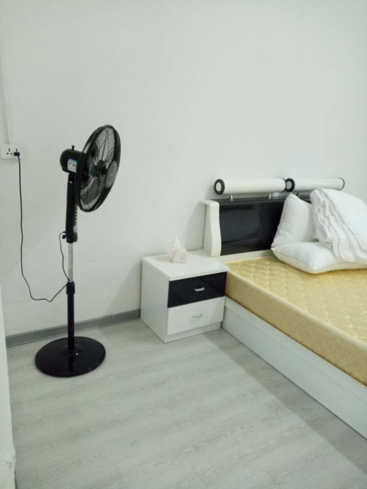
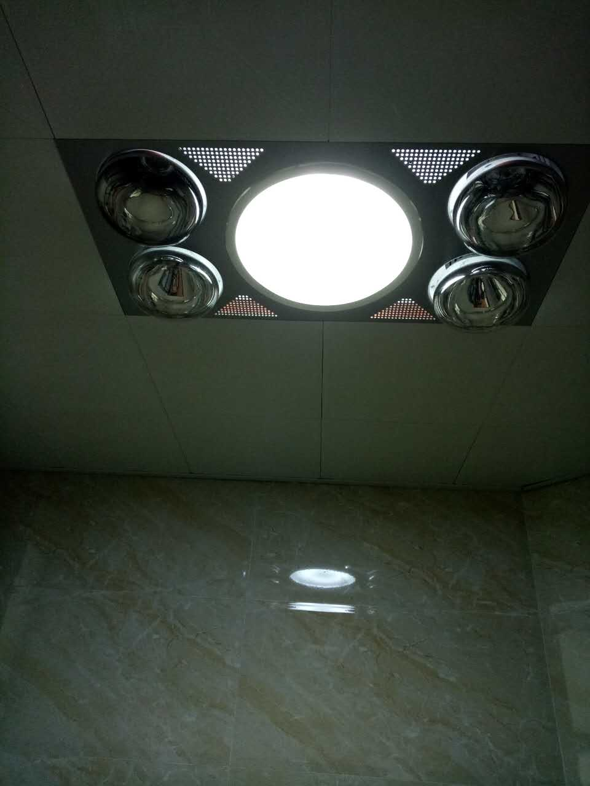
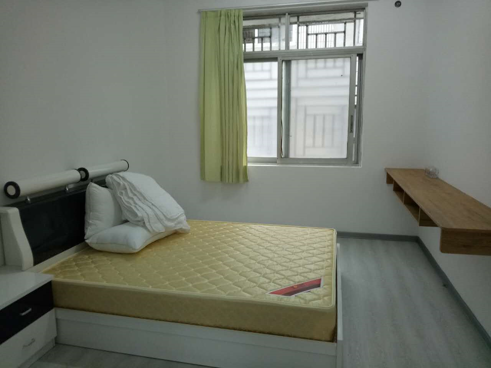

<<<<<<< HEAD
# 更新时间：2019/1/12

# Q&A

## 教师校舍的地址在哪，它的概况是怎样的？

- 地址

  - 位于学校内部，它是基于原学生宿舍装修改造而来的；

- 校舍概况

  - 共4层，每层约有10个房间，每个房间约30平（每个房间带独立卫生间）；
  - 入住情况：1层 10/10；2层 6/10；3层、4层：正在装修；

## 我是否可以拎包入住，需要准备哪些必要家具？

- 厨房使用方面：无燃气以及设备，需个人购买材料准备厨房；

- 学校提供基本住宅套件：床、窗帘、衣柜；

# 实地照片

## 未入住房间照片

## 已入住房间照片

=======
# 更新时间：2019/1/12

# Q&A

## 教师校舍的地址在哪，它的概况是怎样的？

- 地址

  - 位于学校内部，它是基于原学生宿舍装修改造而来的；

- 校舍概况

  - 共4层，每层约有10个房间，每个房间约30平（每个房间带独立卫生间）；
  - 入住情况：1层 10/10；2层 6/10；3层、4层：正在装修；

## 我是否可以拎包入住，需要准备哪些必要家具？

- 厨房使用方面：无燃气以及设备，需个人购买材料准备厨房；

- 学校提供基本住宅套件：床、窗帘、衣柜；

# 实地照片

## 未入住房间照片

## 已入住房间照片

>>>>>>> 0e2c8dab7a2bc95cbfeef9d0374c527a2c62d4c5
