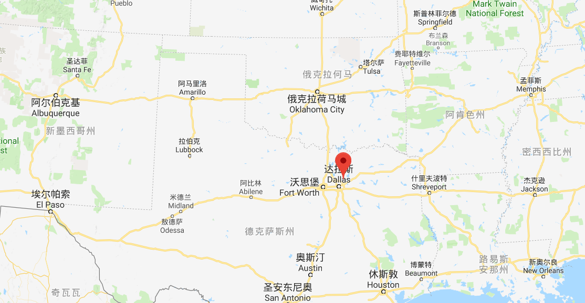

# 概述

Accelerated Christian Education /加速地基督教教育 通畅指常指:

1.  [PACEs (Packets of Accelerated Christian Education)](https://www.aceministries.com/what-is-a-pace):一套基于圣经、从学前直到高中12年(k-12)的`自学为主`的系列教材，此外ACE机构还提供一套`在线互助系统`推进该教材在全球各地区的使用。
    - [教材购买商城链接](https://christianbook.com/page/homeschool/ace/ace-bible)
    - 科目包括：“数学”、“英语”、“文学与创意写作”、“社会研究”、“科学”、“造字”和“圣经阅读”。
2.  ACE机构:Howard夫妇(Donald & Esther)在1970年开始组织的学习社区,目前A.C.E在全球范围内服务超过6000所已注册学校。

## Lighthouse Christian Academy-distance learning

灯塔计划通常会看作是ace vip服务——提供的在线学籍、学业管理服务；

## 愿景

该机构引述圣经申明记申6:7作为愿景(desire)：

> 申6:7  也要殷勤教训你的儿女，无论你坐在家里，行在路上，躺下，起来，都要谈论；  

> The ministry began solely upon God’s leading to meet the need for an individualized, Biblically-based education for children. Their desire was to assist parents, pastors, and school staff in the Lord’s command of Deuteronomy 6:7. And thou shalt teach them diligently unto thy children, and shalt talk to them when thou sittest in thine house, and when thou walkest by the way, and when thou liest down, and when thou risest up.

# 

## 7 个关键原则 /Seven Key Foundational Concepts:

| 7个关键原则                                      | Seven Key Foundational Concepts:                             |
| ------------------------------------------------ | ------------------------------------------------------------ |
| 1. 圣经原则的整合（圣经记忆，智慧原则）          | Integration of Biblical Principles (Scripture memory, wisdom principles) |
| 2. 虔诚的品格训练（ACE人物，基督的90个品格特征） | Godly Character Training (A.C.E. characters, 90 character traits of Christ) |
| 3. 基于精通的学习                                | Mastery-Based Learning                                       |
| 4. 内置强化学习系统                              | Built-In Reinforced System of Learning                       |
| 5. 个性化学习                                    | Individualized Learning                                      |
| 6. 批判性思维能力的发展                          | Development of Critical Thinking Skills                      |
| 7. 社会化                                        | Socialization                                                |

## [教师线上培训/工作坊](https://www.aceministries.com/workshop)

## 学习5法则 Laws of Learning

| 学习5法则                                | Laws of Learning                                             |
| ---------------------------------------- | ------------------------------------------------------------ |
| 1. 设置等级-罗马书12:5-6                 | 1. Assigning the Level – Romans 12:5-6                       |
| 2. 设定目标——路加福音14:28               | 2. Setting the Goal – Luke 14:28                             |
| 3. 提供动力和控制-歌罗西书3:23和箴言22:6 | 3. Providing Motivation and Control – Colossians 3:23 and Proverbs 22:6 |
| 4. 测定测量-路加福音12:48                | 4. Determining Measurement – Luke 12:48                      |
| 5. 归属奖赏-腓立比书3:13-14              | 5. Ascribing Rewards – Philippians 3:13-14                   |

# 访谈 & 国内学生对ACE & PACEs的印象

笔者随机访问了不同学生对PACEs的评价： 

 > “我们会使用耶稣的90个品格作为英文和圣经课的材料”。
  >
  > 数学和科学的教材太简单了”。
  >
  > “高中阶段的备考还是使用留学备考材料，基本不怎么使用（pace）”；

总结国内对ace机构以及 [PACEs (Packets of Accelerated Christian Education)](https://www.aceministries.com/what-is-a-pace) 的看法：

- 教材内容适合以自学材料为主；
- PACEs则是一套很好的品格、英文结合的材料；
- 内容、格式相较陈旧；
- 与同级别材相比难度水平为：较容易；

国内使用PACEs的在家教育/学校的学生 or 家庭，往往是对当前国内局促的赛道(内陆高考)、恶性竞争、品格缺失的不满，他们希望通过改变赛道(留学考试)来减少升学压力，然而相比其他英文母语地区而言，他们更多重在教材的研究与使用；在supervisor监督制度以及学校整体运营上与实践较少。

# reference

[东京但以理国际学校](https://tdis.jp/zh/ace.html)