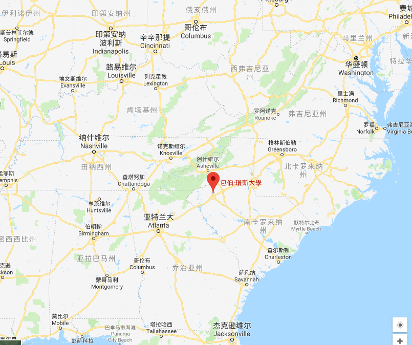

# BJU

Bob Jones大学于1927年组建于美国南卡罗来纳州，致力于提供基督教博雅教育，旨在激发终身学习、爱和领导的精神。

>BJU Press is committed to Christian education. Christian teachers and administrators play a crucial role in educating students for the next generation. To support Christian educators, BJU Press produces textbooks and materials that shape a biblical worldview, are academically rigorous, encourage critical thinking, and are supported with technology solutions. Our Core Values are listed below.

- 现任校长：Dr. Steve Pettit (2014.5~)
- 除高校教育外，旗下的[bju出版社](http://bjupress.com/about)常年为基督徒中小学校提供教材有40多年之久(1973~)。为学生构建基于圣经的世界观，包含严谨的学术，发展批判性思维，并通过远程技术支持提供不同地区的教育解决方案。

- 与同类教材相比难度水平(1-5)为：较困难。

BJU事工联校

## 短访

2018年初上海bju教育家长事务管理员进行了一个简短的采访：

### 如何看待自主式学习法（如蒙台梭利，华德福，瑞吉欧）？
-  基本持反对态度，
bju系统教材包含大量圣经辅导课，因此在教育理念上侧重杖责、权柄、家长与教师的权威，教师通常以“圣经是怎么说的”作为依据教导儿童；
以基督为中心，不以小孩为中心，规避人本层面的体恤，因此大部分家长会对bju的老师会有一种“刻板”的印象。

### 如何看待ACE？
- ACE系统强调自学为主，BJU教师辅导的内容更多；
- 从执业资质看，BJU的办学门槛相比ACE要求要高；
- 国内留学路线方面来看，两者暂无太大明显区别。

### 如何解决学生香蕉人(种族歧视)以及民粹主义问题？
-  教学方面：从小学引入语文大课，包括诗词、中国传统文化、中国历史；
- 圣经教导上，加强使徒行传/加拉太书/罗马书中关于礼仪之争的教导——即人不凭礼仪、血统，而是凭应许作儿女，作天国子民。

### 如何看待教会与学校的关系？
-  目前本地的教学点属于独立办学，暂未与教会联结，主要考虑点如下：
   - 受制于本地教会资源问题，大部分的会众视野尚未触及此块域；
   - 教会暂无教会学校管理办法，例如是否规定本会长老儿女必须入教会学校？若不加入是否需要执行惩戒？

### 如何与不同信仰背景的家长达成办学共识？
-  通过严格审查的家长面试机制，以及学费门槛进行约束；

### 你们最紧迫的问题是什么？
-  场地安全问题，国家规定yiwu教育阶段外的所有工作日全日制教学属于feifa办学，因此，场地的规模和设备的人物力容灾较弱。

